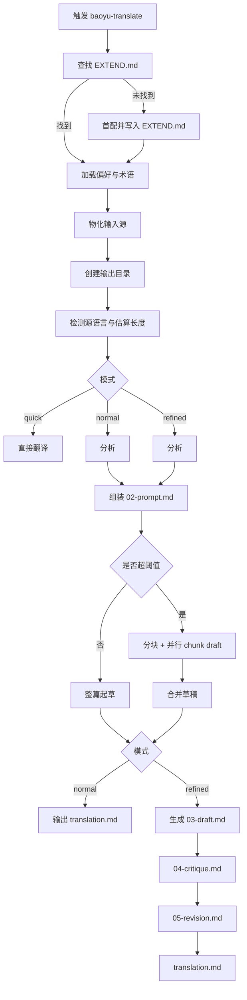

# baoyu-translate Skill 翻译流程研究

更新时间：2026-03-07

## 目的

本文梳理 `C:\Users\DELL\.agents\skills\baoyu-translate` 的实际翻译流程、文件契约、运行时角色分工，以及静态审阅后能确认的实现边界与缺口。

这份文档的重点不是“如何做一次翻译”，而是“这个 skill 在设计上如何组织翻译工作，以及哪些部分真的有脚本实现，哪些部分只是工作流约定”。

## 结论先行

- `baoyu-translate` 本质上是一个“翻译工作流规范”，不是一个完整的可执行翻译程序。
- 真正的翻译动作由主 agent 或 subagent 按提示词执行。
- 代码层唯一明确落地的程序是 Markdown 分块脚本 `scripts/chunk.ts`。
- 这个 skill 的核心价值不在于“直接翻译”，而在于把翻译拆成“配置 -> 分析 -> 提示组装 -> 起草 -> 审校 -> 修订 -> 润色”的可审计流程。
- 长文一致性主要依赖两点：全局分析先行，以及所有 chunk 共用同一个 `02-prompt.md`。

## 本次审阅覆盖的文件

| 路径 | 作用 |
| --- | --- |
| `C:\Users\DELL\.agents\skills\baoyu-translate\SKILL.md` | 总流程入口与规则定义 |
| `C:\Users\DELL\.agents\skills\baoyu-translate\references\workflow-mechanics.md` | 源材料物化、输出目录、冲突处理 |
| `C:\Users\DELL\.agents\skills\baoyu-translate\references\refined-workflow.md` | 分析、批评、修订、润色的详细规范 |
| `C:\Users\DELL\.agents\skills\baoyu-translate\references\subagent-prompt-template.md` | `02-prompt.md` 模板与 subagent 调度模板 |
| `C:\Users\DELL\.agents\skills\baoyu-translate\references\config\extend-schema.md` | `EXTEND.md` 结构与术语优先级 |
| `C:\Users\DELL\.agents\skills\baoyu-translate\references\config\first-time-setup.md` | 首次使用时的阻塞式配置流程 |
| `C:\Users\DELL\.agents\skills\baoyu-translate\references\glossary-en-zh.md` | 内置英译中术语表 |
| `C:\Users\DELL\.agents\skills\baoyu-translate\scripts\chunk.ts` | Markdown 分块脚本 |
| `C:\Users\DELL\.agents\skills\baoyu-translate\scripts\package.json` | 分块脚本依赖 |

## 1. Skill 的组成方式

这个 skill 由 3 层组成。

### 1.1 规则层

规则层由 `SKILL.md` 和 `references/*.md` 构成，定义：

- 何时触发这个 skill。
- 模式如何选择。
- 翻译前必须读取什么配置。
- 长文如何分块。
- 需要落哪些中间文件。
- refined 模式如何审校和返工。

### 1.2 提示层

提示层由 `02-prompt.md` 模板和 subagent 调度模板构成，负责把“分析结果、术语表、读者理解障碍、风格要求”汇总成共享上下文，再把这个共享上下文发给每个 chunk 的翻译代理。

### 1.3 脚本层

脚本层目前只有一个明确实现：

- `scripts/chunk.ts`：把 Markdown 文档按结构化块切成多个 chunk。

换句话说，这个 skill 不是“脚本驱动的翻译器”，而是“agent 驱动的翻译编排器”。

## 2. 运行前提与当前环境观察

### 2.1 触发方式

根据 `SKILL.md`，以下情况会触发这个 skill：

- 用户明确说 `translate`、`翻译`、`精翻`、`本地化` 等。
- 用户提供 URL 或文件并表达翻译意图。
- 用户话术里直接点名 `baoyu-translate`。

### 2.2 首次使用的阻塞式配置

skill 规定翻译开始前必须先查找 `EXTEND.md`：

- 项目级：`.baoyu-skills/baoyu-translate/EXTEND.md`
- 用户级：`$HOME/.baoyu-skills/baoyu-translate/EXTEND.md`

如果都不存在，就不能直接翻译，必须先做首配。首配要一次性收集 5 个默认项：

1. 目标语言
2. 默认模式
3. 目标读者
4. 翻译风格
5. 配置保存位置

然后写出 `EXTEND.md`，再继续翻译。

### 2.3 本机这次检查到的状态

本机当前状态如下：

- 项目级 `EXTEND.md` 不存在。
- 用户级 `EXTEND.md` 不存在。
- `bun` 不存在。
- `npx` 存在。

这意味着如果现在真实执行一次长文翻译：

- 第一步一定会先进入首配。
- 分块脚本的运行器会按 skill 约定退回到 `npx -y bun`。

## 3. 配置系统如何影响翻译

`EXTEND.md` 是这个 skill 的长期配置中心。它不是可选增强，而是整个工作流的默认参数来源。

### 3.1 支持的主要字段

| 字段 | 作用 |
| --- | --- |
| `target_language` | 默认目标语言 |
| `default_mode` | 默认翻译模式 |
| `audience` | 默认读者类型 |
| `style` | 默认文风 |
| `chunk_threshold` | 超过多少词后触发分块 |
| `chunk_max_words` | 每个 chunk 的最大词量 |
| `glossary` | 内联通用术语表 |
| `glossary_files` | 外部术语表文件 |
| `glossaries` | 语言对专属术语表 |

### 3.2 覆盖关系

skill 设计的覆盖关系大体是：

- 命令行参数优先于 `EXTEND.md`
- `EXTEND.md` 优先于 skill 默认值

术语表的优先级在 `extend-schema.md` 中写得更细：

1. `--glossary`
2. `glossaries[language-pair]`
3. `glossary`
4. `glossary_files`
5. 内置 glossary

### 3.3 一个需要注意的文档不一致点

`SKILL.md` 在介绍 glossary merge 时只提到：

- `EXTEND.md glossary`
- `EXTEND.md glossary_files`
- built-in glossary
- `--glossary`

但 `extend-schema.md` 还额外定义了 `glossaries[pair]`，并给出更完整的优先级。这说明：

- 术语合并逻辑的“真实规则”应以 `extend-schema.md` 为准。
- `SKILL.md` 这一段有简化甚至遗漏。

## 4. 总体流程图



## 5. 输入到输出的完整链路

### 5.1 Step 1: 加载偏好与术语

这一阶段的目标不是开始翻译，而是先把“默认行为”固定下来。

会发生的事情包括：

- 查找并加载 `EXTEND.md`
- 选择默认目标语言、模式、读者、风格
- 读取内置术语表
- 合并用户术语表和命令行术语表

这一阶段解决的是“怎么翻”的问题，而不是“翻什么”的问题。

### 5.2 Step 2: 物化输入源

根据 `workflow-mechanics.md`：

- 文件输入：直接使用原文件
- 内联文本：保存为 `translate/{slug}.md`
- URL：抓取内容后保存为 `translate/{slug}.md`

这里的设计说明，skill 希望后续流程全部基于“本地 Markdown 文件”继续，而不是在内存里临时传字符串。

### 5.3 Step 3: 创建输出目录

输出目录规则是：

- 目录位置：源文件旁边
- 命名规则：`{source-basename}-{target-lang}/`

例如：

- `posts/article.md` -> `posts/article-zh/`
- `translate/ai-future.md` -> `translate/ai-future-zh/`

如果输出目录已存在，旧目录必须先改名成 `.backup-YYYYMMDD-HHMMSS`，不能直接覆盖。

这一步的目的，是让每次翻译都变成一份完整的“可回溯工作目录”。

### 5.4 Step 4: 估算长度并决定是否分块

模式不同，策略不同：

- `quick`：永不分块，哪怕是长文也单次直译
- `normal` / `refined`：若长度低于阈值，整篇处理；若超过阈值，先分块再翻译

默认阈值是：

- `chunk_threshold = 4000`
- `chunk_max_words = 5000`

这里可以看出一个明确设计意图：

- `quick` 追求速度，不追求长文一致性。
- `normal` 和 `refined` 追求稳定性，因此允许流程更重。

## 6. 三种模式分别如何处理翻译

### 6.1 Quick 模式

Quick 模式只有一个核心动作：

- 直接翻译并输出 `translation.md`

它不会生成：

- `01-analysis.md`
- `02-prompt.md`
- `03-draft.md`
- `04-critique.md`
- `05-revision.md`

但它仍然要求遵守统一的翻译原则，包括：

- 忠实事实
- 意义优先于字面
- 允许重组句式
- 比喻和情绪要按意图保留
- Markdown 格式必须保留

Quick 模式适合短文本和低风险内容，不适合长文章或高质量发布场景。

### 6.2 Normal 模式

Normal 模式是这个 skill 的默认模式，流程是：

1. 分析整篇内容，生成 `01-analysis.md`
2. 把分析结果和 glossary 组装成 `02-prompt.md`
3. 按 `02-prompt.md` 翻译
4. 输出 `translation.md`

如果是长文：

1. 先做整篇分析
2. 再切 chunk
3. 每个 chunk 共享同一个 `02-prompt.md`
4. 汇总后直接得到 `translation.md`

Normal 模式结束后还会提示用户：

- 如果需要继续精修，可以回复 `继续润色` 或 `refine`

也就是说，Normal 模式在设计上是 Refined 模式的“前半程”。

### 6.3 Refined 模式

Refined 模式是发布级流程，完整链路是：

1. `01-analysis.md`
2. `02-prompt.md`
3. `03-draft.md`
4. `04-critique.md`
5. `05-revision.md`
6. `translation.md`

这 6 份文件不是随便命名的，它们组成了一个明确的生产链：

- `01-analysis.md` 解决理解问题
- `02-prompt.md` 解决指令一致性问题
- `03-draft.md` 解决首次成稿问题
- `04-critique.md` 解决诊断问题
- `05-revision.md` 解决修订问题
- `translation.md` 解决最终交付问题

Refined 模式的本质，是把翻译从“一次生成”改成“编辑式迭代”。

## 7. `01-analysis.md` 到底分析什么

这个文件是整个 skill 的认知中枢。

分析维度包括：

- Quick Summary
- Core Content
- Background Context
- Terminology
- Tone & Style
- Comprehension Challenges
- Figurative Language & Metaphor Mapping
- Structural & Creative Challenges

### 7.1 为什么这个分析很关键

这个 skill 不是让模型“边看边译”，而是要求模型先回答这些问题：

- 作者到底在论证什么
- 哪些概念是全文核心
- 作者默认读者知道什么
- 哪些术语可能译错
- 哪些比喻不能直译
- 哪些地方要加译者注
- 哪些句子结构需要拆开重写

因此，`01-analysis.md` 不是摘要，而是“翻译策略输入”。

### 7.2 比喻映射是这个 skill 的重点

skill 单独要求分析：

- 原始表达是什么
- 作者真实想表达什么
- 字面直译会不会出问题
- 应该选择 interpret、substitute 还是 retain

这说明它非常在意“字面正确但读起来不对”的问题，尤其是英译中场景里的隐喻和情绪词。

## 8. `02-prompt.md` 如何组装

`02-prompt.md` 是共享上下文文件，不是单次任务 prompt。它的作用是把所有 chunk 的翻译标准锁定为同一套。

它通常包含 5 部分：

1. 目标读者
2. 翻译风格
3. 内容背景
4. 术语表
5. 理解障碍与译者注要求

然后再附上统一翻译原则，例如：

- Accuracy first
- Meaning over words
- Figurative language by intended meaning
- Emotional fidelity
- Natural flow
- Preserve format
- Respect original

### 8.1 这种设计的实际价值

如果每个 chunk 都只看原文，不共享分析结果，会出现 4 类常见问题：

- 同一个术语前后译法不一致
- 某个比喻前后处理方式不同
- 某些 chunk 加了译者注，另一些没加
- 章节交界处语气漂移

共享 `02-prompt.md` 的目的，就是把这些问题前置约束。

## 9. 长文分块是怎么工作的

### 9.1 分块前先做全局分析

skill 明确要求，长文不是先切块再翻，而是先扫描整篇：

- 抽专有名词
- 抽技术术语
- 抽高频重复短语
- 建立 session glossary
- 再开始切块

这个顺序很重要。否则每个 chunk 都会像在“盲翻自己的小片段”。

### 9.2 `chunk.ts` 的真实行为

`chunk.ts` 做了以下事情：

1. 读取源 Markdown
2. 用 `remark` 解析为 AST
3. 把 YAML frontmatter 单独拿出来
4. 逐个顶层节点递归切成 block
5. 再把 block 贪心拼成多个 chunk
6. 把结果写入 `chunks/`

输出通常是：

```text
{output-dir}/
  chunks/
    frontmatter.md
    chunk-01.md
    chunk-02.md
    chunk-03.md
```

### 9.3 它按什么规则估算“词数”

这个脚本没有接入正式分词器，而是采用近似计数：

- CJK 字符每个记 1
- 英文和数字 token 每个记 1

这意味着：

- 对英文文档，计数大体接近 word count
- 对中文文档，计数更像字符量而不是词量
- 阈值本质上是“容量近似值”，不是精确 linguistics word count

### 9.4 它如何保持 Markdown 结构

优先级如下：

1. 先按 Markdown AST block 切
2. 单个 block 太大时，递归拆子节点
3. 再不行时按行拆

因此它比“按字符截断”更稳，特别是对：

- 标题
- 列表
- 表格
- 代码块
- 段落

这种结构化内容。

### 9.5 chunk 合并如何完成

每个 chunk 完成翻译后，主 agent 按顺序合并：

- 若存在 `chunks/frontmatter.md`，先 prepend
- 再按 `chunk-01`、`chunk-02` 的顺序拼接

在 `normal` 模式下，合并结果直接落到 `translation.md`。

在 `refined` 模式下，合并结果先落到 `03-draft.md`，后续还要继续审校。

## 10. Refined 模式的后三步为什么重要

### 10.1 `04-critique.md` 只做诊断

这个文件不负责重写，而是系统性找问题。它检查：

- 准确性和完整性
- 术语是否一致
- 是否漏段落
- 是否有欧化中文
- 比喻是否被硬译
- 情绪词是否被翻平
- 逻辑衔接是否生硬
- 译者注是否不足或过量
- 文化适配是否有风险

这一步的价值是把“直觉式改稿”改成“问题清单式改稿”。

### 10.2 `05-revision.md` 是按清单返工

修订阶段读取：

- `03-draft.md`
- `04-critique.md`
- 必要时回看源文和 `01-analysis.md`

然后有针对性地修：

- 改事实错误
- 改欧化表达
- 改僵硬句式
- 改不自然的隐喻
- 补缺失译者注
- 删过度标注
- 修 chunk 之间的衔接

### 10.3 最终 `translation.md` 是润色后的成品

最终润色关注的是：

- 通篇是否像母语写作
- 段落过渡是否顺
- 文风是否前后一致
- 是否仍残留翻译腔
- 是否还有幸存的硬译比喻
- 是否保持了格式与术语一致性

所以 refined 模式实际上把“质量”拆成两种不同操作：

- revision：解决错误和策略偏差
- polish：解决阅读体验和成品感

## 11. 文件产物契约

| 文件 | 谁生成 | 谁读取 | 作用 |
| --- | --- | --- | --- |
| `01-analysis.md` | 主 agent | 主 agent / subagent 间接使用 | 全局理解与翻译策略输入 |
| `02-prompt.md` | 主 agent | 主 agent / subagent | 共享翻译上下文 |
| `03-draft.md` | 主 agent 或 chunk subagent 合并结果 | 主 agent | refined 初稿 |
| `04-critique.md` | 主 agent | 主 agent | 诊断清单 |
| `05-revision.md` | 主 agent | 主 agent | 按诊断完成的修订稿 |
| `translation.md` | 主 agent | 用户 | 最终交付 |
| `chunks/chunk-NN.md` | `chunk.ts` | subagent | 原文分块 |
| `chunks/chunk-NN-draft.md` | subagent | 主 agent | 分块译稿 |
| `chunks/frontmatter.md` | `chunk.ts` | 主 agent | 原 frontmatter |

这组文件的最大特点是：

- 每一步都可追踪
- 每一步都可回滚
- 每一步都有明确输入和输出

## 12. 主 agent、subagent、脚本之间的角色分工

### 12.1 主 agent 负责什么

主 agent 负责：

- 读取配置
- 物化输入源
- 创建输出目录
- 做整篇分析
- 组装 `02-prompt.md`
- 判断是否分块
- 合并 chunk 结果
- 审校
- 修订
- 润色

### 12.2 subagent 负责什么

subagent 只负责一件事：

- 根据 `02-prompt.md` 翻译自己负责的 chunk，并写出 `chunk-NN-draft.md`

根据 `refined-workflow.md` 的定义，subagent 默认不负责 critique、revision、polish。

### 12.3 `chunk.ts` 负责什么

`chunk.ts` 只负责：

- 结构化切块
- 保留 frontmatter
- 输出 chunk 文件

它不负责：

- 翻译
- 语言检测
- 术语抽取
- URL 获取
- prompt 组装
- 合并译文

## 13. 这个 skill 真正强调的翻译原则

从规则设计看，它最强调的是下面 6 件事。

### 13.1 准确性高于流畅性

所有模式都把事实、数字、逻辑一致性放在第一位。

### 13.2 意义高于字面

它明确反对逐词硬译，允许为了目标语言自然度重组句子。

### 13.3 比喻和情绪必须保真

这是它和很多“普通翻译 prompt”最不同的地方。它不仅要求概念翻对，还要求：

- 比喻按意图处理
- 情绪色彩不能被磨平
- 隐含意思不能只停留在表层字面

### 13.4 译者注是受众驱动的

它不要求所有术语都加注，而是要求根据受众判断：

- 大众读者多解释一点
- 技术读者少解释一点

### 13.5 格式保留是硬要求

Markdown 的标题、粗体、链接、图片、代码块都必须保留。

### 13.6 Frontmatter 不是机械复制

它要求把“源文元数据”和“译文元数据”分开存放。这说明它考虑的是“翻译后的内容资产管理”，不是一次性文本输出。

## 14. 以一篇长英文文章精翻为例，实际会怎么跑

假设输入为：

- 源文件：`posts/ai-agents.md`
- 模式：`refined`
- 目标语言：`zh-CN`

理论上的执行顺序会是：

1. 检查 `EXTEND.md`
2. 若不存在，先做首配并保存
3. 加载 glossary 与默认风格
4. 创建 `posts/ai-agents-zh-CN/`
5. 整篇分析，写 `01-analysis.md`
6. 组装共享上下文，写 `02-prompt.md`
7. 如果超阈值，运行类似命令：

```powershell
npx -y bun C:\Users\DELL\.agents\skills\baoyu-translate\scripts\chunk.ts posts/ai-agents.md --max-words 5000 --output-dir posts/ai-agents-zh-CN
```

8. 生成：

```text
posts/ai-agents-zh-CN/
  01-analysis.md
  02-prompt.md
  chunks/
    frontmatter.md
    chunk-01.md
    chunk-02.md
```

9. 每个 chunk 启动一个 subagent，分别生成：

```text
chunks/chunk-01-draft.md
chunks/chunk-02-draft.md
```

10. 主 agent 合并这些 draft -> `03-draft.md`
11. 主 agent 审校 -> `04-critique.md`
12. 主 agent 修订 -> `05-revision.md`
13. 主 agent 润色 -> `translation.md`

最终目录大致是：

```text
posts/ai-agents-zh-CN/
  01-analysis.md
  02-prompt.md
  03-draft.md
  04-critique.md
  05-revision.md
  translation.md
  chunks/
    frontmatter.md
    chunk-01.md
    chunk-01-draft.md
    chunk-02.md
    chunk-02-draft.md
```

## 15. 静态审阅后确认的实现缺口和风险

### 15.1 `chunk.ts` 的参数解析存在明显缺陷

`chunk.ts` 通过下面的方式寻找文件参数：

- `args.find(a => !a.startsWith("--"))`

这会导致一个问题：

- 如果命令写成 `--max-words 5000 article.md`
- 它可能把 `5000` 当成文件名

因此，这个脚本依赖“把文件路径放在第一个非 flag 参数位置”的调用习惯。

### 15.2 `maxWords` 默认值实现不稳

脚本写法是：

- `parseInt(args[args.indexOf("--max-words") + 1] || "5000")`

如果没有传 `--max-words`，它会尝试读取 `args[0]`。而 `args[0]` 往往是文件名，不是数字。

结果可能是：

- `parseInt("article.md")`
- 得到 `NaN`

这会影响后续所有分块判断。

### 15.3 文档说“会退回到 word splitting”，代码里没有真正实现

`SKILL.md` 说明：

- 单块超限时会按行，再按词拆

但 `chunk.ts` 实际只实现到：

- AST 递归拆分
- 按行拆分

没有真正的“按词二次拆分”逻辑。

### 15.4 许多核心能力只存在于规范里，不存在于代码里

以下能力在文档里被要求，但没有对应脚本实现：

- URL 获取内容
- 自动检测源语言
- 术语抽取
- 研究标准译法
- backup 目录重命名
- 合并 chunk 译文
- frontmatter 字段重写
- 译者注插入
- critique / revision / polish

这说明这个 skill 假定“主 agent 具备这些能力并按规范执行”。

### 15.5 内置 glossary 覆盖面有限

当前内置 glossary 明确只有：

- `glossary-en-zh.md`

这意味着：

- 非英译中场景更多依赖模型本身
- 或依赖用户在 `EXTEND.md` 中补足 glossary

### 15.6 文档中部分中文存在编码异常

当前审阅到的源文件里有部分中文显示异常，推测存在编码问题。但整体语义仍可从上下文恢复。

这不一定会影响运行逻辑，但会影响后续维护与人工审阅。

## 16. 对这个 skill 的正确理解

如果只看名字，很容易把 `baoyu-translate` 理解成“一个翻译工具”。

更准确的理解应该是：

- 它是一个翻译生产流程模板。
- 它把翻译工作拆成多个可验证阶段。
- 它试图解决的核心问题是“一致性、可审查性、发布质量”，不是“最快产出第一版译文”。

因此，它最适合：

- 长文章
- 需要保存中间产物的任务
- 需要术语一致性的任务
- 需要人工回看和继续润色的任务
- 最终要发布的内容

它不太适合：

- 一句话速翻
- 不需要留痕的临时任务
- 没有必要生成中间文件的场景

## 17. 总结

`baoyu-translate` 的翻译流程可以概括为一句话：

先用配置和分析把“翻译标准”固定下来，再用共享 prompt 起草译文，最后通过批评、修订和润色把结果提升到可发布状态。

它的强项有 4 个：

- 流程清晰
- 文件契约明确
- 长文一致性设计合理
- refined 模式有完整质量闭环

它的弱项也很明确：

- 只有分块器是硬代码实现
- 许多关键步骤依赖 agent 自觉遵守规则
- 分块脚本本身有参数解析缺陷
- 文档和 schema 存在少量不一致

如果后续要把这个 skill 真正产品化，最先应该补的是：

1. 稳定的参数解析与分块测试
2. 术语合并的程序化实现
3. URL 获取与源语言检测
4. `02-prompt.md` 的自动生成器
5. critique / revision / polish 的可复用执行器

## 18. 首配流程的实际问法与生成结果

`first-time-setup.md` 不是只说“要有首配”，而是把首配问卷本身也定死了。

它要求一次性收集 5 个项目：

1. Target Language
2. Mode
3. Audience
4. Style
5. Save

其中推荐项大致是：

- `zh-CN`
- `normal`
- `general`
- `storytelling`
- user scope

### 18.1 为什么它坚持“一次问完”

文档特别强调：

- 首配必须阻塞
- 不能先翻一半再回来补配置
- 不能边翻边问零散问题

这样设计的原因很明确：

- 避免一次翻译过程中途切换默认语言
- 避免首段按一种风格翻、后段按另一种风格翻
- 避免中途改变 audience 导致译者注策略漂移

### 18.2 生成出来的 `EXTEND.md` 最小长什么样

最小版本通常会像这样：

```yaml
target_language: zh-CN
default_mode: normal
audience: general
style: storytelling
```

然后用户可以自行扩展：

```yaml
chunk_threshold: 4000
chunk_max_words: 5000

glossary:
  - from: "AI Agent"
    to: "AI 智能体"
  - from: "Context Engineering"
    to: "上下文工程"

glossary_files:
  - ./team-glossary.md
```

### 18.3 user scope 和 project scope 的实际差别

- user scope：同一台机器上的所有项目共用一套默认偏好
- project scope：只对当前仓库有效

如果团队内多个项目的受众、文风和术语风格差异较大，project scope 更稳。

如果你长期做一类内容，例如持续英译中技术文章，user scope 更省事。

## 19. Audience 和 Style 为什么被拆成两个维度

这个 skill 不是简单地用一个“文风”字段统管一切，而是刻意把：

- audience
- style

拆成了两个正交维度。

### 19.1 Audience 决定什么

Audience 主要影响：

- 术语解释深度
- 译者注密度
- 注册体正式程度
- 默认背景补充量

例如：

- `general`：更多背景解释，术语更容易加注
- `technical`：更少解释，默认读者已有行业知识
- `academic`：更正式、更严谨
- `business`：更偏结论导向和沟通效率

### 19.2 Style 决定什么

Style 主要影响：

- 句子节奏
- 用词风格
- 叙述的“声线”
- 比喻和修辞如何落地

例如：

- `storytelling`：强调叙事流动感
- `formal`：强调中性和结构
- `technical`：强调紧凑和精确
- `literal`：尽量接近原句结构
- `elegant`：更重视文气和修辞质感

### 19.3 这种拆分的价值

这意味着你可以得到这种组合：

- 技术受众 + storytelling 风格
- 大众受众 + formal 风格
- 商业受众 + conversational 风格

也就是说，skill 把“给谁看”和“怎么写”视为两个不同问题，这比单一 `tone` 字段更成熟。

## 20. `02-prompt.md` 与 subagent prompt 的两段式结构

这是整个 skill 非常关键的一层设计。

文档把 prompt 分成两部分：

1. `02-prompt.md`
2. subagent spawn prompt

### 20.1 第一段：共享上下文文件

`02-prompt.md` 不是一段临时消息，而是一份落盘文件。它会包含：

- 源语言与目标语言
- 目标读者
- 翻译风格
- 内容背景
- 合并后的 glossary
- 理解障碍与译者注要求
- 翻译原则

换句话说，它是“统一标准说明书”。

### 20.2 第二段：任务型调度 prompt

subagent 实际接到的指令非常短，核心就是：

1. 读 `02-prompt.md`
2. 读自己负责的 chunk 文件
3. 翻译
4. 把结果写到 `chunk-NN-draft.md`

### 20.3 为什么不把所有内容塞进每个 subagent prompt

因为那样会带来 3 个问题：

- 每个 subagent 的 prompt 太长，重复上下文过多
- 如果要修 glossary 或策略，必须同步改所有 prompt
- chunk 之间更容易出现版本漂移

两段式结构的好处是：

- 主 agent 只维护一份共享上下文
- subagent prompt 保持极短
- chunk 间的一致性更容易控制

## 21. Frontmatter、术语首现标注、译者注的具体落地方式

这 3 个点在规则里都不是“小修饰”，而是翻译成品结构的一部分。

### 21.1 Frontmatter 不是原样复制

skill 要求把“源文元数据”和“译文元数据”区分开。

假设源文 frontmatter 是：

```yaml
---
title: The Future of AI Agents
description: Why agents need better context handling
author: John Doe
date: 2025-01-10
url: https://example.com/ai-agents
tags:
  - ai
  - agents
---
```

目标 frontmatter 理论上应变成类似：

```yaml
---
title: AI 智能体的未来
description: 为什么智能体需要更好的上下文处理
sourceTitle: The Future of AI Agents
sourceDescription: Why agents need better context handling
sourceAuthor: John Doe
sourceDate: 2025-01-10
sourceUrl: https://example.com/ai-agents
tags:
  - ai
  - agents
---
```

这里最重要的不是字段名字，而是这个原则：

- “关于源文的信息”不要和“翻译后的内容信息”混在一起

### 21.2 术语首现标注

skill 要求 glossary 词在首次出现时保留原文。

例如：

- `AI 智能体（AI Agent）`
- `上下文工程（Context Engineering）`

这样做的用途有两个：

- 降低首次阅读时的术语歧义
- 为后续全文只使用译文术语建立锚点

### 21.3 译者注不是“补英文原词”，而是补理解

它要求译者注解释“这是什么”，而不是只把英文括回来。

更符合 skill 意图的写法是：

- `飞轮效应（Flywheel，指系统增长会自我强化的循环机制）`

而不是：

- `飞轮效应（Flywheel）`

前者解决理解问题，后者只是重复原词。

## 22. Normal 模式升级为 Refined 的续跑机制

这个设计很值得单独写出来，因为它说明 skill 不是非黑即白的“普通翻译”或“精翻”。

### 22.1 正常结束后的状态

Normal 模式结束时，目录里一般已经有：

- `01-analysis.md`
- `02-prompt.md`
- `translation.md`

### 22.2 用户回复“继续润色”之后会发生什么

skill 约定接到续跑指令后，应当把当前结果视为 refined 的初稿起点：

1. 现有 `translation.md` 被视为 draft 基线
2. 它会被重命名或等价迁移为 `03-draft.md`
3. 接着生成 `04-critique.md`
4. 再生成 `05-revision.md`
5. 最终刷新 `translation.md`

### 22.3 这个机制的实际意义

它允许一个很实用的工作方式：

- 先用 normal 模式快速拿到可读版本
- 看看方向对不对
- 确认值得继续投入后，再追加 refined 后半程

这比一开始就全程 refined 更灵活，也更节省资源。

## 23. `chunk.ts` 的伪代码级拆解

从实现角度看，这个脚本的逻辑可以概括成下面的伪代码：

```text
read args
resolve file / maxWords / outputDir
read markdown file
parse markdown AST

for each top-level node:
  if yaml:
    save as frontmatter
  else:
    split node into blocks

pack blocks greedily into chunks
write chunks/frontmatter.md
write chunks/chunk-01.md ... chunk-NN.md
print JSON summary
```

### 23.1 `splitNodeToBlocks` 的真实规则

它的规则是：

- 如果当前节点词量不超限，直接保留为一个 block
- 如果节点类型是 `heading`、`thematicBreak`、`html`，即便超限也不再继续拆
- 如果节点有 children，就递归拆 children
- 如果节点渲染成 Markdown 后有多行，就按行累积拆分
- 最后仍拆不开时，原样返回

### 23.2 这意味着哪些边界情况

- 超长 HTML 块可能整个落入一个 chunk
- 超长标题理论上不会再被拆开
- 真正的“按词拆分”并不存在
- chunk 大小依赖近似词数估算，不是严格 token 控制

### 23.3 输出的 JSON 有什么用

脚本最后会打印：

- `source`
- `chunks`
- `output_dir`
- `frontmatter`
- `words_per_chunk`

这为主 agent 提供了两个直接好处：

- 可以知道一共要起多少个 subagent
- 可以快速判断某个 chunk 是否异常偏大

## 24. 运行时隐含假设与失败场景

这个 skill 有一些没有明说但实际上成立的前提。

### 24.1 它默认主 agent 具备文件系统编排能力

因为它要求主 agent：

- 创建目录
- 备份旧目录
- 写出多个中间文件
- 合并 chunk 输出

如果没有稳定的文件写入能力，这个 skill 根本跑不顺。

### 24.2 它默认主 agent 具备 prompt 组装能力

因为 `02-prompt.md` 不是脚本自动生成的，而是主 agent 根据分析结果手工或半手工拼出来的。

这说明：

- prompt assembly 是 skill 的一等公民
- 不是附属动作

### 24.3 它默认环境里“可能有 subagent，也可能没有”

文档其实已经考虑了这点：

- 有 Agent tool：并行起多个 subagent
- 没有 Agent tool：主 agent 顺序内联翻译

也就是说，subagent 不是必需条件，但会影响效率和一致性风险控制方式。

### 24.4 失败场景没有完全程序化兜底

文档没有明确规定这些情况怎么恢复：

- URL 抓取失败怎么办
- chunk 某一块翻译失败怎么办
- 某个 subagent 写错文件名怎么办
- glossary 文件缺失或格式不合法怎么办

当前规则更像“理想流程规范”，不是“容错完备的执行器”。

## 25. 如果继续补强这份 skill，建议优先增加什么

站在实现角度，继续补强时建议按这个顺序做。

### 25.1 第一优先级：把流程里最脆的环节程序化

优先补：

- 稳定的 CLI 参数解析
- glossary merge 的程序实现
- output dir backup 的程序实现
- `02-prompt.md` 生成器

这些能力补上以后，skill 才从“高度依赖 agent 手工遵守”迈向“部分可执行”。

### 25.2 第二优先级：给 refined 后半程增加模板化执行器

例如：

- critique 检查表生成器
- revision 执行模板
- polish 终审模板

这样能减少不同 agent 在 refined 阶段的自由发挥差异。

### 25.3 第三优先级：补测试与回归样本

至少应覆盖：

- 短文 quick
- 中等长度 normal
- 长文 refined
- 含 frontmatter 文档
- 含代码块、列表、表格文档
- 缺省 `--max-words` 参数
- `--max-words` 放在文件参数前面

如果没有这些样本，后续改 `chunk.ts` 很容易把边界情况改坏。
