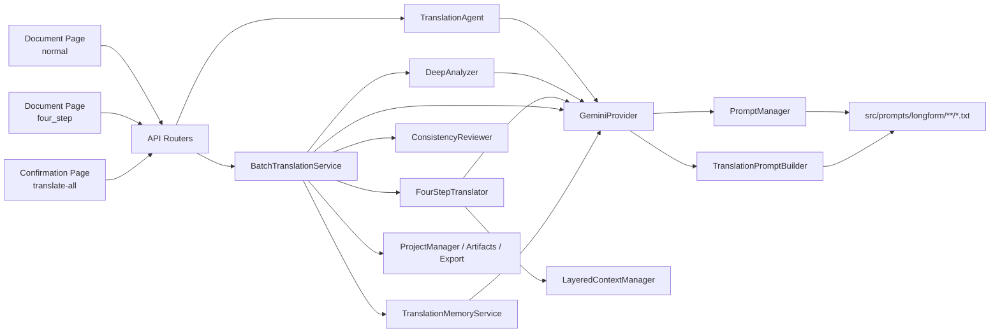
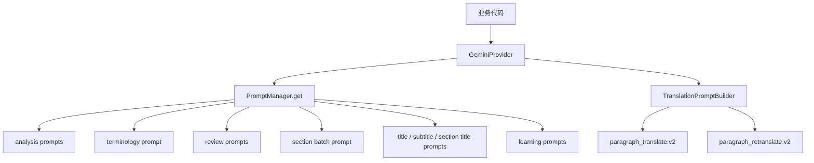
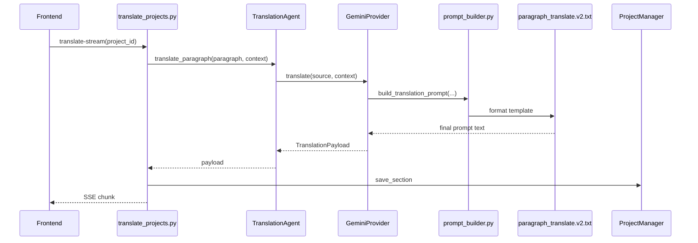
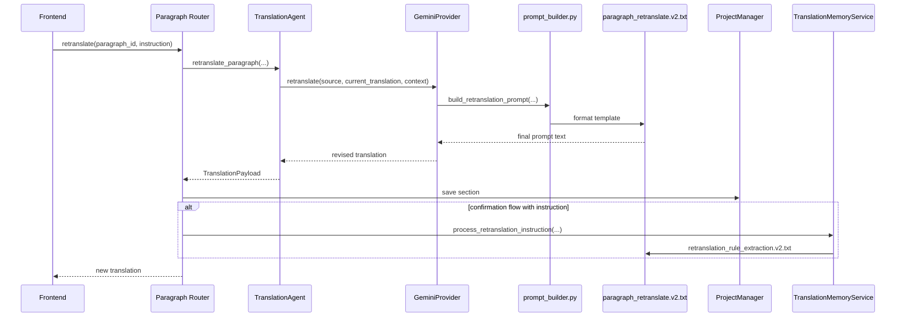
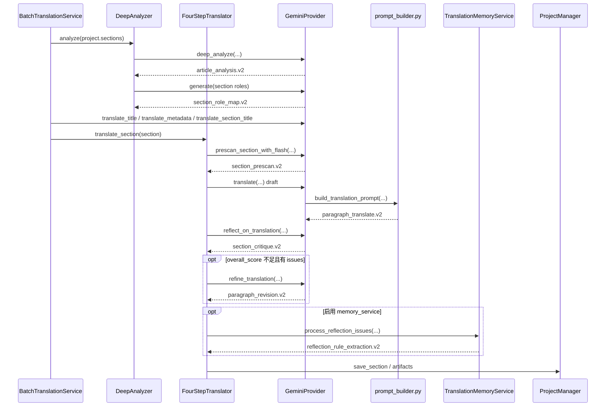
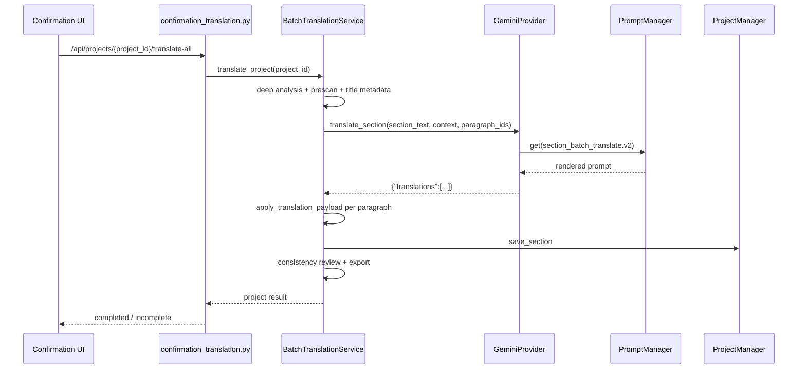
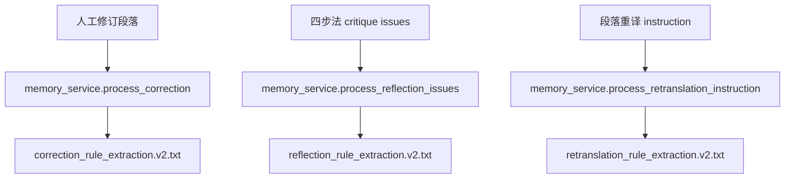
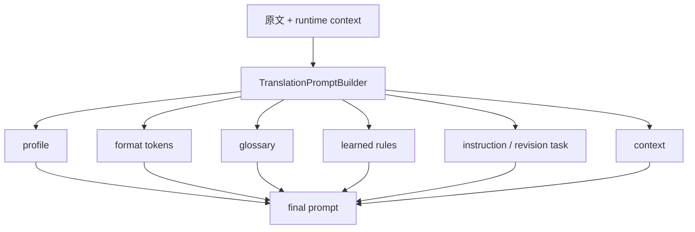

# 长文翻译完整链路与 Prompt 地图

更新时间：2026-03-12

## 1. 先看哪里

如果你现在要快速上手长文翻译，先打开这 8 个文件：

1. Prompt 路由入口：[src/prompts/__init__.py](../src/prompts/__init__.py)
2. 段落 prompt 组装器：[src/prompts/prompt_builder.py](../src/prompts/prompt_builder.py)
3. LLM 实际接线：[src/llm/gemini.py](../src/llm/gemini.py)
4. 普通段落翻译 agent：[src/agents/translation.py](../src/agents/translation.py)
5. 四步法 agent：[src/agents/four_step_translator.py](../src/agents/four_step_translator.py)
6. 项目级总编排：[src/services/batch_translation_service.py](../src/services/batch_translation_service.py)
7. Prompt 输入 contract：[src/prompts/longform/shared/context_contracts.md](../src/prompts/longform/shared/context_contracts.md)
8. Prompt 输出 contract：[src/prompts/longform/shared/output_contracts.md](../src/prompts/longform/shared/output_contracts.md)

这份文档回答 5 个问题：

1. 长文翻译现在有哪些真实在跑的链路。
2. 三条链路各自经过哪些 router / service / agent / prompt。
3. 现在所有活跃长文 prompt 的真实文件位置。
4. 哪些旧长文 prompt / 旧服务已经被彻底删除。
5. 如果要改某种行为，应该先改哪个 prompt / builder / 调用点。

## 2. 当前系统结论

- 三条业务链路都保留：
  - 文档页普通全篇翻译：`POST /api/projects/{project_id}/translate-stream`
  - 文档页四步法全篇翻译：`POST /api/projects/{project_id}/translate-four-step`
- 确认流项目级翻译：`POST /api/projects/{project_id}/translate-all`
- 长文翻译运行时只使用 `src/prompts/longform/...` 下的新 prompt。
- 长文相关旧平铺 prompt、旧名兼容、inline fallback、未接线 fallback prompt 都已删除。
- paragraph retranslate 固定使用专用模板 [paragraph_retranslate.v2.txt](../src/prompts/longform/translation/paragraph_retranslate.v2.txt)。
- 当前活跃长文 prompt 一共 14 个，另有 2 份 contract 文档。

## 3. 系统设计图

### 3.1 组件全景图



### 3.2 Prompt 路由图



### 3.3 组件职责表

| 组件 | 真实文件 | 职责 |
| --- | --- | --- |
| Router: 文档页普通 / 四步法 | [src/api/routers/translate_projects.py](../src/api/routers/translate_projects.py) | 普通全文翻译和四步法全文翻译入口 |
| Router: 确认流项目级翻译 / 段落重译 | [src/api/routers/confirmation_translation.py](../src/api/routers/confirmation_translation.py) | 确认流整项目翻译、确认流段落重译 |
| Router: 文档页段落翻译 / 重译 / 人工修订 | [src/api/routers/projects_paragraphs.py](../src/api/routers/projects_paragraphs.py) | 文档页单段翻译、单段重译、人工更新触发学习 |
| PromptManager | [src/prompts/__init__.py](../src/prompts/__init__.py) | 精确加载模板；长文调用方只传 `longform/...` 新名 |
| PromptBuilder | [src/prompts/prompt_builder.py](../src/prompts/prompt_builder.py) | 普通段落翻译 / 段落重译 prompt 拼装 |
| GeminiProvider | [src/llm/gemini.py](../src/llm/gemini.py) | 组织上下文、渲染 prompt、调用模型（固定分配，无运行时切换）、解析输出 |
| TranslationAgent | [src/agents/translation.py](../src/agents/translation.py) | 普通段落翻译与段落重译 |
| DeepAnalyzer | [src/agents/deep_analyzer.py](../src/agents/deep_analyzer.py) | 全文分析、section role map |
| FourStepTranslator | [src/agents/four_step_translator.py](../src/agents/four_step_translator.py) | prescan / draft / critique / revision |
| BatchTranslationService | [src/services/batch_translation_service.py](../src/services/batch_translation_service.py) | 四步法与确认流 section 模式的项目级总编排 |
| TranslationMemoryService | [src/services/memory_service.py](../src/services/memory_service.py) | 人工修订学习、四步法 critique 学习、重译学习 |
| Context Contracts | [src/prompts/longform/shared/context_contracts.md](../src/prompts/longform/shared/context_contracts.md) | prompt 输入字段规范 |
| Output Contracts | [src/prompts/longform/shared/output_contracts.md](../src/prompts/longform/shared/output_contracts.md) | prompt 输出 schema 规范 |

## 4. 活跃 Prompt 注册表

### 4.1 Longform 运行时 Prompt Tree

- Analysis
  - [article_analysis.v2.txt](../src/prompts/longform/analysis/article_analysis.v2.txt)
  - [section_role_map.v2.txt](../src/prompts/longform/analysis/section_role_map.v2.txt)
- Terminology
  - [section_prescan.v2.txt](../src/prompts/longform/terminology/section_prescan.v2.txt)
- Translation
  - [paragraph_translate.v2.txt](../src/prompts/longform/translation/paragraph_translate.v2.txt)
  - [paragraph_retranslate.v2.txt](../src/prompts/longform/translation/paragraph_retranslate.v2.txt)
  - [section_batch_translate.v2.txt](../src/prompts/longform/translation/section_batch_translate.v2.txt)
- Review
  - [section_critique.v2.txt](../src/prompts/longform/review/section_critique.v2.txt)
  - [paragraph_revision.v2.txt](../src/prompts/longform/review/paragraph_revision.v2.txt)
- Auxiliary
  - [title_translate.v2.txt](../src/prompts/longform/auxiliary/title_translate.v2.txt)
  - [metadata_subtitle_translate.v2.txt](../src/prompts/longform/auxiliary/metadata_subtitle_translate.v2.txt)
  - [section_title_translate.v2.txt](../src/prompts/longform/auxiliary/section_title_translate.v2.txt)
- Learning
  - [correction_rule_extraction.v2.txt](../src/prompts/longform/learning/correction_rule_extraction.v2.txt)
  - [reflection_rule_extraction.v2.txt](../src/prompts/longform/learning/reflection_rule_extraction.v2.txt)
  - [retranslation_rule_extraction.v2.txt](../src/prompts/longform/learning/retranslation_rule_extraction.v2.txt)
- Shared Contracts
  - [context_contracts.md](../src/prompts/longform/shared/context_contracts.md)
  - [output_contracts.md](../src/prompts/longform/shared/output_contracts.md)

### 4.2 活跃 Prompt 索引表

| 类别 | 逻辑名 | 真实文件链接 | 主要调用点 | 活跃链路 | 输出 |
| --- | --- | --- | --- | --- | --- |
| Analysis | `longform/analysis/article_analysis.v2` | [article_analysis.v2.txt](../src/prompts/longform/analysis/article_analysis.v2.txt) | [src/llm/base.py](../src/llm/base.py)、[src/agents/deep_analyzer.py](../src/agents/deep_analyzer.py) | 四步法、确认流 | article analysis JSON |
| Analysis | `longform/analysis/section_role_map.v2` | [section_role_map.v2.txt](../src/prompts/longform/analysis/section_role_map.v2.txt) | [src/agents/deep_analyzer.py](../src/agents/deep_analyzer.py) | 四步法、确认流 | section role map JSON |
| Terminology | `longform/terminology/section_prescan.v2` | [section_prescan.v2.txt](../src/prompts/longform/terminology/section_prescan.v2.txt) | [src/llm/base.py](../src/llm/base.py)、[src/agents/four_step_translator.py](../src/agents/four_step_translator.py) | 四步法、确认流、术语预审 | prescan JSON |
| Translation | `longform/translation/paragraph_translate.v2` | [paragraph_translate.v2.txt](../src/prompts/longform/translation/paragraph_translate.v2.txt) | [src/prompts/prompt_builder.py](../src/prompts/prompt_builder.py)、[src/llm/gemini.py](../src/llm/gemini.py) | 文档页普通翻译、四步法 draft | 纯文本 |
| Translation | `longform/translation/paragraph_retranslate.v2` | [paragraph_retranslate.v2.txt](../src/prompts/longform/translation/paragraph_retranslate.v2.txt) | [src/prompts/prompt_builder.py](../src/prompts/prompt_builder.py)、[src/llm/gemini.py](../src/llm/gemini.py) | 文档页段落重译、确认流段落重译 | 纯文本 |
| Translation | `longform/translation/section_batch_translate.v2` | [section_batch_translate.v2.txt](../src/prompts/longform/translation/section_batch_translate.v2.txt) | [src/llm/gemini.py](../src/llm/gemini.py) | 确认流项目级翻译 | `translations[]` JSON |
| Review | `longform/review/section_critique.v2` | [section_critique.v2.txt](../src/prompts/longform/review/section_critique.v2.txt) | [src/llm/base.py](../src/llm/base.py)、[src/agents/four_step_translator.py](../src/agents/four_step_translator.py) | 四步法 | critique JSON |
| Review | `longform/review/paragraph_revision.v2` | [paragraph_revision.v2.txt](../src/prompts/longform/review/paragraph_revision.v2.txt) | [src/llm/base.py](../src/llm/base.py)、[src/agents/four_step_translator.py](../src/agents/four_step_translator.py) | 四步法 | 纯文本 |
| Auxiliary | `longform/auxiliary/title_translate.v2` | [title_translate.v2.txt](../src/prompts/longform/auxiliary/title_translate.v2.txt) | [src/llm/gemini.py](../src/llm/gemini.py)、[src/services/batch_translation_service.py](../src/services/batch_translation_service.py) | 四步法、确认流 | 纯文本 |
| Auxiliary | `longform/auxiliary/metadata_subtitle_translate.v2` | [metadata_subtitle_translate.v2.txt](../src/prompts/longform/auxiliary/metadata_subtitle_translate.v2.txt) | [src/llm/gemini.py](../src/llm/gemini.py)、[src/services/batch_translation_service.py](../src/services/batch_translation_service.py) | 四步法、确认流 | 纯文本 |
| Auxiliary | `longform/auxiliary/section_title_translate.v2` | [section_title_translate.v2.txt](../src/prompts/longform/auxiliary/section_title_translate.v2.txt) | [src/llm/gemini.py](../src/llm/gemini.py)、[src/services/batch_translation_service.py](../src/services/batch_translation_service.py) | 四步法、确认流 | 纯文本 |
| Learning | `longform/learning/correction_rule_extraction.v2` | [correction_rule_extraction.v2.txt](../src/prompts/longform/learning/correction_rule_extraction.v2.txt) | [src/services/memory_service.py](../src/services/memory_service.py) | 人工修订侧路 | 规则提取 JSON |
| Learning | `longform/learning/reflection_rule_extraction.v2` | [reflection_rule_extraction.v2.txt](../src/prompts/longform/learning/reflection_rule_extraction.v2.txt) | [src/services/memory_service.py](../src/services/memory_service.py) | 四步法 critique 学习 | 规则提取 JSON |
| Learning | `longform/learning/retranslation_rule_extraction.v2` | [retranslation_rule_extraction.v2.txt](../src/prompts/longform/learning/retranslation_rule_extraction.v2.txt) | [src/services/memory_service.py](../src/services/memory_service.py) | 段落重译学习 | 规则提取 JSON |

输入字段统一看：

- [context_contracts.md](../src/prompts/longform/shared/context_contracts.md)
- [output_contracts.md](../src/prompts/longform/shared/output_contracts.md)

## 5. 已删除的旧长文资产

这一节是当前状态，不是计划。

已经删除的旧长文 prompt：

- `deep_analysis.txt`
- `section_roles_analysis.txt`
- `understanding.txt`
- `section_prescan.txt`
- `translation.txt`
- `translation_simplified.txt`
- `batch_translation.txt`
- `reflection.txt`
- `refine.txt`
- `retranslation.txt`
- `rule_extraction.txt`
- `reflection_rule_extraction.txt`
- `retranslation_rule_extraction.txt`
- `heading_translation.txt`

已经删除的长文运行时死代码：

- `src/prompts/longform/analysis/section_understanding_fallback.v2.txt`
- `src/prompts/longform/auxiliary/heading_translate.v2.txt`
- `src/services/retranslation_service.py`
- `src/services/heading_metadata_service.py`
- `src/services/segmentation_service.py`

结论：

- 当前仓库里已经不存在“保留但不参与运行时”的长文 legacy prompt 文件。
- 你以后重构长文 prompt，只需要关注 [src/prompts/longform](../src/prompts/longform) 下仍然存在的文件。

## 6. 链路 A：文档页普通全篇翻译

### 6.1 入口

- 前端页：[web/frontend/src/features/document/index.tsx](../web/frontend/src/features/document/index.tsx)
- 前端服务：[web/frontend/src/features/document/services/fullTranslationService.ts](../web/frontend/src/features/document/services/fullTranslationService.ts)
- 后端路由：[src/api/routers/translate_projects.py](../src/api/routers/translate_projects.py)
- 运行核心：[src/agents/translation.py](../src/agents/translation.py)

### 6.2 流程图

```mermaid
flowchart TD
    A[Document Page: normal] --> B[POST /api/projects/{project_id}/translate-stream]
    B --> C[translate_projects.py]
    C --> D[按 section / paragraph 循环]
    D --> E[TranslationAgent.translate_paragraph]
    E --> F[GeminiProvider.translate]
    F --> G[prompt_builder.py]
    G --> H[paragraph_translate.v2.txt]
    H --> I[Gemini 输出译文]
    I --> J[apply_translation_payload]
    J --> K[ProjectManager.save_section]
```

### 6.3 时序图



### 6.4 实际步骤表

| 步骤 | 代码文件 | prompt |
| --- | --- | --- |
| 入口 SSE | [translate_projects.py](../src/api/routers/translate_projects.py) | 无 |
| 段落上下文构建 | [translate_projects.py](../src/api/routers/translate_projects.py) | 无 |
| 段落翻译 agent | [translation.py](../src/agents/translation.py) | 无 |
| LLM prompt 构建 | [gemini.py](../src/llm/gemini.py) | [paragraph_translate.v2.txt](../src/prompts/longform/translation/paragraph_translate.v2.txt) |
| Prompt 动态区块拼装 | [prompt_builder.py](../src/prompts/prompt_builder.py) | [paragraph_translate.v2.txt](../src/prompts/longform/translation/paragraph_translate.v2.txt) |

### 6.5 这条链路会带哪些上下文

- glossary
- previous paragraphs
- next preview
- learned rules
- format tokens
- instruction

Builder 关键规则：

- 只有 `instruction` 时，插入 `Extra Instruction`
- 同时存在 `previous_translation + instruction` 时，插入 `Revision Task`
- 普通翻译绝不再落回旧 prompt 文件

## 7. 段落重译链路

### 7.1 入口

- 确认流段落重译：[src/api/routers/confirmation_translation.py](../src/api/routers/confirmation_translation.py)
- 文档页段落重译：[src/api/routers/projects_paragraphs.py](../src/api/routers/projects_paragraphs.py)

### 7.2 时序图



### 7.3 实际调用点

| 步骤 | 真实文件 | prompt |
| --- | --- | --- |
| API 收口 | [confirmation_translation.py](../src/api/routers/confirmation_translation.py)、[projects_paragraphs.py](../src/api/routers/projects_paragraphs.py) | 无 |
| 重译 agent | [translation.py](../src/agents/translation.py) | 无 |
| LLM dedicated retranslate | [gemini.py](../src/llm/gemini.py) | [paragraph_retranslate.v2.txt](../src/prompts/longform/translation/paragraph_retranslate.v2.txt) |
| Prompt 组装 | [prompt_builder.py](../src/prompts/prompt_builder.py) | [paragraph_retranslate.v2.txt](../src/prompts/longform/translation/paragraph_retranslate.v2.txt) |
| 重译学习 | [memory_service.py](../src/services/memory_service.py) | [retranslation_rule_extraction.v2.txt](../src/prompts/longform/learning/retranslation_rule_extraction.v2.txt) |

### 7.4 重要边界

- 真正的 paragraph retranslate 只走 dedicated retranslation template。
- 不再通过普通翻译模板加 `Revision Task` 来模拟“重译接口”。
- 确认流路由会在后台调用学习链路；文档页段落重译不会额外触发这条后台学习。

## 8. 链路 B：文档页四步法全篇翻译

### 8.1 入口

- 前端页：[web/frontend/src/features/document/index.tsx](../web/frontend/src/features/document/index.tsx)
- 前端服务：[web/frontend/src/features/document/services/fullTranslationService.ts](../web/frontend/src/features/document/services/fullTranslationService.ts)
- 后端路由：[src/api/routers/translate_projects.py](../src/api/routers/translate_projects.py)
- 编排核心：[src/services/batch_translation_service.py](../src/services/batch_translation_service.py)

### 8.2 总流程图

```mermaid
flowchart TD
    A[Document Page: four_step] --> B[POST /api/projects/{project_id}/translate-four-step]
    B --> C[BatchTranslationService.translate_project]
    C --> D[DeepAnalyzer.analyze]
    D --> D1[article_analysis.v2.txt]
    D --> D2[section_role_map.v2.txt]
    C --> E[translate title / metadata / section titles]
    E --> E1[title_translate.v2.txt]
    E --> E2[metadata_subtitle_translate.v2.txt]
    E --> E3[section_title_translate.v2.txt]
    C --> F[section prescan]
    F --> F1[section_prescan.v2.txt]
    C --> G[FourStepTranslator.translate_section]
    G --> H[Draft]
    H --> H1[paragraph_translate.v2.txt]
    G --> I[Critique]
    I --> I1[section_critique.v2.txt]
    G --> J[Revision]
    J --> J1[paragraph_revision.v2.txt]
    G --> K[reflection learning]
    K --> K1[reflection_rule_extraction.v2.txt]
    C --> L[ConsistencyReviewer]
    C --> M[Artifacts + Export]
```

### 8.3 Section 级时序图



### 8.4 四步法真实 Prompt 顺序

| 阶段 | 代码文件 | prompt |
| --- | --- | --- |
| 全文分析 | [deep_analyzer.py](../src/agents/deep_analyzer.py)、[base.py](../src/llm/base.py) | [article_analysis.v2.txt](../src/prompts/longform/analysis/article_analysis.v2.txt) |
| section role map | [deep_analyzer.py](../src/agents/deep_analyzer.py) | [section_role_map.v2.txt](../src/prompts/longform/analysis/section_role_map.v2.txt) |
| 标题 | [batch_translation_service.py](../src/services/batch_translation_service.py)、[gemini.py](../src/llm/gemini.py) | [title_translate.v2.txt](../src/prompts/longform/auxiliary/title_translate.v2.txt) |
| 副标题 | [batch_translation_service.py](../src/services/batch_translation_service.py)、[gemini.py](../src/llm/gemini.py) | [metadata_subtitle_translate.v2.txt](../src/prompts/longform/auxiliary/metadata_subtitle_translate.v2.txt) |
| section title | [batch_translation_service.py](../src/services/batch_translation_service.py)、[gemini.py](../src/llm/gemini.py) | [section_title_translate.v2.txt](../src/prompts/longform/auxiliary/section_title_translate.v2.txt) |
| prescan | [four_step_translator.py](../src/agents/four_step_translator.py)、[base.py](../src/llm/base.py) | [section_prescan.v2.txt](../src/prompts/longform/terminology/section_prescan.v2.txt) |
| Draft | [four_step_translator.py](../src/agents/four_step_translator.py)、[prompt_builder.py](../src/prompts/prompt_builder.py) | [paragraph_translate.v2.txt](../src/prompts/longform/translation/paragraph_translate.v2.txt) |
| Critique | [four_step_translator.py](../src/agents/four_step_translator.py)、[base.py](../src/llm/base.py) | [section_critique.v2.txt](../src/prompts/longform/review/section_critique.v2.txt) |
| Revision | [four_step_translator.py](../src/agents/four_step_translator.py)、[base.py](../src/llm/base.py) | [paragraph_revision.v2.txt](../src/prompts/longform/review/paragraph_revision.v2.txt) |
| Critique 学习 | [four_step_translator.py](../src/agents/four_step_translator.py)、[memory_service.py](../src/services/memory_service.py) | [reflection_rule_extraction.v2.txt](../src/prompts/longform/learning/reflection_rule_extraction.v2.txt) |

### 8.5 当前四步法的重要边界

- Step 1 understand 现在直接依赖 Phase 0 产出的 `section_roles`。
- 已不再存在独立的 `section_understanding_fallback` prompt。
- prescan 固定走 `prescan_section_with_flash`。
- 没有 runtime fallback prompt。

## 9. 链路 C：确认流项目级翻译

### 9.1 入口

- 前端 API：[web/frontend/src/features/confirmation/api/confirmationApi.ts](../web/frontend/src/features/confirmation/api/confirmationApi.ts)
- 后端路由：[src/api/routers/confirmation_translation.py](../src/api/routers/confirmation_translation.py)
- 编排核心：[src/services/batch_translation_service.py](../src/services/batch_translation_service.py)

### 9.2 总流程图

```mermaid
flowchart TD
    A[Confirmation Page] --> B[POST /api/projects/{project_id}/translate-all]
    B --> C[BatchTranslationService.translate_project]
    C --> D[DeepAnalyzer]
    D --> D1[article_analysis.v2.txt]
    D --> D2[section_role_map.v2.txt]
    C --> E[Title / Subtitle / Section Title]
    E --> E1[title_translate.v2.txt]
    E --> E2[metadata_subtitle_translate.v2.txt]
    E --> E3[section_title_translate.v2.txt]
    C --> F[section prescan]
    F --> F1[section_prescan.v2.txt]
    C --> G[GeminiProvider.translate_section]
    G --> G1[section_batch_translate.v2.txt]
    C --> H[apply section results]
    C --> I[ConsistencyReviewer]
    C --> J[Artifacts + Export]
```

### 9.3 Section Batch Translation 时序图



### 9.4 当前确认流真实 Prompt 顺序

| 阶段 | 代码文件 | prompt |
| --- | --- | --- |
| 全文分析 | [deep_analyzer.py](../src/agents/deep_analyzer.py) | [article_analysis.v2.txt](../src/prompts/longform/analysis/article_analysis.v2.txt)、[section_role_map.v2.txt](../src/prompts/longform/analysis/section_role_map.v2.txt) |
| 标题 / 元信息 | [batch_translation_service.py](../src/services/batch_translation_service.py)、[gemini.py](../src/llm/gemini.py) | [title_translate.v2.txt](../src/prompts/longform/auxiliary/title_translate.v2.txt)、[metadata_subtitle_translate.v2.txt](../src/prompts/longform/auxiliary/metadata_subtitle_translate.v2.txt)、[section_title_translate.v2.txt](../src/prompts/longform/auxiliary/section_title_translate.v2.txt) |
| prescan | [batch_translation_service.py](../src/services/batch_translation_service.py)、[four_step_translator.py](../src/agents/four_step_translator.py) | [section_prescan.v2.txt](../src/prompts/longform/terminology/section_prescan.v2.txt) |
| section batch translation | [gemini.py](../src/llm/gemini.py) | [section_batch_translate.v2.txt](../src/prompts/longform/translation/section_batch_translate.v2.txt) |

## 10. 学习侧路

学习 prompt 不属于三条主翻译链路的“主干输出”，但它们是当前运行时活跃 prompt，必须单独看。

### 10.1 学习链路图



### 10.2 学习 Prompt 对照表

| 触发动作 | 入口代码 | service | prompt |
| --- | --- | --- | --- |
| 人工修改段落 | [projects_paragraphs.py](../src/api/routers/projects_paragraphs.py)、[confirmation_service.py](../src/services/confirmation_service.py) | [memory_service.py](../src/services/memory_service.py) | [correction_rule_extraction.v2.txt](../src/prompts/longform/learning/correction_rule_extraction.v2.txt) |
| 四步法 critique 学习 | [four_step_translator.py](../src/agents/four_step_translator.py) | [memory_service.py](../src/services/memory_service.py) | [reflection_rule_extraction.v2.txt](../src/prompts/longform/learning/reflection_rule_extraction.v2.txt) |
| 段落重译学习 | [confirmation_translation.py](../src/api/routers/confirmation_translation.py) | [memory_service.py](../src/services/memory_service.py) | [retranslation_rule_extraction.v2.txt](../src/prompts/longform/learning/retranslation_rule_extraction.v2.txt) |

## 11. PromptBuilder 的真实行为

当前 [src/prompts/prompt_builder.py](../src/prompts/prompt_builder.py) 只做两件事：

1. 构建普通段落翻译 prompt
2. 构建段落重译 prompt

### 11.1 Builder 组装图



### 11.2 Builder 对应模板

| Builder 方法 | 模板 |
| --- | --- |
| `build_translation_prompt(...)` | [paragraph_translate.v2.txt](../src/prompts/longform/translation/paragraph_translate.v2.txt) |
| `build_retranslation_prompt(...)` | [paragraph_retranslate.v2.txt](../src/prompts/longform/translation/paragraph_retranslate.v2.txt) |

## 12. 仓库里仍存在但不属于长文运行时的 Prompt

下面这些 prompt 文件仍在 `src/prompts/` 下，但不属于长文翻译主链：

| 文件 | 说明 |
| --- | --- |
| [analysis.txt](../src/prompts/analysis.txt) | 通用分析 prompt，服务其他分析能力 |
| [consistency.txt](../src/prompts/consistency.txt) | 非长文主链的一致性 prompt |
| [post_translation.txt](../src/prompts/post_translation.txt) | 帖子优化专用 |

这份文档不再覆盖 Slack / tools 等其他功能 prompt。

## 13. 如果你要改某件事，先改哪里

| 你想改什么 | 先打开这些文件 |
| --- | --- |
| 改全文分析风格 / 术语抽取策略 | [article_analysis.v2.txt](../src/prompts/longform/analysis/article_analysis.v2.txt)、[deep_analyzer.py](../src/agents/deep_analyzer.py) |
| 改 section 在全文中的角色分析 | [section_role_map.v2.txt](../src/prompts/longform/analysis/section_role_map.v2.txt)、[deep_analyzer.py](../src/agents/deep_analyzer.py) |
| 改普通段落翻译语气 / 约束 | [paragraph_translate.v2.txt](../src/prompts/longform/translation/paragraph_translate.v2.txt)、[prompt_builder.py](../src/prompts/prompt_builder.py) |
| 改段落重译策略 | [paragraph_retranslate.v2.txt](../src/prompts/longform/translation/paragraph_retranslate.v2.txt)、[prompt_builder.py](../src/prompts/prompt_builder.py)、[translation.py](../src/agents/translation.py) |
| 改确认流 section batch translation 契约 | [section_batch_translate.v2.txt](../src/prompts/longform/translation/section_batch_translate.v2.txt)、[gemini.py](../src/llm/gemini.py)、[output_contracts.md](../src/prompts/longform/shared/output_contracts.md) |
| 改四步法 critique 维度 | [section_critique.v2.txt](../src/prompts/longform/review/section_critique.v2.txt)、[four_step_translator.py](../src/agents/four_step_translator.py) |
| 改四步法 revision 策略 | [paragraph_revision.v2.txt](../src/prompts/longform/review/paragraph_revision.v2.txt)、[four_step_translator.py](../src/agents/four_step_translator.py) |
| 改标题 / 副标题 / section title | [title_translate.v2.txt](../src/prompts/longform/auxiliary/title_translate.v2.txt)、[metadata_subtitle_translate.v2.txt](../src/prompts/longform/auxiliary/metadata_subtitle_translate.v2.txt)、[section_title_translate.v2.txt](../src/prompts/longform/auxiliary/section_title_translate.v2.txt)、[gemini.py](../src/llm/gemini.py) |
| 改术语预扫 | [section_prescan.v2.txt](../src/prompts/longform/terminology/section_prescan.v2.txt)、[four_step_translator.py](../src/agents/four_step_translator.py)、[terminology_review_service.py](../src/services/terminology_review_service.py) |
| 改学习规则抽取 | [correction_rule_extraction.v2.txt](../src/prompts/longform/learning/correction_rule_extraction.v2.txt)、[reflection_rule_extraction.v2.txt](../src/prompts/longform/learning/reflection_rule_extraction.v2.txt)、[retranslation_rule_extraction.v2.txt](../src/prompts/longform/learning/retranslation_rule_extraction.v2.txt)、[memory_service.py](../src/services/memory_service.py) |
| 改 PromptManager 模板解析规则 | [src/prompts/__init__.py](../src/prompts/__init__.py) |
| 改 prompt 输入输出字段规范 | [context_contracts.md](../src/prompts/longform/shared/context_contracts.md)、[output_contracts.md](../src/prompts/longform/shared/output_contracts.md) |

## 14. 一句话版结论

现在长文翻译的三条业务链路都还在，但运行时只剩新的 `src/prompts/longform/...` 体系；旧长文 prompt、兼容路由和死代码已经删掉，这份文档里的每个活跃 prompt 都给了真实文件链接，你可以直接从这里进入代码和模板修改项目。
