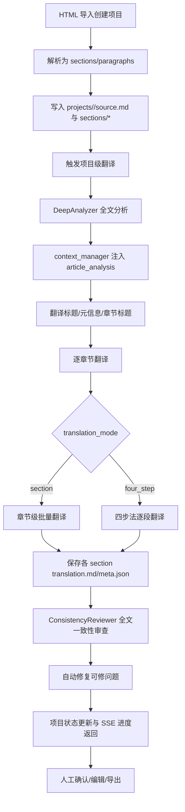
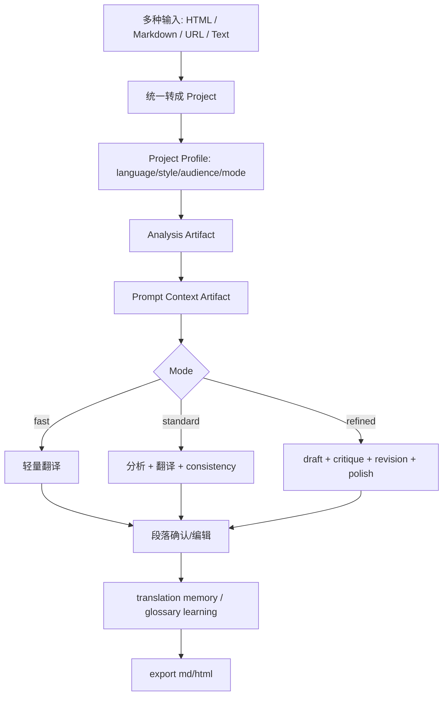

# 本项目与 baoyu-translate 的翻译流程对比与建议

更新时间：2026-03-07

## 目的

本文对比两个对象：

1. 你的项目 `translation_agent` 当前真实存在的翻译流程
2. `C:\Users\DELL\.agents\skills\baoyu-translate` 定义的翻译工作流

目标不是判断谁“更好”，而是回答 3 个更有用的问题：

- 你的项目现在到底在怎么翻译
- 它和 `baoyu-translate` 的差异在哪里
- 哪些设计值得借鉴，哪些不应该照搬

这份文档是在阅读本项目代码和前一份 skill 研究文档基础上整理的。若只想先看结论，直接看第 4 节和第 7 节。

## 1. 一句话结论

`baoyu-translate` 更像“单篇文档翻译工作流模板”，核心是显式产物链和多阶段精修。

你的项目更像“项目化翻译协作系统”，核心是：

- HTML 导入与结构化分段
- 章节/段落级持久化
- 人工确认与状态流转
- glossary、术语冲突和翻译记忆
- 项目级批量翻译与导出

因此，两者并不是一一对应关系。

更准确的说法是：

- `baoyu-translate` 强在“流程显式化”
- 你的项目强在“协作系统化”

对你的项目最有价值的，不是把 `baoyu-translate` 整套搬进来，而是吸收它的这几类能力：

- 明确的翻译产物链
- 项目级翻译配置画像
- 可升级的 refined 流程
- 更清晰的“快翻 / 标准翻 / 精修翻”产品分层

## 2. 本项目当前真实存在的翻译路径

你的项目不是只有一条翻译链路，而是至少有 4 类入口。

## 2.1 工具型文本翻译

入口：

- `src/api/routers/tools_translate.py`

特点：

- 面向短文本
- 自动用正则粗略判断中英文
- 直接拼 prompt 调 LLM
- 不做项目持久化
- 不做分析、审校、修订产物

这条链路对应的是“工具翻译”，不是“项目翻译”。

## 2.2 帖子翻译与优化

入口：

- `src/api/routers/translate_posts.py`

特点：

- 面向帖子或短内容
- 有专门的 post prompt
- 有单独的 optimize 接口
- 允许 conversation history 作为优化上下文
- 仍然不属于项目级多阶段工作流

这条链路比工具翻译多了风格化 prompt，但仍然是轻量链路。

## 2.3 段落级交互翻译

入口：

- `src/api/routers/projects_paragraphs.py`
- `src/agents/translation.py`

特点：

- 面向项目中的单段或多段
- 会加载 project glossary
- 会注入 learned rules
- 会带前文已确认段落作为上下文
- 支持 direct translate、重译、确认、编辑回写

这条链路的核心是“人机协作改稿”，而不是“整篇文档一次跑完”。

## 2.4 项目级整篇翻译

入口：

- `src/api/routers/translate_projects.py`
- `src/services/batch_translation_service.py`
- `src/agents/deep_analyzer.py`
- `src/agents/four_step_translator.py`
- `src/agents/consistency_reviewer.py`

这是与你要比较的 `baoyu-translate` 最接近的一条主链路。

它又分成两个入口：

- `/projects/{project_id}/translate-stream`
- `/projects/{project_id}/translate-four-step`

其中真正更重的项目级流程是后者。

## 3. 本项目的主翻译流程到底怎么跑

如果只看“项目级全文翻译”，你的项目当前最接近的主流程可以概括为下面这条链。



## 3.1 输入与项目初始化

项目不是从 Markdown 开始，而是通常从 HTML 开始：

- `ProjectManager.create()` 会复制 `source.html`
- 通过 `HTMLParser` 拆成 sections 和 paragraphs
- 保存项目级 `source.md`
- 保存每个章节的 `source.md`、`translation.md`、`meta.json`

也就是说，你的项目是“先结构化，再翻译”。

这和 `baoyu-translate` 的“文件就是主对象”很不一样。

## 3.2 持久化模型

你的项目把状态保存在这些层级：

- `projects/<project_id>/meta.json`
- `projects/<project_id>/source.md`
- `projects/<project_id>/sections/<section_id>/source.md`
- `projects/<project_id>/sections/<section_id>/translation.md`
- `projects/<project_id>/sections/<section_id>/meta.json`
- `projects/<project_id>/output.md`
- `projects/<project_id>/output.html`
- `projects/<project_id>/preview.md`

其中最重要的不是单个 `translation.md`，而是：

- 段落对象里保存多次翻译记录
- `confirmed` 单独保存已确认版本
- `status` 记录段落当前阶段

这说明你的项目的状态中心是“结构化对象 + JSON”，不是“中间 Markdown 文件链”。

## 3.3 状态驱动而不是模式驱动

你的项目有一套比较明确的状态机：

- `ProjectStatus`: `created / analyzing / in_progress / reviewing / completed`
- `ParagraphStatus`: `pending / translating / translated / reviewing / modified / approved`

这带来的直接好处是：

- 支持人机协作
- 支持局部重译
- 支持断点续跑
- 支持人工确认后继续编辑

`baoyu-translate` 更强调“模式”和“产物链”；你的项目更强调“状态”和“协作链”。

## 3.4 项目级深度分析

在项目级重流程里，分析并不是可有可无的前置动作，而是主流程 Phase 0。

当前实现里：

- `BatchTranslationService.translate_project()` 会先调用 `deep_analyzer.analyze(project.sections)`
- `DeepAnalyzer` 会对整篇内容采样
- 调用 `llm.deep_analyze(...)`
- 生成 `ArticleAnalysis`
- 再额外批量分析 `section_roles`

分析内容包括：

- 文章主题
- 核心论点
- 结构摘要
- terminology
- style
- challenges
- guidelines
- 每个 section 在全文中的角色

这一点和 `baoyu-translate` 很像，说明你的项目已经具备“全文先理解再翻译”的能力。

## 3.5 上下文构建方式

这是本项目与 `baoyu-translate` 差异最大的地方之一。

`baoyu-translate` 的做法是：

- 把共享上下文显式写成 `02-prompt.md`

你的项目的做法是：

- 通过 `LayeredContextManager` 在运行时动态组装上下文

上下文分层包括：

- 全文级：theme、structure、guidelines、relevant terms
- 章节级：section role、前后章节标题
- 局部级：前文译文、后文 preview
- 动态级：术语实际使用记录、已定义缩写

再加上：

- learned rules
- glossary 相关术语筛选
- 可选的 previous_translation + instruction

最终由 `prompt_builder` 组装成一段 prompt，而不是单独落盘成文件。

## 3.6 实际翻译执行方式

这里你的项目分成两种主要路线。

### A. 章节级批量翻译

当 `BatchTranslationService.translation_mode == "section"` 时：

- 会把整个 section 拼成带段落 ID 的文本
- 调用 `llm.translate_section(...)`
- 一次性返回多个段落的 JSON 翻译结果
- 再按 paragraph id 回填到段落对象

这种方式更像“章节批处理”。

### B. 四步法逐段翻译

当 `translation_mode == "four_step"` 时：

- `FourStepTranslator.translate_section()` 会执行：
  - Understand
  - Translate
  - Reflect
  - Refine
- 对长章节再按 `paragraph_threshold` 分批
- 每段翻译时还会持续记录术语使用和上下文

这一条更接近 `baoyu-translate` 的 refined 设计，但它是“section 内四步”，不是“整篇文档 artifact 链四步”。

## 3.7 一致性审查

项目级翻译完成后，`BatchTranslationService` 还会调用：

- `ConsistencyReviewer.review(...)`

它检查：

- 术语一致性
- 风格一致性
- 交叉引用
- 数据一致性
- 标点一致性
- 专有名词一致性

然后：

- 可自动修的内容直接 auto-fix
- 不可自动修的内容保留为 manual review

这一点是你项目非常强的地方，甚至在某些方面比 `baoyu-translate` 更产品化。

## 3.8 人工确认与翻译记忆

你的项目不是“翻完就结束”，而是：

- 支持逐段确认
- 支持逐段重译
- 支持手工编辑
- 会把用户修订提炼为 translation rules
- 后续翻译时可通过 `memory_service.get_relevant_rules(...)` 反向注入 prompt

这相当于在系统里内建了“翻译后学习”。

`baoyu-translate` 的 `EXTEND.md` 更像“静态偏好 + 术语表”。

你的项目则多了一层：

- 从历史纠错中学习动态规则

这是你项目明显强于 skill 的点。

## 4. 与 baoyu-translate 的逐项对比

下表是最核心的差异摘要。

| 维度 | `baoyu-translate` | 你的项目 | 结论 |
| --- | --- | --- | --- |
| 主要对象 | 单篇文件/URL/内联文本 | 项目、章节、段落 | 范式不同，不能直接套 |
| 输入形态 | Markdown 文件优先 | HTML 导入优先，另有短文本接口 | 你的项目更像翻译工作台 |
| 默认配置 | `EXTEND.md` | `ProjectConfig` + glossary + memory + prompt 参数 | 你的配置更分散，skill 更集中 |
| 分析方式 | 显式 `01-analysis.md` | `DeepAnalyzer` 产出 `ArticleAnalysis` 对象 | 能力相似，落地形式不同 |
| prompt 组织 | 显式 `02-prompt.md` | `LayeredContextManager` + `prompt_builder` 动态拼接 | 你的运行时更灵活，审计性更弱 |
| 长文处理 | `chunk.ts` 做 Markdown AST 分块 | 先按 HTML/段落结构切，再按章节/段落批量处理 | 你的切分更结构化于 HTML，不适用于任意 Markdown 文件 |
| 模式设计 | `quick / normal / refined` | 多入口、多模式，但没有统一产品抽象 | 你的能力多，用户心智更复杂 |
| 精修流程 | `draft -> critique -> revision -> polish` 显式落盘 | `understand -> translate -> reflect -> refine` 主要在 section 内完成 | 你的流程更工程化，skill 更可见 |
| 一致性控制 | glossary + shared prompt + main agent review | term tracker + prescan + consistency reviewer + auto-fix | 你的项目更强 |
| 人工参与 | 正常模式后可升级 refine | 段落确认、编辑、版本、重译、缓存失效 | 你的项目明显更适合协作 |
| 中间产物 | 很多 Markdown 文件 | 主要是 `meta.json` / `translation.md` / 内存对象 | 你的审计产物不足 |
| 输出形式 | 单篇目录下的多文件结果 | 项目目录、section 目录、最终导出文件 | 你的输出更适合持续维护 |

## 4.1 本项目强于 baoyu-translate 的地方

这些能力不是 skill 的替代品，而是你项目已经做得更深的地方。

### 4.1.1 人机协作深度更高

你的项目有：

- 段落状态
- 确认机制
- 修改历史
- 批量与单段共存
- 局部重译

`baoyu-translate` 没有形成这样的协作状态机。

### 4.1.2 术语治理更完整

你的项目除了 glossary，还有：

- `DeepAnalyzer` 提取术语
- `LayeredContextManager` 跟踪实际使用
- prescan 发现新术语
- 冲突检测与解决
- consistency review 检查跨章节一致性

这套东西比 `baoyu-translate` 的静态 merge glossary 更完整。

### 4.1.3 翻译记忆是明显优势

`baoyu-translate` 的用户偏好主要来自 `EXTEND.md`。

你的项目额外支持：

- 从用户纠错中抽规则
- 从 reflection issue 中抽规则
- 按项目命名空间隔离 memory
- 翻译时回注 learned rules

这是非常有价值的系统资产，不应该被 file-only workflow 替代。

### 4.1.4 项目导出和持续维护能力更强

你的项目支持：

- `output.md`
- `output.html`
- `preview.md`
- section 级 source/translation/meta

这比 skill 的“翻译结果目录”更接近真实工作台。

## 4.2 baoyu-translate 强于本项目的地方

这些是最值得你借鉴的部分。

### 4.2.1 流程显式化更强

`baoyu-translate` 明确要求把这些步骤落盘：

- 分析
- prompt
- 初稿
- 批评
- 修订
- 最终稿

你的项目虽然内部也做了其中一部分，但大多存在于：

- Python 对象
- 内存上下文
- LLM 中间调用
- 最终回填结果

用户和开发者都很难复盘“这篇译文是怎么一步步出来的”。

### 4.2.2 模式定义更清晰

skill 的用户心智很简单：

- quick
- normal
- refined

你的项目目前模式分散在不同 API：

- tools translate
- post translate
- paragraph translate
- translate-stream
- translate-four-step
- direct-translate

从产品视角看，能力很多，但“模式边界”不够清晰。

### 4.2.3 文件级文档工作流更完整

`baoyu-translate` 天然支持：

- 文件
- URL
- inline text
- Markdown frontmatter
- 文档级 chunk

你的项目现在更偏：

- HTML 导入
- 项目化结构处理

如果未来要支持“用户丢一篇 md 给你直接出成品”，skill 的设计更接近目标。

### 4.2.4 refined 后半程更清楚

你的项目有：

- reflect
- refine
- consistency review

但这些步骤对外并不透明。

skill 的好处是把 refined 明确拆成：

- 诊断
- 修订
- 润色

这样更适合做人工复核和迭代。

## 5. 当前项目里最值得注意的几个结构性问题

这些问题不是“代码坏了”，而是“流程表达与系统行为有偏差”。

## 5.1 `/translate-four-step` 的命名与真实执行路径可能不一致

这是当前最值得优先处理的问题。

现象：

- `translate_projects.py` 中的 `/projects/{project_id}/translate-four-step` 接口会直接实例化 `BatchTranslationService`
- 但 `BatchTranslationService` 的默认 `translation_mode` 是 `"section"`
- 代码里只有当 `translation_mode != "section"` 时才走 `FourStepTranslator`

这意味着当前接口名虽然叫 `translate-four-step`，但正文段落翻译很可能默认仍走章节级批量翻译，而不是四步法逐段翻译。

影响：

- 用户预期和真实行为可能不一致
- 前端文案和后端实现可能语义漂移
- 后续调参与排障容易误判

这是一个高优先级建议项。

## 5.2 分析产物有两套，但没有统一

你项目里至少有两套分析路径：

- `AnalysisService`：给 analyze 接口写 `analysis.json`
- `DeepAnalyzer`：给项目级翻译生成 `ArticleAnalysis`，但不显式落盘成统一产物文件

结果是：

- 有“分析能力”
- 但没有统一的“分析产物协议”

这会带来维护成本：

- 用户看到的分析结果和批量翻译实际用的分析结果可能不是同一套
- 开发时不容易确定哪个分析才是主流程真相

## 5.3 prompt 关键上下文没有显式留痕

你项目的 prompt 实际很丰富：

- glossary
- learned rules
- previous paragraphs
- section role
- guidelines
- article theme

但这些都是运行时动态组装的。

问题不在于“动态组装不好”，而在于：

- 缺少可审计快照
- 缺少调试时的真凭据
- 很难回溯某次坏翻译到底是分析问题、规则问题还是 prompt 拼装问题

## 5.4 refined 能力存在，但用户心智不够清晰

从代码上看，你已经有很多 refined 能力：

- deep analysis
- understand
- reflect
- refine
- consistency review
- memory learning

但从产品心智上看，它们没有被组织成统一的：

- 快翻
- 标准翻
- 精修翻

这会让用户难以预测“某个入口到底会做多少事”。

## 5.5 文件级翻译 workflow 还不够完整

如果用户不是导入 HTML 项目，而是直接给你：

- 一个 Markdown 文件
- 一个 URL
- 一段长文本

你的项目目前没有像 `baoyu-translate` 那样自然的“文档级工作流目录”。

这不是 bug，但它限制了使用场景。

## 6. 我对你项目的建议

下面的建议按优先级排序。

## 6.1 P0：先修正语义漂移和流程可见性

### 建议 1：修正 `/translate-four-step` 的真实执行模式

建议二选一：

1. 真正让它传入 `translation_mode="four_step"`
2. 如果保留当前章节级模式，就重命名接口和前端文案

我的建议是优先选第 1 个，因为接口已经对外叫 four-step，语义上应当兑现。

### 建议 2：给项目级翻译增加显式 artifact 目录

建议新增类似：

```text
projects/<project_id>/artifacts/
  analysis.json
  section_roles.json
  translation_prompt.md
  consistency_report.json
  run-YYYYMMDD-HHMMSS/
    draft_snapshot.md
    consistency_report.json
```

如果要进一步借鉴 `baoyu-translate`，还可以是：

```text
projects/<project_id>/artifacts/runs/<run_id>/
  01-analysis.md
  02-prompt.md
  03-draft.md
  04-critique.md
  05-revision.md
```

这不会破坏你现有的 section/meta 架构，但会极大增强：

- 调试
- 可审计性
- 结果复盘
- 团队协作

### 建议 3：把“翻译画像”从分散配置收敛成一个统一对象

建议在 `ProjectConfig` 或单独 profile 文件里显式加入：

- target_language
- audience
- style
- annotation_policy
- translation_mode
- section_mode_threshold
- chunk_policy
- terminology_policy

这相当于把 `baoyu-translate` 的 `EXTEND.md` 思想，移植成更适合你项目的配置层。

不要原样照搬 `EXTEND.md` 的 blocking 首配流程。

更适合你的做法是：

- UI 表单或 API 字段设置默认 profile
- 项目级覆盖用户默认 profile

## 6.2 P1：把 refined 能力产品化，而不是只存在于内部类里

### 建议 4：把当前“内隐 refined”整理成显式模式

建议从产品上定义清楚三档：

- `fast`：轻量直译，少分析
- `standard`：全文分析 + 正常翻译 + consistency
- `refined`：analysis + draft + critique + revision + consistency + human review

这样能把现有多入口收束成更清晰的用户心智。

### 建议 5：把 `reflect / refine / consistency review` 的结果持久化

目前这些结果更多停留在对象或返回值中。

建议落盘至少两类信息：

- section 级 reflection 结果
- project 级 consistency 报告

最好用户在 UI 上也能看见：

- 哪一段因何被判定为低分
- 哪些问题被 auto-fix
- 哪些仍需人工 review

### 建议 6：加一个“标准翻 -> 继续精修”的续跑入口

这个设计可以直接借鉴 `baoyu-translate`：

- 用户先跑快速或标准翻译
- 如果结果方向对，再触发精修

这样比每次都跑最重流程更灵活。

## 6.3 P1：统一分析链和 prompt 资产

### 建议 7：统一 `AnalysisService` 与 `DeepAnalyzer` 的定位

建议明确其中一个成为：

- 项目级翻译的唯一正式分析入口

另一个要么：

- 退化为轻量辅助接口
- 要么复用同一底层分析对象

理想状态是：

- API analyze 接口看到的分析结果
- 项目级批量翻译实际使用的分析结果

来自同一条分析链，只是展示层不同。

### 建议 8：为动态 prompt 组装增加快照输出

你不一定要像 `baoyu-translate` 一样强制写 `02-prompt.md`。

但至少建议在项目级翻译运行时支持：

- 保存一次最终 prompt snapshot
- 或保存结构化 prompt context JSON

这对定位问题会非常有帮助。

## 6.4 P2：扩展输入能力，而不是放弃现有项目范式

### 建议 9：新增“文档模式”适配器，而不是改写项目主模型

如果你想吸收 `baoyu-translate` 的文件工作流，不建议把项目主模型改成 file-only。

更合理的做法是新增输入适配器：

- Markdown -> Project
- URL -> Markdown -> Project
- Plain text -> Virtual section -> Project

这样用户就能：

- 继续使用你的项目级协作系统
- 同时获得 skill 那种“丢文件就能翻”的入口

### 建议 10：如果要支持 Markdown 长文，再引入 AST 分块

当前你的切分优势在 HTML/paragraph 结构化。

如果未来支持 Markdown 原生输入，建议补上类似 `chunk.ts` 的能力：

- frontmatter 感知
- block 级切分
- headings/lists/code/tables 保真

但这应当是“新输入适配器”的能力，不是硬塞进现有 HTML 主链路。

## 6.5 P2：保留你项目已经很强的部分，不要为了借鉴 skill 而退化

这些能力我建议明确保留：

- paragraph confirmation
- history/version
- translation memory
- learned rules 注入
- glossary conflict resolution
- SSE progress
- section/source/translation/export 结构

原因很简单：

- 这些是你项目相对 `baoyu-translate` 的核心竞争力
- 它们直接面向真实协作和长期维护
- skill 没有提供对应级别的系统能力

## 7. 我建议你的目标状态是什么

如果让我给你的项目定义一个更稳的下一阶段目标，我会建议不是“变成 `baoyu-translate`”，而是：

成为一个具备显式 artifact 链的项目化翻译系统。

也就是把两者优点组合起来：

- 保留你现在的项目/章节/段落状态机
- 保留人工确认、翻译记忆、glossary 治理
- 引入 `baoyu-translate` 式的显式分析/审校/修订产物
- 把模式收束成清楚的产品层级

理想形态大致是：



## 8. 最终判断

如果只问一句“你的项目该不该照着 `baoyu-translate` 改”，我的答案是：

- 不该照搬
- 但非常值得吸收它的 artifact 化和模式化设计

更具体一点：

- 你的项目不缺翻译能力
- 也不缺一致性能力
- 真正缺的是“把这些能力组织成用户可理解、开发可审计的流程产物”

所以接下来最值得做的不是重写翻译器，而是：

1. 修正模式语义漂移
2. 增加显式 artifact
3. 收敛翻译模式心智
4. 统一分析链
5. 再考虑增加 Markdown/URL 适配器

## 9. 建议执行顺序

如果按最务实的路径，我建议你按这个顺序推进。

### 第一阶段

- 修复 `/translate-four-step` 与 `translation_mode` 的不一致
- 给项目级翻译落 `analysis`、`prompt snapshot`、`consistency report`
- 为 `ProjectConfig` 增加 language/style/audience/mode

### 第二阶段

- 统一 `AnalysisService` 和 `DeepAnalyzer`
- 给 refined 流程增加用户可见的 artifact 和升级入口
- 在前端把快翻/标准翻/精修翻的模式区分讲清楚

### 第三阶段

- 新增 Markdown/URL 输入适配器
- 在需要时引入 AST 分块
- 增加回归测试，覆盖长文和模式切换

---

如果你后续继续深挖，我建议下一份文档直接做成“落地改造方案”，具体到：

- 目录怎么改
- 哪几个 API 要调整
- 哪些字段要进 `ProjectConfig`
- 哪些 artifact 该存成 JSON，哪些该存成 Markdown
