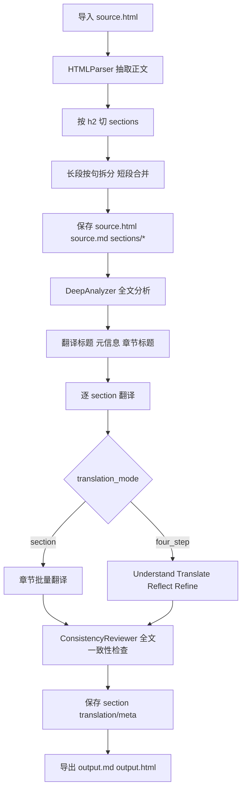
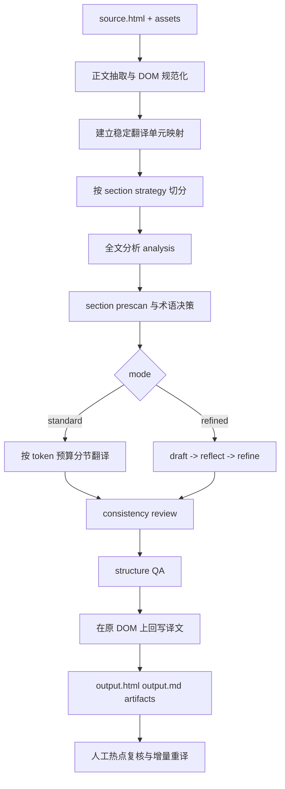

# 长文 HTML 翻译：本项目与 baoyu-translate 的流程对比与深入建议

更新时间：2026-03-07

## 0. 讨论范围

这份文档只讨论一个很窄但很重要的场景：

- 输入只有本地 `HTML` 文件
- 内容是长文，不是短文本
- 目标是把长文稳定翻译出来，并尽量保住原始 HTML 结构与可发布性

因此，下面会主动忽略这些能力：

- URL 输入
- Markdown 输入
- frontmatter 处理
- inline text 临时翻译
- 面向短文本的轻量接口

也就是说，这份文档不是在问“你的项目和 `baoyu-translate` 谁更全”，而是在问：

- 对“长文 HTML 翻译”这个目标，谁的设计更贴近问题本质
- 你的项目现在最该补的是哪一层
- 哪些 `baoyu-translate` 思路值得借鉴，哪些反而应该明确放弃

## 1. 收窄范围后的结论

如果你的目标已经明确为“只做长文 HTML 翻译”，那么你的项目当前的大方向其实比 `baoyu-translate` 更接近正确答案。

原因很直接：

- `baoyu-translate` 的核心对象是“文档文本”
- 你的项目的核心对象是“HTML 解析后的结构化项目”

而长文 HTML 翻译最难的地方，并不是把文本译出来，而是下面这些事：

- 怎么正确抽取正文，排除导航、页脚、推荐阅读、广告块
- 怎么按结构切分，而不是只按字数切分
- 怎么保住标题层级、列表、表格、图片、链接、锚点、脚注
- 怎么在长任务里断点续跑、局部重译、复盘问题
- 怎么导出成仍然“像原文页面”的 HTML，而不是只剩文本内容

所以，针对你的场景，最值得借鉴 `baoyu-translate` 的不是它的 Markdown chunking，也不是它的 `EXTEND.md`，而是这三件事：

- 显式 artifact 链
- 清楚的 `standard / refined` 分层
- 可复盘的分析、批评、修订过程

最不值得照搬的是这几件事：

- Markdown-first 的 `chunk.ts`
- frontmatter 导向的工作流
- URL / inline text 的统一入口
- 面向所有输入形态的通用设计

一句话说：  
你不该把项目改成 `baoyu-translate`，而应该把它升级成“HTML-first 的长文翻译系统”，并吸收 `baoyu-translate` 在 artifact 化和精修链路上的优点。

## 2. 你项目当前的长文 HTML 翻译流程

如果只看“长文 HTML 文件 -> 项目 -> 翻译 -> 导出”这条主链路，当前实现大致是这样的：



### 2.1 导入与结构化

当前导入阶段做得其实不差：

- 复制原始 `source.html`
- 复制同目录下可能存在的 `*_files` 资源目录
- 解析正文容器
- 抽取标题、元信息、图片、表格、代码、段落、列表项、引用块
- 写入项目目录与章节目录

这说明你已经在做“结构化翻译”，而不是“把 HTML 当纯文本翻”。

这是对的。

### 2.2 当前结构切分逻辑

当前切分大致有三层：

1. 按 `h2` 分 `section`
2. 单个过长段落按句子拆分
3. 连续短段落再做合并

这套逻辑在工程上简单有效，但对“长文 HTML 保真”来说，还不够精细。后面很多建议都会围绕这一点展开。

### 2.3 当前翻译执行逻辑

你的项目现在有两种主要的项目级翻译路径：

- `section`：整章批量翻译
- `four_step`：`Understand -> Translate -> Reflect -> Refine`

另外还有这些增强层：

- 全文级深度分析
- 章节预扫术语
- glossary / 术语冲突处理
- 一致性审查
- translation memory
- 人工确认与重译

从“文本质量控制”角度说，这套东西已经比 `baoyu-translate` 更系统。

### 2.4 当前导出逻辑

当前导出有两个方向：

- `output.md`
- `output.html`

但对长文 HTML 来说，真正关键的是 `output.html`。  
因为用户最终要的不是“译文文本”，而是“尽量保住结构和发布形态的 HTML 成品”。

而你目前最大的问题，恰恰出在这里。

## 3. 只看长文 HTML 时，你的项目和 baoyu-translate 的本质差异

| 维度 | `baoyu-translate` | 你的项目 | 对你的场景意味着什么 |
| --- | --- | --- | --- |
| 主对象 | 文档文本 | HTML 结构化项目 | 你的范式更适合长文 HTML |
| 切分基础 | Markdown AST / 文本块 | HTML 元素 / section / paragraph | 你的方向更对，但还不够细 |
| 中间产物 | 很显式 | 偏运行时对象 | 你更强执行，skill 更强复盘 |
| 长任务可恢复 | 中等 | 强 | 你更适合长文 |
| 人工确认 | 弱 | 强 | 你更适合长文迭代 |
| 导出保真 | Markdown 友好 | HTML 有潜力，但当前实现不足 | 这是你最该补的地方 |
| 模式表达 | 清晰 | 分散 | 你需要收敛到更少、更稳定的模式 |
| 精修链路 | 显式可见 | 内部存在但不够显式 | 应借鉴 skill 的 artifact 化 |

如果只看这个场景，结论已经很明确：

- 你的项目更适合作为底座
- `baoyu-translate` 更适合作为流程表达参考

## 4. 对 baoyu-translate 应明确“只借鉴、不迁移”的部分

针对你的场景，我建议你明确放弃下面这些迁移冲动。

### 4.1 不要迁移 Markdown chunking

`baoyu-translate` 的 `chunk.ts` 解决的是：

- Markdown block 切分
- frontmatter 分离
- 共享 prompt 下的 chunk 并行翻译

而你这里真正的问题不是 Markdown block，而是：

- DOM block
- 标题层级
- 列表容器
- 表格单元格
- 图片与标题/说明的绑定
- 锚点和内部引用

所以，对你来说，正确问题不是“要不要引入 `chunk.ts`”，而是：

- 要不要建立 HTML DOM 级翻译单元图

答案是：要。

### 4.2 不要迁移 frontmatter 思维

你的输入是 HTML，不是 Markdown 文档。

因此这些能力优先级很低：

- frontmatter 改写
- `sourceTitle/sourceUrl` 这类文档头部字段工程

对你更重要的是：

- HTML metadata 提取
- `<head>` 保留
- canonical / og / author / date 的映射
- 页面内标题、图注、脚注、引用链接的结构保持

### 4.3 不要把 URL/Markdown/inline text 入口做成近期重点

如果你的产品范围已经明确是“只翻 HTML 文件”，就不要让需求边界回到泛输入。

这类扩展会明显分散精力，而且会让你在最重要的 HTML fidelity 问题上欠账更多。

### 4.4 不要把 `quick` 作为长文 HTML 的主要模式

长文 HTML 的主要矛盾不是速度，而是：

- 结构保真
- 一致性
- 可恢复
- 可复盘

所以如果只做长文 HTML，我建议你对外最多暴露两档：

- `standard`
- `refined`

`fast` 可以保留在内部，不应该成为主产品心智。

## 5. 当前方案中，针对长文 HTML 最值得重视的深层问题

下面这些问题比“翻译 prompt 再改一点”更根本。

## 5.1 `output.html` 现在更像“重新拼了一份页面”，不是“在原 DOM 上回写译文”

这是当前最核心的问题。

你现在的 HTML 导出逻辑本质上是：

- 读取原始 HTML 的 `<head>`
- 新建一个 `<body>`
- 再按 `section -> paragraph` 重建 `h1/h2/p/li/blockquote/pre/table/img`

这会带来一串长文 HTML 特有的问题：

- 原页面的容器层级丢失
- 原始 class / id / data-* 属性丢失
- 内联链接、强调、行内代码无法可靠保留到译后 HTML
- 锚点和站内跳转关系容易断
- 注释、脚注、callout、embed 等自定义块容易被扁平化
- 列表项可能被直接输出成裸 `<li>`，而不再处于 `<ul>/<ol>` 容器中
- 原始样式依赖的 DOM 包裹层会消失

对于长文 HTML，这个问题比术语一致性还严重。  
因为它直接决定“译后 HTML 还能不能像原页面一样工作”。

## 5.2 当前切章固定写死为 `h2`，而 `ProjectConfig.segment_level` 又没有真正接上主流程

你模型里已经有：

- `segment_level`

但实际切章仍然是：

- 直接按 `h2`

这意味着现在存在明显的“配置语义漂移”：

- 配置层看起来支持切分级别
- 实际执行层并没有真正尊重它

对长文 HTML，这会造成两个问题：

- 没有 `h2` 的文章会被错误压成超大 intro section
- 某些 `h2` 下内容极长时，section 会膨胀得不利于翻译与复盘

## 5.3 当前长段切分和短段合并是“文本启发式”，不是“结构感知式”

当前主要用的是：

- `max_paragraph_length = 800`
- `_split_sentences()` 做句子切分
- `SHORT_PARAGRAPH_THRESHOLD = 150`
- `_merge_short_paragraphs()` 合并连续短段

对长文 HTML 来说，这里面有几个深层风险：

- 字符数不等于 token 数
- 英文技术文章里的句号不一定是可安全切句点
- 缩写、公式、编号、脚注引用会干扰切句
- 连续短段并不意味着应该合并

更重要的是，当前短段合并并不是严格结构安全的。  
它会把连续短文本块当作可合并对象，但在 HTML 里，短块经常是：

- 多个列表项
- 图注
- 小标题后的引导句
- 注释块
- 引文拆行

这些东西一旦被错误合并，翻译之后再导出，结构语义就会变差。

## 5.4 长段切分后会丢失精确的 `source_html` 绑定

当前过长段落在拆分后，新的子段落会变成：

- `source` 有值
- `source_html = None`

这对长文 HTML 是非常关键的问题。

因为一旦没有精确的 `source_html` 或 DOM 映射，你在导出阶段就只能：

- 用纯文本重新包一个 `<p>`

这样会丢掉：

- 原始内联链接
- 强调
- 行内代码
- 局部 span
- 页面内锚点
- 精细的 HTML 片段边界

这说明当前系统已经能“把文本拆开来翻”，但还不能“把译文稳定地写回原来的 HTML 结构”。

## 5.5 当前批量策略对长文还不够 token-aware

你现在的几个关键阈值是：

- 段落字符数
- 章节段落数
- 上下文窗口的固定段落数

典型表现包括：

- `paragraph_threshold = 8`
- `context_window_size = 3`
- `preview_size = 2`

这对长文技术文章会过于粗糙，因为：

- 8 个短段和 8 个超长技术段完全不是一个量级
- 表格、代码、列表、长引用块的 token 密度很不一样
- 某些跨节引用需要的上下文不是“前 3 段”，而是“前文首次定义该概念的段”

也就是说，你现在有上下文系统，但还没有真正的“长文检索式上下文”。

## 5.6 当前缺少 HTML 结构质量校验

你现在的一致性审查主要偏文本：

- 术语
- 风格
- 数字
- 标点
- 专有名词

但长文 HTML 还需要另一类质量门禁：

- 标题层级是否仍然正确
- 列表是否仍然成组
- 表格数量和单元格结构是否完整
- 图片数量和 `src` 是否有效
- 内部锚点是否仍可跳转
- 脚注前后链接是否成对
- 章节交叉引用是否失效

这类问题不会在纯文本 consistency review 里暴露出来。

## 5.7 当前正文抽取对“任意 HTML 文件”仍然偏脆弱

目前正文查找依赖少量 selector，如果没命中，就可能退回到更大的 HTML 范围。

这对“任意长文 HTML 文件”有两个风险：

- 误把导航、页脚、相关推荐带进项目
- 误把页面壳层而不是正文层当作内容源

如果你的输入会来自不同来源的离线 HTML，这个问题会越来越明显。

## 5.8 当前 artifact 不足，导致长文问题很难复盘

你现在有很多能力，但缺少长文项目真正需要的“运行证据”：

- 这次全文分析到底得出了什么
- 每个 section 最终吃到的 prompt 上下文是什么
- 哪个 section 经过了 refine，为什么 refine
- consistency 到底修了哪些段
- export 之后结构 QA 结果如何

长文任务一旦出问题，没有 artifact，就很难把“翻译质量问题”和“HTML 结构问题”分开定位。

## 6. 更深入、更聚焦于长文 HTML 的建议

下面的建议只为你的场景服务，不再讨论泛输入。

## 6.1 P0：把“DOM 保真”提升为第一原则

### 建议 1：建立稳定的 HTML 翻译单元映射，而不是只保存 `source` 文本

我建议你把每个可翻译块都建成稳定映射对象，至少包含：

- `node_id`
- `dom_path`
- `tag_name`
- `parent_node_id`
- `section_id`
- `ordinal_in_parent`
- `source_text`
- `source_html`
- `normalized_text_hash`
- `list_group_id`
- `table_id / row / col`
- `anchor_id`

核心思想是：

- 翻译对象不是“字符串”
- 翻译对象是“DOM 中某个稳定位置上的可翻译块”

只有这样，后续这些能力才好做：

- 增量重译
- 精确回写
- 结构校验
- 变更追踪

### 建议 2：把 `output.html` 改成“原 DOM 回写模式”，不要继续“重建 body”

这是我认为最该优先落地的一项。

正确方向不是：

- 根据段落对象重新拼 HTML

而是：

- 解析原始 DOM
- 找到映射好的可翻译节点
- 只替换这些节点内部对应的文本或子块
- 保留原页面的 DOM 骨架、容器、属性、class、id、资源引用

这样会立刻解决一大批长文 HTML 问题：

- 列表容器不丢
- 锚点不丢
- 样式挂载点不丢
- 自定义 block 不被扁平化
- head/body 结构更稳定

### 建议 3：把“结构保真”从导出问题前移到解析阶段

你现在在解析阶段已经识别：

- `p`
- `li`
- `blockquote`
- `pre`
- `table`
- `img`

但对长文 HTML 来说，我建议继续细分翻译单元类型，至少考虑补上：

- `figcaption`
- `caption`
- `th`
- `td`
- `sup` / 脚注引用
- `footnote_item`
- `callout`
- `summary`

这样做的收益是：

- 翻译策略可以按块类型定制
- 结构 QA 可以更细
- 导出回写也更准确

### 建议 4：严禁跨结构边界做短段合并

如果你继续保留 `_merge_short_paragraphs()` 这个优化，我建议把规则改严：

- 不合并不同 `element_type`
- 不合并 `li`
- 不合并图注
- 不合并表格相关块
- 不合并脚注
- 不跨 `heading_chain` 边界合并

更进一步的建议是：

- 只允许合并连续普通段落 `p`
- 且这些段落有相同父容器、相同结构角色、相近语义密度

否则长文 HTML 的结构语义会被越翻越平。

## 6.2 P0：修正长文切分与模式语义

### 建议 5：让 section 切分从“写死 h2”升级为“可配置 + 自适应”

你当前最适合的不是把 section 策略做成完全通用，而是做成这类有限但实用的策略：

- `h2_only`
- `h2_then_h3_if_oversize`
- `content_density_adaptive`

其中第二种很适合你现在：

- 默认按 `h2`
- 如果某个 `h2` section 过大，再按 `h3` 二次切

这会比“整篇固定 h2”更稳。

另外，`ProjectConfig.segment_level` 要么真正接入主流程，要么删掉，避免配置层和执行层继续漂移。

### 建议 6：把所有阈值改成 token-aware，而不是字符数和段落数

建议至少新增几类预算：

- `max_unit_tokens`
- `max_batch_tokens`
- `max_section_tokens`
- `context_budget_tokens`

并对不同块类型给权重，例如：

- 普通段落：1x
- 列表项：0.8x
- 引用：1x
- 表格单元格：1.5x
- 代码块：保护或跳过

对长文技术文章来说，这比简单的：

- 800 字符
- 8 个段

可靠得多。

### 建议 7：修正 `/translate-four-step` 的真实执行语义

这个建议在你收窄范围后仍然是 `P0`。

原因很简单：

- 如果长文主打标准翻和精修翻
- 那么“精修入口的语义必须是真的”

否则前端、后端、人工评估都会错位。

## 6.3 P0 / P1：补上长文必须具备的 artifact 链

### 建议 8：为每次长文运行保存完整 artifact

我建议你新增类似目录：

```text
projects/<project_id>/artifacts/runs/<run_id>/
  00-source-manifest.json
  01-dom-map.json
  02-analysis.json
  03-section-plan.json
  04-prompt-context.json
  05-section-prescan.json
  06-draft/
  07-reflection/
  08-consistency.json
  09-structure-qa.json
  10-export-manifest.json
```

对长文 HTML，这些 artifact 的价值非常直接：

- `source-manifest`：记录源文件、资源目录、基础统计、hash
- `dom-map`：记录翻译单元与 DOM 的映射
- `analysis`：记录全文分析
- `section-plan`：记录 section 切分策略和原因
- `prompt-context`：保留最终上下文快照
- `section-prescan`：记录术语增量和冲突
- `draft`：保留分节初稿
- `reflection`：保留每节诊断
- `consistency`：保留全文一致性问题
- `structure-qa`：保留 HTML 结构层的校验结果
- `export-manifest`：记录最终导出产物和版本

### 建议 9：把 refined 流程显式化，但只保留两档用户模式

如果你的场景只有长文 HTML，我建议对外统一成：

- `standard`：`analysis + translate + consistency + export`
- `refined`：`analysis + draft + reflect + refine + consistency + structure QA + export`

不要再让用户在多入口 API 之间猜测差异。

同时也不要把 `fast` 作为主入口。

## 6.4 P1：补上 HTML 专属质量门禁

### 建议 10：新增结构 QA，而不是只做文本 consistency

建议至少检查：

- 标题数量与层级变化
- 列表容器与列表项数量
- 表格数量与维度
- 图片数量与 `src`
- 锚点定义与引用关系
- 脚注引用与脚注条目数量
- 内链是否仍然可跳
- 关键 DOM 容器是否保留

这套 QA 和文本 consistency 一样重要。

### 建议 11：为不同 HTML 块定义不同翻译策略

建议显式定义：

- 段落：正常翻译
- 列表项：保持并列句式与节奏
- 图注：短句、信息密度高、术语锁定
- 表头/单元格：数字、单位、缩写优先锁定
- 代码块：通常不翻
- 行内代码：通常不翻
- 锚点文本：谨慎翻
- 脚注：保留引用关系

长文 HTML 不是“所有块都是 paragraph”。

### 建议 12：把“内联元素保留”从 source markdown 展示能力升级为译后 HTML 能力

你现在已经会抽取：

- link
- strong
- em
- inline code

但这层信息更多用在源文本恢复上，而不是译后 HTML 回写。

我建议把它升级成：

- 译后仍能保留链接
- 译后仍能保留强调
- 译后仍能保留行内代码
- 译后仍能保留 anchor / title 属性

这一步和 DOM 回写设计是配套的。

## 6.5 P1：让长文真的可增量、可恢复、可维护

### 建议 13：加“源 HTML 指纹 -> section / unit 失效”的增量重译机制

这对长文非常值。

建议至少做三层 fingerprint：

- 文件级 hash
- section 级 hash
- 翻译单元级 hash

当 HTML 更新时，不要整篇重来，而是：

- 定位新增块
- 定位修改块
- 定位移动块
- 只失效相关 section 和相关 consistency 报告

这会极大提升长文迭代效率。

### 建议 14：把 review 从“平均逐段审”升级为“热点优先审”

长文最怕 reviewer 被平均摊平。

更好的做法是先把高风险段挑出来，例如：

- reflection 分数低
- consistency 命中多
- 含新增术语
- 含表格/图注/脚注
- 含交叉引用

这样人工精力用得更值。

## 6.6 P1 / P2：提升任意 HTML 的正文抽取稳健性

### 建议 15：在 HTMLParser 前增加“正文抽取层”

当前 parser 已经能工作，但对于来源杂的 HTML，建议再补一层：

- boilerplate removal
- DOM density scoring
- site-specific adapter

最务实的落地方式不是一下做通用阅读器，而是：

1. 保留现有 selector 机制
2. 再增加一层正文候选打分
3. 对高频来源做定制 adapter

这比单纯继续堆 selector 更稳。

## 7. 我建议你的目标状态

我不建议你的项目“变成一个支持所有输入形态的翻译器”。

我建议它变成：

一个以 HTML DOM 为核心对象、支持长文标准翻与精修翻、具备显式 artifact 链和结构保真导出的翻译系统。

理想形态大致如下：



这个目标状态和 `baoyu-translate` 的关系应该是：

- 借它的 artifact 和 refined 思路
- 明确坚持你自己的 HTML-first 路线

## 8. 建议执行顺序

如果按收益和风险排序，我建议这样推进。

### 第一阶段：先修最影响成品质量的点

- 把 `output.html` 改成 DOM 回写模式
- 为翻译单元建立稳定的 DOM 映射
- 禁止跨结构边界合并短段
- 让 `segment_level` 真正生效，或替换成新的 section strategy
- 修正 `/translate-four-step` 的真实执行语义

### 第二阶段：让长文任务可复盘、可控、可恢复

- 引入 run artifact 目录
- 引入 token-aware 预算
- 引入结构 QA
- 引入源 HTML fingerprint 与增量重译

### 第三阶段：把系统做成真正适合长期维护的长文平台

- 建立热点优先 review
- 增加更细的块类型与翻译策略
- 增强正文抽取层
- 增强长距离引用检索与上下文召回

## 9. 最终判断

在“只做长文 HTML 翻译”这个前提下，你现在最不该做的事是：

- 去追 Markdown 通用性
- 去追 URL / inline text 统一入口
- 去把项目改成 file-only workflow

你现在最该做的事是：

1. 把 HTML 结构保真能力补齐
2. 把长文 artifact 链补齐
3. 把 section / batching / context 做成 token-aware
4. 把 refined 流程对外显式化
5. 把导出从“重建 HTML”升级成“回写原 DOM”

如果把这 5 件事做对，你的项目在这个细分场景下，会比 `baoyu-translate` 更有产品价值，也更有技术壁垒。
