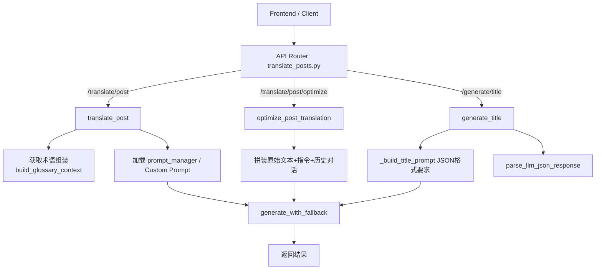

# 帖子翻译完整链路与 Prompt 地图

更新时间：2026-03-13

## 1. 先看哪里

理解帖子（Post）翻译的整体逻辑，只需要查阅以下核心文件：

1. API 路由入口和核心流程约束：`src/api/routers/translate_posts.py`
2. 主翻译 Prompt：`src/prompts/post_translation.txt`
3. 术语获取工具：`src/api/utils/glossary.py`
4. 底层模型通信：`src/api/utils/llm_factory.py` (专注于 `generate_with_fallback`)

帖子翻译没有像长文那样的分段逻辑或者“深层阶段审查”，追求的是一个 `Request In` -> `Prompt Rendering` -> `LLM` -> `Result Out` 的单步强同步闭环。

---

## 2. 系统设计图

### 组件路由图

---

## 3. 链路详情分析

### 3.1 基础翻译链路 `/translate/post`

**职责：** 从原文一步到位直接生成高锐度、高密度、纯正的分析师姿态社交媒体推文/短帖。

**时序：**
1. 接收 `PostTranslateRequest`（含 content文本，以及可选项 custom_prompt）。
2. 调用 `build_glossary_context(request.content)`，基于字符匹配获取当前帖子应该遵守的术语表。
3. **Prompt 处理**：
   - 如果用户自带 `custom_prompt`，对 `{content}` 和 `{glossary}` 做简单字符串替换。
   - 否则从 `prompt_manager` 取取名 `post_translation` 的模板文件，注入参数。
4. 调用 `generate_with_fallback`，启用超时（默认 `POST_TRANSLATE_TIMEOUT` 60s）。
5. 直接返回 string 内容给前端。

### 3.2 优化翻译链路 `/translate/post/optimize`

**职责：** 用户通过指令引导或批评的方式对已经输出的翻译进行二次返工，强调微调和修改。

**时序：**
1. 接收 `PostOptimizeRequest`（含 `original_text`, `current_translation`, 可选的 `instruction` 或 `option_id`，以及最多前 3 轮的 `conversation_history`）。
2. 调用内部方法 `resolve_post_optimize_instruction`。如果是自带预设指令的 `option_id`（如 `readable`, `idiomatic`, `professional`），则转换成对应的预设文本模板。
3. 把历史轮次序列化拼接为一段文本类型的 Context：`User: ...` / `AI: ...`。
4. 将上下文同内联式 Prompt （Inline Prompt）拼装。内联 Prompt 中写死了针对改写任务的最高指令（**消除翻译腔、保留锐度、严控长度**），并将解析后的指令注入到 `## 优化要求` 中。
5. 调用 `generate_with_fallback` 执行模型推理，同样在 60s （`POST_OPTIMIZE_TIMEOUT`）超时内阻塞等待结果。
6. 返回修改后的译文文本。

### 3.3 标题生成链路 `/generate/title`

**职责：** 为翻译好的图文/帖子一键生产 6 种具有传播效能的不同角度中文标题。

**时序：**
1. 接收 `GenerateTitleRequest`。
2. 调用内部方法 `_build_title_prompt` 组装内联式 Prompt。这里不仅传达了“忠实事实且具吸引力”的原则，还通过结构化手段约束了输出（必须返回固定 key 的 JSON）。
3. 调用 `generate_with_fallback`。超时设置为 30s (`POST_TITLE_TIMEOUT`)，这更紧凑因为生成的 Token 少。
4. 拿到模型返回值后，走 `parse_llm_json_response(result)` 做 JSON 解析容错。
5. 把 `suspense`, `data`, `counter_intuitive`, `pain_point`, `minimal`, `metaphor` 的各个标题内容抽取到一个字符串列表中。
6. 以换行 `\n` 进行 join 之后返回。

---

## 4. 活跃 Prompt 注册表

| 类别 | 逻辑名 / 路径 | 适用端点 | 加载方式 | 输出形式 |
| --- | --- | --- | --- | --- |
| 翻译 | `src/prompts/post_translation.txt` | `/translate/post` | 文件加载 `prompt_manager.get` / 自定义替换 | 纯文本 |
| 优化 | `optimize_post_translation` 内部文本 | `/translate/post/optimize` | 硬编码 Inline Prompt | 纯文本 |
| 标题 | `_build_title_prompt` 方法 | `/generate/title` | 硬编码 Inline Prompt | `{"suspense":"", ...}` 的 JSON 对象 |
