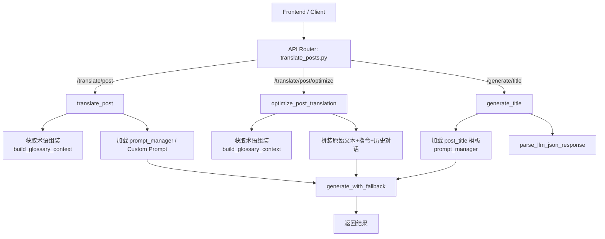

# 帖子翻译完整链路与 Prompt 地图

更新时间：2026-04-15

## 1. 先看哪里

理解帖子（Post）翻译的整体逻辑，只需要查阅以下核心文件：

1. API 路由入口和核心流程约束：`src/api/routers/translate_posts.py`
2. 主翻译 Prompt：`src/prompts/post_translation.txt`
3. 术语获取工具：`src/api/utils/glossary.py`
4. LLM 配置系统：`src/llm/config_loader.py`
5. LLM Provider 适配器：`src/llm/provider_adapter.py`

帖子翻译没有像长文那样的分段逻辑或者”深层阶段审查”，追求的是一个 `Request In` -> `Prompt Rendering` -> `LLM` -> `Result Out` 的单步强同步闭环。

相关阅读：
- [LLM模块系统手册](./LLM模块系统手册.md) - 模型配置、故障转移、Provider 管理
- [帖子翻译技术手册](./帖子翻译技术手册.md) - 技术细节和 Prompt 设计

---

## 2. 系统设计图

### 组件路由图

---

## 3. 链路详情分析

### 3.1 基础翻译链路 `/translate/post`

**职责：** 从原文一步到位直接生成高锐度、高密度、纯正的分析师姿态社交媒体推文/短帖。

**时序：**
1. 接收 `PostTranslateRequest`（含 content文本，以及可选项 custom_prompt）。
2. 调用 `build_glossary_context(request.content)`，基于字符匹配获取当前帖子应该遵守的术语表。
3. **Prompt 处理**：
   - 如果用户自带 `custom_prompt`，对 `{content}` 和 `{glossary}` 做简单字符串替换。
   - 否则从 `prompt_manager` 取取名 `post_translation` 的模板文件，注入参数。
4. 调用 `generate_with_fallback`，启用超时（默认 `POST_TRANSLATE_TIMEOUT` 60s）。
5. 直接返回 string 内容给前端。

### 3.2 优化翻译链路 `/translate/post/optimize`

**职责：** 用户通过指令引导对已有译文进行整段优化，去除翻译腔。

**时序：**
1. 接收 `PostOptimizeRequest`（含 `original_text`, `current_translation`, 可选的 `instruction` 或 `option_id`）。
2. 调用内部方法 `resolve_post_optimize_instruction`。如果是自带预设指令的 `option_id`（如 `readable`, `idiomatic`, `professional`），则转换成对应的预设文本模板。
3. 调用 `build_glossary_context(request.original_text)` 获取术语约束。
4. 通过 `prompt_manager` 加载 `post_optimize` 模板文件，注入术语、原文、当前译文和优化指令。
5. 调用 `generate_with_fallback` 执行模型推理，在 60s （`POST_OPTIMIZE_TIMEOUT`）超时内阻塞等待结果。
6. 返回优化后的译文文本。

### 3.3 标题生成链路 `/generate/title`

**职责：** 为翻译好的图文/帖子一键生产 8 个不同角度的中文标题（6 个指定维度 + 2 个自由发挥）。

**时序：**
1. 接收 `GenerateTitleRequest`。
2. 通过 `prompt_manager` 加载 `post_title` 模板文件，注入内容正文和用户指令（无指令时使用默认值）。模板通过结构化手段约束了输出（必须返回固定 key 的 JSON）。
3. 调用 `generate_with_fallback`。超时设置为 30s (`POST_TITLE_TIMEOUT`)，这更紧凑因为生成的 Token 少。
4. 拿到模型返回值后，走 `parse_llm_json_response(result)` 做 JSON 解析容错。
5. 把 `suspense`, `data`, `counter_intuitive`, `pain_point`, `minimal`, `contrast`, `free_1`, `free_2` 的各个标题内容抽取到一个字符串列表中。
6. 以换行 `\n` 进行 join 之后返回。

---

## 4. 活跃 Prompt 注册表

| 类别 | 逻辑名 / 路径 | 适用端点 | 加载方式 | 输出形式 |
| --- | --- | --- | --- | --- |
| 翻译 | `src/prompts/post_translation.txt` | `/translate/post` | 文件加载 `prompt_manager.get` / 自定义替换 | 纯文本 |
| 优化 | `src/prompts/post_optimize.txt` | `/translate/post/optimize` | 文件加载 `prompt_manager.get` | 纯文本 |
| 标题 | `src/prompts/post_title.txt` | `/generate/title` | 文件加载 `prompt_manager.get` | `{"suspense":"", ...}` 的 JSON 对象 |
