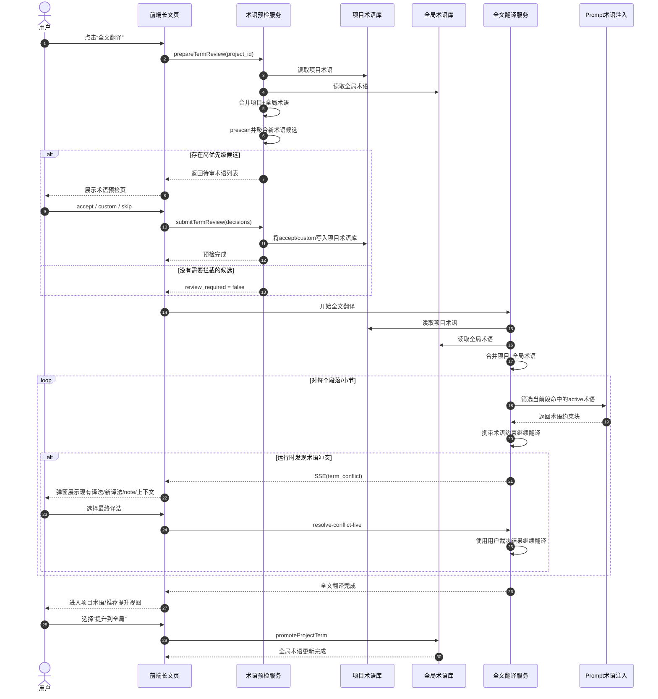

# 术语库系统手册
更新时间：2026-04-07

本文档专门描述当前仓库中“术语库”这一套能力的真实实现，覆盖数据模型、存储结构、接口、运行时优先级、前端管理入口、推荐提升、批量操作、标签体系、调试方法和维护边界。

相关阅读：
- [长文翻译技术手册](./长文翻译技术手册.md)
- [长文翻译链路](./长文翻译链路.md)

上面两份文档会提到术语库，但粒度仍然属于“长文翻译总链路”的一部分；本文档只聚焦术语库本身，并以当前代码为准。

---

# 一、文档范围与边界

## 1.1 本文覆盖的内容

1. 持久化术语库的数据模型与字段语义。
2. 全局术语和项目术语的文件结构、读写、合并与覆盖规则。
3. 全局术语 API、项目术语 API、批量接口、推荐提升接口。
4. 前端统一术语中心的入口、视图结构和管理能力。
5. 长文翻译、确认流、帖子翻译对术语库的真实使用方式。
6. 标签、状态、来源字段的真实语义。
7. 排障思路、维护建议和扩展边界。

## 1.2 本文不重点展开的内容

1. 长文翻译 Prompt 模板的写法。
2. 四步法全文分析 prompt 的术语抽取提示词设计。
3. 学习链路自身的 prompt 细节。

这些内容请回到：
- [长文翻译技术手册](./长文翻译技术手册.md)
- [长文翻译链路](./长文翻译链路.md)

## 1.3 一个重要边界

当前仓库里和“术语”相关的东西其实有两类：

1. 持久化术语库：真正写进 JSON 文件、可跨请求复用的术语。
2. 运行时候选术语：来自全文分析、prescan、术语审阅等链路的临时候选，不一定立刻写入术语库。

本文档的主角是第一类，也会解释第二类如何回流到第一类，但不会把两者混为一谈。

---

# 二、术语库的核心概念

## 2.1 三层术语来源

当前系统中，和“术语”相关的来源层次如下：

1. 全局术语
   - 作用域：跨项目、跨帖子翻译复用。
   - 默认文件：[../glossary/global_glossary_semi.json](../glossary/global_glossary_semi.json)
2. 项目术语
   - 作用域：仅当前长文项目。
   - 默认文件：`projects/<project_id>/glossary.json`
3. 运行时候选术语
   - 来源：全文分析、section prescan、术语审阅。
   - 主要落在项目 `artifacts` 或运行时上下文中。
   - 不等于“已经入库”。

## 2.2 当前真实优先级

持久化术语库层面的优先级非常简单：

`项目术语 > 全局术语`

实现入口在：
- [src/core/glossary.py](../src/core/glossary.py)

如果进入的是长文高级链路，运行时还可能叠加全文分析或 Prescan 产出的术语候选；那部分是长文翻译链路的额外层，不是持久化术语库本体。

## 2.3 什么叫“同名术语”

系统用 `original.lower()` 做主键比较：

- `TSMC`
- `tsmc`
- `Tsmc`

这三种会被视为同一条术语。

对应实现：
- [src/core/models/glossary.py](../src/core/models/glossary.py)

这意味着：
1. 添加同名术语会覆盖旧值，而不是并存。
2. 大小写变化不会形成新纪录。
3. 如果你想表达不同上下文的不同译法，不能只靠大小写区分。

---

# 三、数据模型

## 3.1 `GlossaryTerm`

定义文件：
- [src/core/models/glossary.py](../src/core/models/glossary.py)

当前字段如下：

| 字段 | 类型 | 是否必填 | 含义 | 当前真实用法 |
|---|---|---|---|---|
| `original` | `str` | 是 | 原文术语 | 主键，大小写不敏感匹配 |
| `translation` | `Optional[str]` | 否 | 目标译法 | `preserve` 时可为空 |
| `strategy` | `TranslationStrategy` | 否 | 翻译策略 | `preserve` / `preserve_annotate` / `first_annotate` / `translate` |
| `note` | `Optional[str]` | 否 | 词义说明 | 进入 prompt 时渲染为”词义”，用于避免一词多义误译 |
| `tags` | `List[str]` | 否 | 分类标签 | 用于管理、筛选、分组，不参与匹配优先级 |
| `first_occurrence` | `Optional[str]` | 否 | 首次出现位置信息 | 当前主要用于审阅/提升链路保留元数据 |
| `scope` | `str` | 否 | 作用域 | 当前真实值应为 `global` 或 `project` |
| `source` | `str` | 否 | 来源 | 常见值：`manual`、`term_review`、`promoted_from_project` |
| `status` | `str` | 否 | 状态 | 当前真实值：`active` / `disabled` |
| `updated_at` | `datetime` | 否 | 更新时间 | 每次更新或批量操作会刷新 |

## 3.2 `TranslationStrategy`

策略定义来自：
- [src/core/models/enums.py](../src/core/models/enums.py)

当前真实语义：

| 值 | 语义 | 典型表现 | 示例 |
|---|---|---|---|
| `preserve` | 保留原文 | 全文保留英文原文，不翻译不解释 | `AMD` → 全文写”AMD” |
| `preserve_annotate` | 保留原文+首次注释 | 首次出现保留原文并括号注中文，后续只保留原文 | `TSMC` → 首次写”TSMC（台积电）”，后文写”TSMC” |
| `first_annotate` | 首次标注 | 首次出现用中文并括号注原文，后续只用中文 | `TSMC` → 首次写”台积电（TSMC）”，后文写”台积电” |

`GlossaryManager.apply_strategy()` 完整支持四种策略：`preserve`、`preserve_annotate`、`first_annotate`、`translate`，根据 `is_first_occurrence` 参数决定首现行为。
| `translate` | 翻译 | 全文直接使用中文翻译 | `wafer` → 全文写”晶圆” |

## 3.3 `Glossary`

定义文件：
- [src/core/models/glossary.py](../src/core/models/glossary.py)

这是术语表容器，只有两个字段：

1. `version`
2. `terms`

它自带两个核心方法：

1. `get_term(original)`
   - 大小写不敏感查找。
2. `add_term(term)`
   - 同名则覆盖，不同名则追加。

## 3.4 一个容易忽略的事实

`Glossary.add_term()` 的覆盖是“整条覆盖”，不是字段级 merge。

也就是说，如果你拿一条同名术语重新写入：
- `translation`
- `strategy`
- `note`（词义说明）
- `tags`
- `status`

最终会以新对象为准，而不是只改其中一个字段。

字段级更新逻辑是在 API 层先复制旧对象，再按请求 patch，最后整体写回。

补充说明：
- API / JSON / CSV 字段名仍然是 `note`
- 前端统一术语中心把它显示为“词义说明”
- 导出的 Markdown 术语表列头也显示为“词义说明”

---

# 四、物理存储结构

## 4.1 目录结构

```text
project_root/
├── glossary/
│   └── global_glossary_semi.json
├── projects/
│   └── <project_id>/
│       ├── glossary.json
│       └── artifacts/
│           └── term-review/
│               └── latest.json
```

## 4.2 全局术语文件

默认全局文件：
- [../glossary/global_glossary_semi.json](../glossary/global_glossary_semi.json)

当前系统只有这一份全局术语文件，没有“领域切换”这一层概念。

这意味着当前“全局术语管理”固定操作这个默认文件。

## 4.3 项目术语文件

项目术语文件固定是：
- `projects/<project_id>/glossary.json`

特点：
1. 每个项目独立一份。
2. 没有项目文件时，`load_project()` 返回空术语表，而不是报错。
3. 第一次保存项目术语时，目录会自动创建。

对应实现：
- [src/core/glossary.py](../src/core/glossary.py)

## 4.4 审阅工作区文件

术语审阅准备阶段会写入：
- `projects/<project_id>/artifacts/term-review/latest.json`

它不是正式术语库，而是“待审候选集”。

对应实现：
- [src/services/terminology_review_service.py](../src/services/terminology_review_service.py)

## 4.5 规则库边界说明

当前实现中，规则库已经不再向术语库输出候选文件。规则提取 Prompt 明确禁止输出术语型规则，术语候选的来源以全文分析、prescan 和术语审阅链路为准。

---

# 五、加载、保存与规范化

## 5.1 `GlossaryManager` 是唯一核心入口

定义文件：
- [src/core/glossary.py](../src/core/glossary.py)

依赖注入入口：
- [src/api/dependencies.py](../src/api/dependencies.py)

当前 API 层通过 `GlossaryManagerDep` 注入单例，不应该在各路由里自己 new 新实例。

## 5.2 加载流程

### 全局加载

`load_global()`

行为：
1. 读取全局文件 `glossary/global_glossary_semi.json`
2. 如果文件不存在，返回空 `Glossary()`
3. 读取后立刻做 normalize
4. 强制默认 `scope=global`

### 项目加载

`load_project(project_id)`

行为：
1. 读取 `projects/{project_id}/glossary.json`
2. 如果文件不存在，返回空 `Glossary()`
3. 读取后立刻做 normalize
4. 强制默认 `scope=project`

## 5.3 保存流程

### `save_global()`

行为：
1. 保存前再次 normalize
2. 自动 `version += 1`
3. 覆盖写回全局文件 `glossary/global_glossary_semi.json`

### `save_project()`

行为：
1. 保存前再次 normalize
2. 自动 `version += 1`
3. 自动创建项目目录
4. 覆盖写回 `projects/{project_id}/glossary.json`

## 5.4 normalize 具体做了什么

核心函数：
- `normalize_glossary_tags()`
- `infer_glossary_tags()`
- `normalize_glossary_term()`
- `normalize_glossary()`

定义文件：
- [src/core/glossary.py](../src/core/glossary.py)

### 5.4.1 字段清洗

保存或加载时会自动：
1. `original.strip()`
2. `translation.strip()`
3. `note.strip()`
4. `first_occurrence.strip()`
5. 统一补全 `scope`
6. 统一补全 `source`
7. 统一补全 `status`

### 5.4.2 标签清洗

`normalize_glossary_tags()` 的行为：
1. 去掉首尾空格。
2. 去掉空字符串。
3. 用小写做去重键。
4. 保留第一次出现的显示形式。

例子：

```json
[" AI ", "ai", "company", ""]
```

会变成：

```json
["AI", "company"]
```

### 5.4.3 自动补标签

如果术语没有标签，系统会尝试按默认半导体分类自动推断标签。

推断函数：
- `infer_glossary_tags(original)`

当前默认标签组定义在：
- [src/core/glossary.py](../src/core/glossary.py)

现有标签组包括：

1. `company`
2. `manufacturing`
3. `chip`
4. `packaging`
5. `memory`
6. `ai`
7. `performance`
8. `business`
9. `general`

说明：
1. 一个术语可以有多个标签。
2. 标签只用于管理，不改变匹配逻辑。
3. 当前内置推断词表以半导体术语为主。

## 5.5 合并流程

核心函数：
- `merge(global_glossary, project_glossary)`
- `load_merged(project_id)`

规则：
1. 先把全局术语全部放进去。
2. 再把项目术语逐条 `add_term()`。
3. 同名时，项目术语覆盖全局术语。

这套规则是当前长文/确认流最核心的术语优先级来源。

## 5.6 版本号语义

`Glossary.version` 每次 `save_global()` 或 `save_project()` 都会自动递增。

它当前主要用于：
1. 表示文件被修改过。
2. 给下游缓存失效或刷新判断提供信号。

注意：
- 版本号不是数据库事务号。
- 不是“某条术语”的版本。
- 是整份 glossary 文件的版本。

## 5.7 默认回退术语表

函数：
- `create_default_global_glossary()`

定义文件：
- [src/core/glossary.py](../src/core/glossary.py)

它的作用不是替代正式全局文件，而是作为特定场景下的兜底默认值。当前明确用到的地方是：
- `/projects/{project_id}/glossary/match`

如果：
1. 项目合并术语为空
2. 全局术语也为空

那么会回退到内置默认半导体术语表做匹配。

---

# 六、当前术语文件里的真实层级

## 6.1 全局层

全局层就是：
- [../glossary/global_glossary_semi.json](../glossary/global_glossary_semi.json)

这个文件当前会影响：
1. 帖子翻译
2. 长文翻译中的全局基线术语
3. 确认流重翻和项目翻译中的全局基线术语
4. 项目术语推荐提升后的落点

## 6.2 项目层

项目层就是：
- `projects/<project_id>/glossary.json`

它的作用不是复制一份完整全局术语，而是承载：
1. 当前项目新增术语
2. 当前项目对全局术语的覆盖项
3. 审阅接受后的项目术语

## 6.3 推荐提升层不是第三个存储层

前端看到的“推荐提升”只是一个工作视图，不是第三份 glossary 文件。

它的本质是：
1. 从项目术语里找出高频、值得沉淀为全局规范的条目。
2. 用户点击后，调用“提升到全局”。
3. 最终写回的仍然是全局术语文件。

---

# 七、全局术语 API

定义文件：
- [src/api/routers/glossary.py](../src/api/routers/glossary.py)

## 7.1 路由总览

| 方法 | 路径 | 作用 |
|---|---|---|
| `GET` | `/glossary` | 读取全局术语表 |
| `POST` | `/glossary` | 新增或覆盖全局术语 |
| `PUT` | `/glossary/terms/{original}` | 更新单条全局术语 |
| `DELETE` | `/glossary/terms/{original}` | 删除单条全局术语 |
| `POST` | `/glossary/batch` | 批量操作全局术语 |

## 7.2 `POST /glossary`

请求体：

```json
{
  "original": "TSMC",
  "translation": "台积电",
  "strategy": "first_annotate",
  "note": "Taiwan Semiconductor Manufacturing Company",
  "tags": ["company"],
  "status": "active"
}
```

行为：
1. 如果同名术语已存在，不报错，直接覆盖。
2. 返回 `replaced` 字段，表示是否覆盖了旧术语。
3. `scope` 会被强制写成 `global`。
4. 如果 `tags` 为空，会尝试自动推断标签。

## 7.3 `PUT /glossary/terms/{original}`

行为：
1. 路径参数按当前实现直接匹配现有术语名。
2. 请求体是 patch 语义，不需要传全字段。
3. 只要字段出现在请求体里，就会写回并刷新 `updated_at`。

## 7.4 `DELETE /glossary/terms/{original}`

行为：
1. 删除的是全局标准术语本身。
2. 所有依赖全局术语的场景都会受到影响。
3. 同名判断大小写不敏感。

## 7.5 `POST /glossary/batch`

批量动作枚举：

1. `delete`
2. `set_status`
3. `set_strategy`
4. `add_tags`
5. `replace_tags`
6. `remove_tags`

请求示例：

```json
{
  "originals": ["HBM", "CoWoS"],
  "action": "add_tags",
  "tags": ["priority", "ai"]
}
```

注意：
1. `delete` 只返回 `matched_count`，`updated_count` 会是 `0`。
2. `set_status` 必须带 `status`。
3. `set_strategy` 必须带 `strategy`。
4. 标签类动作必须带非空 `tags`。

---

# 八、项目术语 API

定义文件：
- [src/api/routers/project_glossary.py](../src/api/routers/project_glossary.py)

## 8.1 路由总览

| 方法 | 路径 | 作用 |
|---|---|---|
| `GET` | `/projects/{project_id}/glossary` | 读取项目术语视图 |
| `PUT` | `/projects/{project_id}/glossary` | 新增项目术语 |
| `PUT` | `/projects/{project_id}/glossary/terms/{original}` | 更新单条项目术语 |
| `DELETE` | `/projects/{project_id}/glossary/terms/{original}` | 删除单条项目术语 |
| `POST` | `/projects/{project_id}/glossary/batch` | 批量操作项目术语 |
| `POST` | `/projects/{project_id}/glossary/check-conflict` | 保存前冲突检测 |
| `POST` | `/projects/{project_id}/glossary/match` | 段落术语匹配 |
| `GET` | `/projects/{project_id}/glossary/recommendations` | 获取推荐提升列表 |
| `POST` | `/projects/{project_id}/glossary/terms/{original}/promote` | 提升到全局 |

## 8.2 `GET /projects/{project_id}/glossary` 的特殊行为

这个接口返回的不是“项目文件原始内容的机械转储”，而是“项目术语可见视图”。

它会过滤掉一类条目：
- 项目术语文件中存在
- 但内容与同名全局术语完全一致
- 只是在项目里留下了一个继承种子

过滤条件比较以下字段：
1. `translation`
2. `strategy`
3. `note`（词义说明）
4. `tags`
5. `status`

如果都一样，就不返回给前端。

这就是为什么“项目术语”页看到的通常不是完整全局展开，而是：
1. 项目新增术语
2. 项目对全局的覆盖项

## 8.3 `PUT /projects/{project_id}/glossary`

行为：
1. 新增项目术语。
2. `scope` 强制写成 `project`。
3. `source` 默认写成 `manual`。
4. `tags` 为空时自动推断。

## 8.4 `PUT /projects/{project_id}/glossary/terms/{original}`

行为：
1. 更新已有项目术语。
2. 如果找不到同名项目术语，会报 `404`。
3. 不会隐式创建全局层条目。

## 8.5 `DELETE /projects/{project_id}/glossary/terms/{original}`

行为：
1. 删除的是项目层覆盖项。
2. 不会删除全局术语。
3. 删除后，如果全局层存在同名术语，运行时会重新回落到全局术语。

## 8.6 `POST /projects/{project_id}/glossary/batch`

支持的动作与全局批量接口一致：

1. `delete`
2. `set_status`
3. `set_strategy`
4. `add_tags`
5. `replace_tags`
6. `remove_tags`

语义差别只有一个：
- 它只作用于项目文件里的条目，不动全局文件。

## 8.7 `POST /projects/{project_id}/glossary/check-conflict`

作用：
1. 按 `original` 检查项目层和全局层是否已有同名术语。
2. 如果同名但 `translation` 不同，就返回冲突列表。

返回结构里会带：
1. `scope`
2. `existing_translation`
3. `existing_strategy`
4. `existing_note`（已有词义说明）

## 8.8 `POST /projects/{project_id}/glossary/match`

作用：
1. 加载项目+全局合并术语。
2. 对当前段落做术语匹配。
3. 返回匹配分数和匹配类型。

边界行为：
1. 如果项目+全局都空，回退到内置默认半导体术语表。
2. 返回的 `match_type` 可能是 `exact` 或 `partial`。

---

# 九、术语审阅与推荐提升

核心服务：
- [src/services/terminology_review_service.py](../src/services/terminology_review_service.py)

## 9.1 `prepare_review`

输入：
- `project_id`

流程：
1. 读取项目 section。
2. 读取项目+全局合并术语。
3. 对每个 section 做 prescan。
4. 聚合 `new_terms`。
5. 合并规则中提取出的术语候选。
6. 生成候选 payload。
7. 写入 `artifacts/term-review/latest.json`。

输出里每个候选会带：
1. `term`
2. `suggested_translation`
3. `reasons`
4. `occurrence_count`
5. `related_sections`
6. `contexts`
7. `similar_terms`

## 9.2 `apply_review`

行为：
1. 接收前端决策：`accept` / `custom` / `skip`
2. 对 accept/custom 的项写入项目术语文件
3. 写入时：
   - `scope=project`
   - `source=term_review`
   - `status=active`
4. 如果已有项目同名术语，沿用旧的策略/标签或进行推断

## 9.3 推荐提升逻辑

接口：
- `GET /projects/{project_id}/glossary/recommendations`

生成规则：
1. 只看项目术语里的 `active` 且有 `translation` 的条目。
2. 如果全局已经有同名且同译法，就不推荐。
3. 统计项目中实际使用次数。
4. 使用次数 `< 2` 不推荐。

当前阈值定义：
- `HIGH_FREQUENCY_THRESHOLD = 2`

## 9.4 相似术语推荐

审阅 payload 中会带 `similar_terms`，帮助用户判断是否与现有术语冲突或重复。相似术语计算会自动排除与候选术语完全相同的 glossary 条目，避免自身出现在推荐列表中。
如果相似术语条目自身带 `note`，前端会显示为”词义说明”，帮助判断是不是同形异义。

当前参数：
1. `SIMILARITY_THRESHOLD = 0.45`
2. `MAX_SIMILAR_TERMS = 3`

## 9.5 提升到全局

接口：
- `POST /projects/{project_id}/glossary/terms/{original}/promote`

行为：
1. 从项目术语里读取目标术语。
2. 构造新的全局术语。
3. 保留：
   - `original`
   - `translation`
   - `strategy`
   - `note`（词义说明）
   - `tags`
   - `first_occurrence`
   - `status`
4. 改写：
   - `scope=global`
   - `source=promoted_from_project`
5. 写回全局术语文件。

---

# 十、术语在运行时是怎么被使用的

## 10.1 使用矩阵

| 场景 | 是否使用术语库 | 使用哪一层 |
|---|---|---|
| 文档页普通全篇翻译 `translate-stream` | 是 | 项目+全局合并 |
| 项目 section 批量翻译 | 是 | 项目+全局合并 |
| 确认流重翻 | 是 | 项目+全局合并 |
| 段落术语匹配 | 是 | 项目+全局合并，必要时回退默认内置术语 |
| 帖子翻译 `POST /translate/post` | 是 | 仅全局术语 |
| 帖子优化 `POST /translate/post/optimize` | 当前不是从术语库注入 | 仅 prompt 内写死原则 |
| Slack / 工具箱 | 当前统一共用术语中心入口 | 运行时术语消费未在本文范围内确认 |

## 10.2 长文普通翻译

入口：
- [src/api/routers/translate_projects.py](../src/api/routers/translate_projects.py)

行为：
1. `gm.load_merged(project_id)`
2. 构造 `TranslationContext(glossary=glossary)`
3. `TranslationAgent` 通过 `src/core/glossary_prompt.py` 的 `select_glossary_terms_for_text()` 只选择当前段落命中的 `active` 术语
4. 再交给 `render_glossary_prompt_block()` 统一渲染为 prompt 里的术语约束块
5. 如果调用方设置了 `TranslationContext.term_usage`，`first_annotate` / `preserve_annotate` 术语会根据使用记录动态降级，避免重复加注

### 10.2.1 四步法术语首次出现追踪

四步法批翻（链路 B/C）通过 `LayeredContextManager.term_tracker`（`TermUsageTracker`）在内存中追踪术语使用。`_translate_batch` 在每个段落翻译完成后立即调用 `record_translation()` 更新 tracker（`translate_section` 不再重复调用），确保同一章节内后续批次能感知前面批次的术语使用情况。断点续传场景下，`batch_translation_service._prepopulate_term_tracker()` 在全文分析完成后扫描所有已译段落，为 `first_annotate` / `preserve_annotate` 术语预填充 tracker，确保跳过的已译章节中的术语使用记录不丢失。

### 10.2.2 四步法实时术语冲突

入口：
- [src/api/routers/translate_projects.py](../src/api/routers/translate_projects.py)
- [src/services/batch_translation_service.py](../src/services/batch_translation_service.py)

行为：
1. section prescan 发现同名术语译法冲突时，先构造 `TermConflict`
2. 后端通过 SSE 发送 `type=term_conflict`
3. payload 会带：
   - `existing_translation`
   - `new_translation`
   - `existing_note` / `new_note`
   - `existing_context` / `new_context`
4. 前端冲突对话框将 `note` 显示为“词义说明”
5. 用户选择后，后端更新运行时术语版本并继续翻译

## 10.3 确认流重翻

入口：
- [src/api/routers/confirmation_translation.py](../src/api/routers/confirmation_translation.py)

行为：
1. `get_combined_glossary(project_id)`
2. 放进 `TranslationContext(glossary=glossary)`
3. 调用 `build_term_usage_from_project()` 扫描当前段落之前的所有已译段落，构建 `term_usage`（仅追踪 `first_annotate` / `preserve_annotate` 策略的术语），注入 `TranslationContext.term_usage`
4. 重翻前同样只筛当前段落命中的术语
5. 重翻单段时，已在前文出现过的 `first_annotate` / `preserve_annotate` 术语不再重复加注

这里的 `get_combined_glossary()` 实际也是”项目覆盖全局”的同一规则。

## 10.4 帖子翻译

入口：
- [src/api/routers/translate_posts.py](../src/api/routers/translate_posts.py)

行为：
1. `build_glossary_context(source_text)`
2. 内部读取全局术语文件 `glossary/global_glossary_semi.json`
3. 只取 `active` 且在当前帖子正文中实际命中的条目
4. 英文/缩写术语会按词边界再校验一层，避免 `AI` 这类短词误命中普通单词片段
5. 按统一上限 `MAX_GLOSSARY_TERMS_IN_PROMPT = 30` 截断
6. 通过 `render_glossary_prompt_block()` 把术语格式化进 prompt

当前格式化器在：
- [src/core/glossary_prompt.py](../src/core/glossary_prompt.py)
- [src/api/utils/glossary.py](../src/api/utils/glossary.py)

输出会带统一术语约束块，例如：

```text
## 术语约束（仅列出当前文本命中的术语，必须优先遵守）
- 原文：TSMC；标准写法：台积电；要求：首次出现写”台积电（TSMC）”，后文写”台积电”
- 原文：AMD；标准写法：AMD；要求：保留英文原文，不加注释
- 原文：CoWoS；标准写法：CoWoS（先进封装技术）；要求：首次出现写”CoWoS（先进封装技术）”，后文写”CoWoS”
```

## 10.5 帖子优化

入口：
- [src/api/routers/translate_posts.py](../src/api/routers/translate_posts.py)

当前真实行为：
1. 不调用 `build_glossary_context()`。
2. 不读取全局或项目 glossary 文件。
3. 只是 prompt 里写死一段术语处理原则。

这点非常重要，因为很多人会误以为“帖子优化”也吃术语库；当前实现不是。

---

# 十一、前端统一术语中心

## 11.1 路由与入口

前端术语中心路由：
- [web/frontend/src/router.tsx](../web/frontend/src/router.tsx)

路径：
- `/glossary`

右上角统一入口：
- [web/frontend/src/components/layout/AppLayout.tsx](../web/frontend/src/components/layout/AppLayout.tsx)

行为：
1. 所有主 tab 共用同一个右上角书本按钮。
2. 如果当前在长文页并且存在 `currentProjectId`，按钮会把 `projectId` 和 `scope=project` 带到 `/glossary`。
3. 如果当前在确认页，也会带当前 `projectId`。
4. 如果当前在帖子页、Slack、工具箱，没有项目上下文，就只打开全局术语视图。

## 11.2 页面组件

统一术语中心组件：
- [web/frontend/src/features/glossary/index.tsx](../web/frontend/src/features/glossary/index.tsx)（路由入口）
- [web/frontend/src/features/glossary/GlossaryCenter.tsx](../web/frontend/src/features/glossary/GlossaryCenter.tsx)（主组件）

长文页直接复用同一个 `GlossaryCenter`，并默认打开项目术语 tab，不再保留额外兼容壳组件。

## 11.3 当前前端视图结构

如果没有项目上下文：
1. 只显示 `全局术语`

如果有项目上下文：
1. `项目术语`
2. `全局术语`
3. `推荐提升`

## 11.4 当前管理能力

术语中心目前支持：

1. 搜索
2. 状态筛选
3. 策略筛选
4. 标签筛选
5. 排序
6. 表格视图
7. 按标签分组视图
8. 行级编辑
9. 新建术语
10. 删除术语
11. 多选
12. 批量启用 / 停用
13. 批量改策略
14. 批量加标签 / 替换标签 / 移除标签
15. 项目术语提升到全局
16. `note` 字段在 UI 中显示为“词义说明”，用于解释当前语境下为什么这样翻

## 11.5 当前 query 参数

`/glossary` 页面当前会消费这些 query 参数：

| 参数 | 含义 |
|---|---|
| `from` | 返回来源路由 |
| `projectId` | 当前项目 ID |
| `projectTitle` | 当前项目标题，可选 |
| `scope` | 默认打开哪个 scope：`project` / `global` / `recommendations` |

---

# 十二、标签系统

## 12.1 标签的定位

标签是“管理辅助信息”，不是匹配算法的一部分。

它当前用于：
1. 筛选
2. 分组浏览
3. 批量管理
4. 识别术语类别

它当前不用于：
1. 改变术语优先级
2. 改变 prompt 注入顺序
3. 决定 term matcher 分数

## 12.2 当前默认标签组

定义位置：
- [src/core/glossary.py](../src/core/glossary.py)

当前内置类别：
1. `company`
2. `manufacturing`
3. `chip`
4. `packaging`
5. `memory`
6. `ai`
7. `performance`
8. `business`
9. `general`

## 12.3 标签自动推断的触发点

当前会自动补标签的地方：

1. `GlossaryManager.load_global()` / `save_global()`
2. `GlossaryManager.load_project()` / `save_project()`
3. `GlossaryManager.import_from_file()`
4. 全局新增术语 API
5. 项目新增术语 API
6. 术语审阅写入项目术语

## 12.4 标签不是树结构

当前标签是扁平字符串列表：

- 没有父子层级
- 没有颜色配置
- 没有独立标签表
- 没有标签权限模型

这意味着现在的“分类”本质上是自由标签，不是 taxonomy 系统。

---

# 十三、状态与来源字段

## 13.1 `status`

当前真实值：
1. `active`
2. `disabled`

语义：
- `active`：参与 prompt 注入、导出和大多数运行时逻辑。
- `disabled`：保留在库里，但通常不参与运行时 prompt。

例子：
- `build_glossary_context()` 只取 `active` 条目。
- `GlossaryManager.to_dict()` / `to_list()` 也会过滤 `active`。

## 13.2 `source`

当前常见来源值：

| 值 | 含义 |
|---|---|
| `manual` | 人工在术语管理里新增或修改 |
| `term_review` | 术语审阅接受或自定义写入 |
| `promoted_from_project` | 从项目术语提升到全局 |

说明：
- 这不是严格 enum，目前是字符串。
- 现阶段主要用于溯源和后续维护，不直接影响匹配逻辑。

---

# 十四、导入导出能力

定义位置：
- [src/core/glossary.py](../src/core/glossary.py)

## 14.1 当前支持的格式

### 导入 `import_from_file()`

支持：
1. JSON
2. CSV

CSV 字段当前支持：
1. `original`
2. `translation`
3. `strategy`
4. `note`
5. `tags`

### 导出 `export_to_file()`

支持：
1. JSON
2. CSV

## 14.2 当前边界

这些方法目前是核心层能力，不是完整的 UI/REST 产品能力。

也就是说：
1. 后端核心支持导入导出。
2. 当前统一术语中心前端还没有完整的导入导出入口。
3. 如果需要暴露给用户，还要补 API 和前端交互。

---

# 十五、当前默认全局数据集说明

默认全局数据文件：
- [../glossary/global_glossary_semi.json](../glossary/global_glossary_semi.json)

当前这份文件的定位是：
1. 当前系统默认的全局标准术语集（内容以半导体术语为主）
2. 帖子翻译默认术语来源
3. 长文翻译的全局基线术语来源

当前已经做过以下清理与规范化：
1. `scope` 统一为 `global`
2. 全部条目带 `tags`
3. 前导/尾随空白被清理
4. 默认公司策略做过区分：部分公司名用 `first_annotate`，部分缩写或品牌名用 `preserve`

如果后续你要继续扩展这份文件，应该优先遵守：
1. 不要在全局文件里写 `scope=project`
2. 不要留下前导空格原文
3. 尽量给出明确标签
4. `preserve` 时允许 `translation=null`

---

# 十六、常见误解与真实语义

## 16.1 “项目术语页为什么不是完整的全局+项目展开？”

因为项目接口会过滤掉“和全局完全一样的继承种子”，只展示项目新增或项目覆盖项。

## 16.2 “删除项目术语会不会把全局术语删掉？”

不会。

删除项目术语只会删：
- `projects/<project_id>/glossary.json` 里的覆盖项

运行时如果全局还有同名术语，会回落到全局条目。

## 16.3 “帖子翻译和帖子优化都吃术语库吗？”

不是。

1. 帖子翻译吃全局术语。
2. 帖子优化当前不直接读取术语库。

## 16.4 “标签会改变翻译优先级吗？”

不会。

标签只影响管理视图，不影响运行时优先级。

## 16.5 “推荐提升是不是第三份术语库存储？”

不是。

它只是项目术语里高频条目的推荐视图，最终落点仍然是全局术语文件。

---

# 十七、调试与排障清单

当你怀疑某条术语“没有生效”时，按这个顺序查：

## 17.1 先确认它到底在哪一层

1. 全局：[../glossary/global_glossary_semi.json](../glossary/global_glossary_semi.json)
2. 项目：`projects/<project_id>/glossary.json`

## 17.2 确认状态是不是 `active`

如果是 `disabled`，很多运行时路径都会直接过滤掉。

## 17.3 确认 `original` 有没有脏空格

虽然当前保存会 normalize，但如果你手动改文件，还是要检查：
- 前导空格
- 尾随空格
- 异常大小写期待

## 17.4 确认使用场景到底读的是哪一层

1. 长文翻译：项目+全局
2. 确认流：项目+全局
3. 帖子翻译：全局
4. 帖子优化：当前不直接读术语库

## 17.5 确认是不是被项目层覆盖了

如果全局术语已经改了，但长文项目里同名项目术语还在，那么运行时会优先使用项目术语。

## 17.6 确认前端看到的项目术语是不是被过滤了

如果项目接口判断它和全局完全一致，就不会在“项目术语”页返回它，但运行时仍然会有全局条目。

## 17.7 确认是不是 prompt 注入链路没走

尤其是帖子优化，不要误判为“术语库失效”；它当前就是没走 glossary 注入。

---

# 十八、维护建议

## 18.1 修改数据文件时的原则

1. 优先通过 API 或术语中心改，不要直接手改 JSON。
2. 如果必须手改，改完至少检查：
   - `scope`
   - `status`
   - `tags`
   - `original` 是否有空白
3. 不要在全局文件里混入项目条目。

## 18.2 扩展全局术语体系时的原则

如果将来要把默认全局术语从“半导体为主”扩到更多行业：

1. 先明确这是否仍然共用同一份全局文件。
2. 再补充标签推断表。
3. 再评估是否需要把标签体系拆得更细。

## 18.3 设计上下一步最值得做的事情

1. 为导入导出补 REST API 和前端入口。
2. 给项目术语加“覆盖了哪个全局术语”的可视化提示。
3. 给标签增加统计视图和折叠导航。
4. 把帖子优化也接入 glossary context，而不是只写死 prompt 原则。

---

# 十九、代码索引

如果你要直接改代码，优先从这里进入：

## 19.1 核心模型

- [src/core/models/glossary.py](../src/core/models/glossary.py)

## 19.2 核心管理器

- [src/core/glossary.py](../src/core/glossary.py)

## 19.3 依赖注入

- [src/api/dependencies.py](../src/api/dependencies.py)

## 19.4 全局术语 API

- [src/api/routers/glossary.py](../src/api/routers/glossary.py)

## 19.5 项目术语 API 与推荐提升

- [src/api/routers/project_glossary.py](../src/api/routers/project_glossary.py)
- [src/services/terminology_review_service.py](../src/services/terminology_review_service.py)

## 19.6 Prompt 注入工具

- [src/core/glossary_prompt.py](../src/core/glossary_prompt.py) — 术语筛选 + prompt 渲染统一入口
- [src/api/utils/glossary.py](../src/api/utils/glossary.py) — 帖子翻译术语上下文构建

## 19.7 长文翻译使用入口

- [src/api/routers/translate_projects.py](../src/api/routers/translate_projects.py)
- [src/api/routers/confirmation_translation.py](../src/api/routers/confirmation_translation.py)

## 19.8 帖子翻译使用入口

- [src/api/routers/translate_posts.py](../src/api/routers/translate_posts.py)

## 19.9 前端统一术语中心

- [web/frontend/src/features/glossary/index.tsx](../web/frontend/src/features/glossary/index.tsx)（路由入口）
- [web/frontend/src/features/glossary/GlossaryCenter.tsx](../web/frontend/src/features/glossary/GlossaryCenter.tsx)（主组件）
- [web/frontend/src/features/glossary/components/TermTable.tsx](../web/frontend/src/features/glossary/components/TermTable.tsx)（术语表格）
- [web/frontend/src/features/glossary/components/TermEditor.tsx](../web/frontend/src/features/glossary/components/TermEditor.tsx)（术语编辑器）
- [web/frontend/src/features/glossary/components/BatchActionsBar.tsx](../web/frontend/src/features/glossary/components/BatchActionsBar.tsx)（批量操作栏）
- [web/frontend/src/features/glossary/components/RecommendationsList.tsx](../web/frontend/src/features/glossary/components/RecommendationsList.tsx)（推荐提升列表）
- [web/frontend/src/components/layout/AppLayout.tsx](../web/frontend/src/components/layout/AppLayout.tsx)
- [web/frontend/src/router.tsx](../web/frontend/src/router.tsx)

---

# 二十、术语库如何和人交互

这一章不再从“数据结构”视角描述术语库，而是从“用户在产品中实际会经历什么”来讲。

当前这套系统里，术语库和人的交互不是单点，而是四类闭环：

1. 人直接维护术语库。
2. 人在全文翻译前确认高优先级新术语。
3. 人在全文翻译过程中实时裁决术语冲突。
4. 人在项目完成后把成熟项目术语提升为全局标准。

换句话说，系统不是简单把术语“塞进 prompt”，而是在几个关键节点把人拉进来做决策，然后再把决策反哺回术语库。

## 20.1 先记住一条主线

按当前实现，术语库和人的分工大致是：

1. 人负责定义标准。
2. 系统负责发现候选、提示风险、执行匹配、注入 prompt。
3. 当系统无法自动决定时，把选择权交还给人。
4. 人的选择最终写回项目术语或全局术语，变成后续可复用规则。

所以它本质上是一套“术语治理闭环”，不是单纯的静态词表。

## 20.2 第一层交互：人直接维护术语库

最直接的人机交互入口是统一术语中心：

- 前端入口：[../web/frontend/src/features/glossary/GlossaryCenter.tsx](../web/frontend/src/features/glossary/GlossaryCenter.tsx)

统一术语中心同时管理三种视图：

1. 项目术语
2. 全局术语
3. 推荐提升

用户在这里可以直接做：

1. 新建术语
2. 编辑术语
3. 删除术语
4. 改 `strategy`
5. 改 `status`
6. 维护 `note`（前端显示为“词义说明”）
7. 打标签
8. 批量启用、停用、改策略、加标签、删标签、删除

对应实现：

- [../web/frontend/src/features/glossary/GlossaryCenter.tsx](../web/frontend/src/features/glossary/GlossaryCenter.tsx)
- [../src/api/routers/project_glossary.py](../src/api/routers/project_glossary.py)
- [../src/api/routers/glossary.py](../src/api/routers/glossary.py)

这一层的真实语义是：

1. 人显式定义“标准译法是什么”。
2. 系统只负责保存、规范化、覆盖和返回。
3. 只要保存成功，这条术语就会进入后续匹配和 prompt 注入链路。

## 20.3 第二层交互：全文翻译前的术语预检

这是当前最关键的一层人机交互。

在长文页里，用户点击全文翻译后，系统不会立刻开翻，而是先尝试准备术语预检：

- 前端触发入口：[../web/frontend/src/features/document/index.tsx](../web/frontend/src/features/document/index.tsx)
- 后端准备逻辑：[../src/services/terminology_review_service.py](../src/services/terminology_review_service.py)

当前真实流程是：

1. 先加载“项目术语 + 全局术语”的合并视图。
2. 把现有术语转成 `existing_terms`，供 prescan 避免重复提词。
3. 对每个 section 做术语 prescan。
4. 只聚焦还没入正式术语库的新候选。
5. 汇总出现次数、上下文、是否命中标题、建议译法。
6. 再把规则提取链路留下来的候选一起并进来。
7. 生成待审 payload，写入项目 `artifacts/term-review/latest.json`。

对应实现：

- [../src/services/terminology_review_service.py](../src/services/terminology_review_service.py)

用户在预检页能看到：

1. 术语原文
2. 建议译法
3. 出现次数
4. 上下文
5. 被拦截原因：标题命中 / 高频 / 存在歧义
6. 相似术语推荐
7. 相似术语已有的“词义说明”

前端页面：

- [../web/frontend/src/features/document/components/TerminologyReviewPage.tsx](../web/frontend/src/features/document/components/TerminologyReviewPage.tsx)

用户此时有三种操作：

1. `accept`
   - 采用系统建议译法
2. `custom`
   - 自己输入项目译法
3. `skip`
   - 本次翻译先跳过，不写入项目术语库

提交后，后端会把 `accept` 和 `custom` 的结果写入项目术语文件，并标记：

1. `scope=project`
2. `source=term_review`
3. `status=active`

而 `skip` 只表示“这次先不沉淀”，不会入库。

这一层的人机关系非常清楚：

1. 系统负责把“值得你确认的术语”挑出来。
2. 人负责做最终裁决。
3. 一旦裁决，项目术语库立刻变成后续全文翻译的依据。

## 20.4 第三层交互：翻译时按段自动使用人的标准

预检结束之后，并不是把整本术语库无差别塞给模型。

当前真实实现是：

1. 运行时先从当前段落里筛选真正命中的术语。
2. 只保留 `active` 条目。
3. 把这些条目渲染成 prompt 中的术语约束块。

对应实现：

- [../src/core/glossary_prompt.py](../src/core/glossary_prompt.py)

每条进入 prompt 的术语会带上：

1. `original`
2. `translation`
3. `strategy`
4. `note`

其中：

1. `strategy` 会决定是”保留原文””保留原文+首次注释””首次标注”还是”直接翻译”
2. `note` 会以“词义”的形式进入 prompt，用于帮助模型区分语境

所以这一层虽然用户不一定每次都点按钮，但本质仍然是人机交互的延续：

1. 人在前面定义了规则。
2. 系统在运行时按段调用这些规则。
3. 模型实际看到的是“人已经裁好的术语约束”。

## 20.5 第四层交互：翻译过程中实时裁决术语冲突

四步法全文翻译不是完全离线跑完。

当前实现支持一种实时人在环交互：术语冲突弹窗。

对应后端：

- [../src/api/routers/translate_projects.py](../src/api/routers/translate_projects.py)

对应前端：

- [../web/frontend/src/features/document/index.tsx](../web/frontend/src/features/document/index.tsx)

真实链路是：

1. 后端四步法翻译过程中发现术语冲突。
2. 通过 SSE 向前端发送 `type=term_conflict` 事件。
3. 前端收到后打开冲突弹窗。
4. 用户看到现有译法、新译法，以及双方的 `note` / 上下文。
5. 用户二选一。
6. 前端调用 `resolve-conflict-live` 把选择发回后端。
7. 后端唤醒等待中的翻译协程，继续往下执行。

这里最重要的一点是：

这不是“翻完以后再改词”，而是“翻译进行到一半时，让人实时仲裁”。

因此，这一层的人机关系是：

1. 系统负责发现自动化无法安全决策的问题。
2. 人负责做最终仲裁。
3. 系统用这个仲裁结果继续跑后面的全文翻译。

## 20.6 第五层交互：分段确认时继续增删改术语

在确认流里，术语库不是静态背景板。

当前前端有专门的术语检测 hook：

- [../web/frontend/src/features/confirmation/hooks/useTermDetection.ts](../web/frontend/src/features/confirmation/hooks/useTermDetection.ts)

它负责：

1. 加载项目术语
2. 对当前段落做术语匹配
3. 检测术语使用变化
4. 添加术语
5. 更新术语
6. 删除术语

也就是说，在分段确认里，用户可以一边看当前段落，一边顺手维护项目术语。

这使得术语库和人的交互进一步变成：

1. 不是只有“进入术语中心”才能改词。
2. 在真实翻译/确认现场，用户也可以把发现的问题立刻回写到项目术语库。

## 20.7 第六层交互：项目术语提升为全局标准

项目术语不是只服务当前项目。

如果某条项目术语在项目内高频出现、且已经形成稳定译法，系统会在“推荐提升”视图中提示它适合沉淀为全局术语。

对应实现：

- 推荐计算：[../src/services/terminology_review_service.py](../src/services/terminology_review_service.py)
- 前端入口：[../web/frontend/src/features/glossary/GlossaryCenter.tsx](../web/frontend/src/features/glossary/GlossaryCenter.tsx)

用户在“推荐提升”页可以直接点：

1. `提升到全局`

点击后，后端会：

1. 从项目术语读取目标条目
2. 复制为全局条目
3. 写入全局术语文件
4. 标记 `source=promoted_from_project`

这一层的人机关系是：

1. 系统先做“哪些值得沉淀”的推荐。
2. 人决定是否升级为跨项目标准。
3. 一旦提升，帖子翻译、其他项目、统一术语中心都会看到它。

## 20.8 一张总时序图

下面这张图描述的是“长文全文翻译场景下，术语库如何和人交互”的主链路。



## 20.9 用一句话概括当前的人机关系

如果只用一句话概括当前系统：

1. 人负责定规则、裁冲突、做沉淀。
2. 系统负责找候选、拦风险、按段调用、跨流程复用。

所以当前术语库的真实定位不是“一个 JSON 文件”，而是一套带人工决策节点的术语治理系统。

---

# 二十一、结论

当前术语库系统已经从“单纯一份 JSON + 单条编辑”演进成一套完整的双层体系：

1. 全局层负责跨项目复用。
2. 项目层负责当前长文项目覆盖和补充。
3. 统一术语中心负责集中管理。
4. 审阅与推荐提升负责把运行时候选沉淀为正式术语资产。

如果只记住一句话，就是：

`帖子翻译只读全局；长文翻译读项目+全局；项目术语永远覆盖全局术语。`
