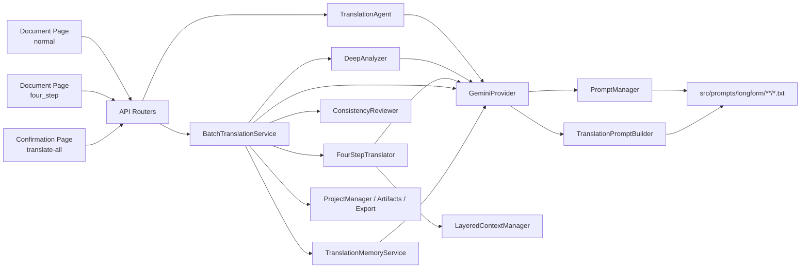
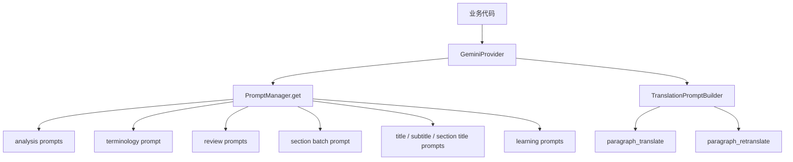
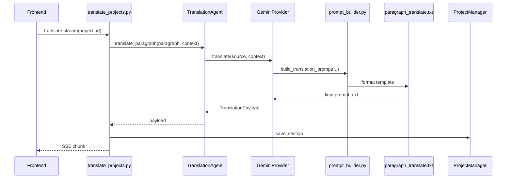
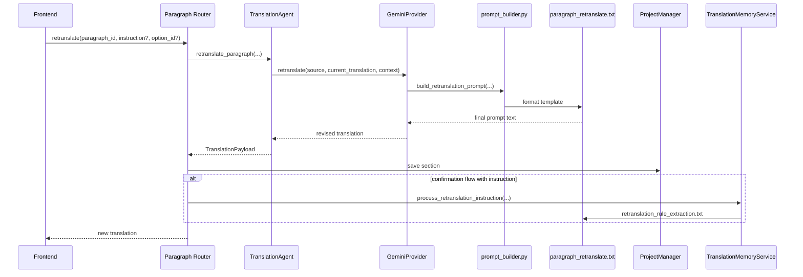
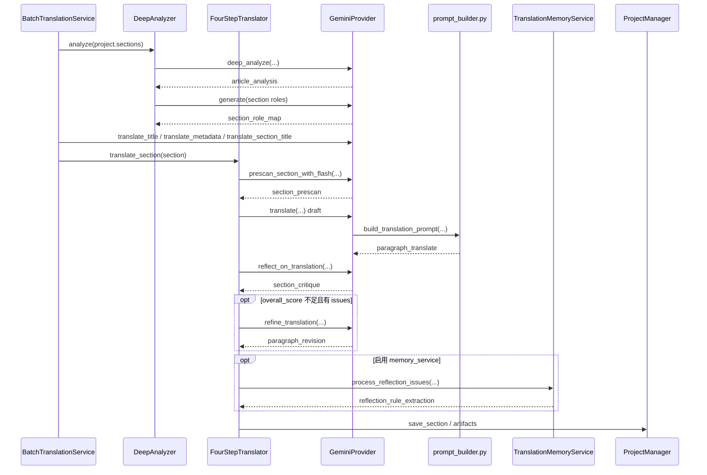
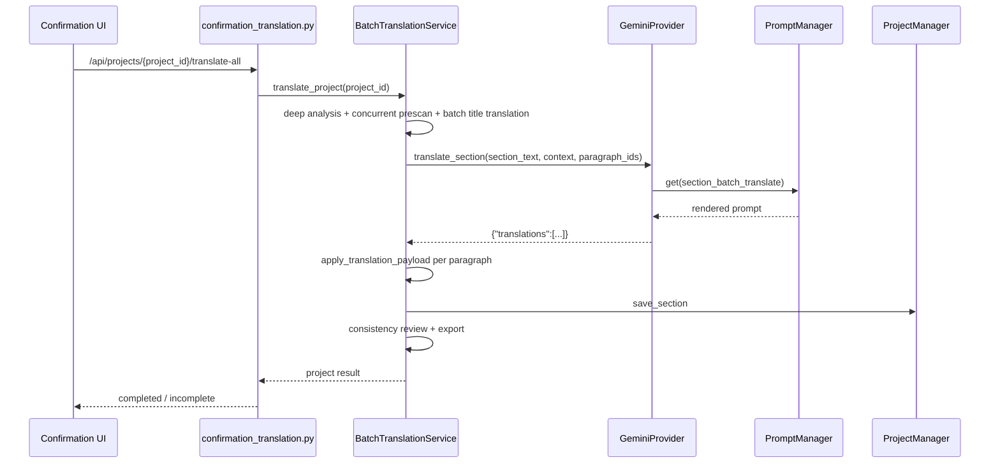
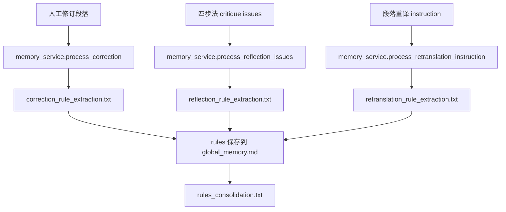
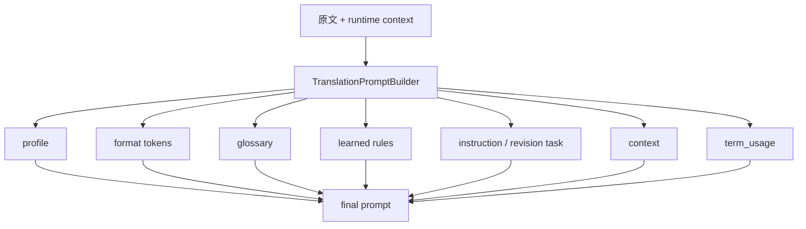

# 长文翻译完整链路与 Prompt 地图

更新时间：2026-03-15

## 1. 先看哪里

如果你现在要快速上手长文翻译，先打开这 8 个文件：

1. Prompt 路由入口：[src/prompts/__init__.py](../src/prompts/__init__.py)
2. 段落 prompt 组装器：[src/prompts/prompt_builder.py](../src/prompts/prompt_builder.py)
3. LLM 实际接线：[src/llm/gemini.py](../src/llm/gemini.py)
4. 普通段落翻译 agent：[src/agents/translation.py](../src/agents/translation.py)
5. 四步法 agent：[src/agents/four_step_translator.py](../src/agents/four_step_translator.py)
6. 项目级总编排：[src/services/batch_translation_service.py](../src/services/batch_translation_service.py)
7. Prompt 输入 contract：[src/prompts/longform/shared/context_contracts.md](../src/prompts/longform/shared/context_contracts.md)
8. Prompt 输出 contract：[src/prompts/longform/shared/output_contracts.md](../src/prompts/longform/shared/output_contracts.md)

这份文档回答 5 个问题：

1. 长文翻译现在有哪些真实在跑的链路。
2. 三条链路各自经过哪些 router / service / agent / prompt。
3. 现在所有活跃长文 prompt 的真实文件位置。
4. 格式处理链路如何保证行内格式在翻译过程中不被破坏。
5. 如果要改某种行为，应该先改哪个 prompt / builder / 调用点。

## 2. 当前系统结论

- 三条业务链路都保留：
  - 文档页普通全篇翻译：`POST /api/projects/{project_id}/translate-stream`
  - 文档页四步法全篇翻译：`POST /api/projects/{project_id}/translate-four-step`
- 确认流项目级翻译：`POST /api/projects/{project_id}/translate-all`
- 长文翻译运行时只使用 `src/prompts/longform/...` 下的新 prompt。
- 长文相关旧平铺 prompt、旧名兼容、inline fallback、未接线 fallback prompt 都已删除。
- paragraph retranslate 固定使用专用模板 [paragraph_retranslate.txt](../src/prompts/longform/translation/paragraph_retranslate.txt)。
- 当前活跃长文 prompt 一共 13 个，另有 2 份 contract 文档。

## 3. 系统设计图

### 3.1 组件全景图



### 3.2 Prompt 路由图



### 3.3 组件职责表

| 组件 | 真实文件 | 职责 |
| --- | --- | --- |
| Router: 文档页普通 / 四步法 | [src/api/routers/translate_projects.py](../src/api/routers/translate_projects.py) | 普通全文翻译和四步法全文翻译入口 |
| Router: 确认流项目级翻译 / 段落重译 | [src/api/routers/confirmation_translation.py](../src/api/routers/confirmation_translation.py) | 确认流整项目翻译、确认流段落重译 |
| Router: 文档页段落翻译 / 重译 / 人工修订 | [src/api/routers/projects_paragraphs.py](../src/api/routers/projects_paragraphs.py) | 文档页单段翻译、单段重译、人工更新触发学习 |
| PromptManager | [src/prompts/__init__.py](../src/prompts/__init__.py) | 精确加载模板；长文调用方只传 `longform/...` 新名 |
| PromptBuilder | [src/prompts/prompt_builder.py](../src/prompts/prompt_builder.py) | 普通段落翻译 / 段落重译 prompt 拼装 |
| GeminiProvider | [src/llm/gemini.py](../src/llm/gemini.py) | 组织上下文、渲染 prompt、调用模型（固定分配，无运行时切换）、解析输出 |
| TranslationAgent | [src/agents/translation.py](../src/agents/translation.py) | 普通段落翻译与段落重译 |
| DeepAnalyzer | [src/agents/deep_analyzer.py](../src/agents/deep_analyzer.py) | 全文分析、section role map |
| FourStepTranslator | [src/agents/four_step_translator.py](../src/agents/four_step_translator.py) | prescan / draft / critique / revision |
| BatchTranslationService | [src/services/batch_translation_service.py](../src/services/batch_translation_service.py) | 四步法与确认流 section 模式的项目级总编排 |
| TranslationMemoryService | [src/services/memory_service.py](../src/services/memory_service.py) | 人工修订学习、四步法 critique 学习、重译学习 |
| Context Contracts | [src/prompts/longform/shared/context_contracts.md](../src/prompts/longform/shared/context_contracts.md) | prompt 输入字段规范 |
| Output Contracts | [src/prompts/longform/shared/output_contracts.md](../src/prompts/longform/shared/output_contracts.md) | prompt 输出 schema 规范 |

## 4. 活跃 Prompt 注册表

### 4.1 Longform 运行时 Prompt Tree

- Analysis
  - [article_analysis.txt](../src/prompts/longform/analysis/article_analysis.txt)
  - [section_role_map.txt](../src/prompts/longform/analysis/section_role_map.txt)
- Terminology
  - [section_prescan.txt](../src/prompts/longform/terminology/section_prescan.txt)
- Translation
  - [paragraph_translate.txt](../src/prompts/longform/translation/paragraph_translate.txt)
  - [paragraph_retranslate.txt](../src/prompts/longform/translation/paragraph_retranslate.txt)
  - [section_batch_translate.txt](../src/prompts/longform/translation/section_batch_translate.txt)
- Review
  - [section_critique.txt](../src/prompts/longform/review/section_critique.txt)
  - [paragraph_revision.txt](../src/prompts/longform/review/paragraph_revision.txt)
- Auxiliary
  - [title_translate.txt](../src/prompts/longform/auxiliary/title_translate.txt)（含副标题翻译）
  - [section_title_translate.txt](../src/prompts/longform/auxiliary/section_title_translate.txt)
- Learning
  - [correction_rule_extraction.txt](../src/prompts/longform/learning/correction_rule_extraction.txt)
  - [reflection_rule_extraction.txt](../src/prompts/longform/learning/reflection_rule_extraction.txt)
  - [retranslation_rule_extraction.txt](../src/prompts/longform/learning/retranslation_rule_extraction.txt)
- Shared Contracts
  - [context_contracts.md](../src/prompts/longform/shared/context_contracts.md)
  - [output_contracts.md](../src/prompts/longform/shared/output_contracts.md)

### 4.2 活跃 Prompt 索引表

| 类别 | 逻辑名 | 真实文件链接 | 主要调用点 | 活跃链路 | 输出 |
| --- | --- | --- | --- | --- | --- |
| Analysis | `longform/analysis/article_analysis` | [article_analysis.txt](../src/prompts/longform/analysis/article_analysis.txt) | [src/llm/base.py](../src/llm/base.py)、[src/agents/deep_analyzer.py](../src/agents/deep_analyzer.py) | 四步法、确认流 | article analysis JSON |
| Analysis | `longform/analysis/section_role_map` | [section_role_map.txt](../src/prompts/longform/analysis/section_role_map.txt) | [src/agents/deep_analyzer.py](../src/agents/deep_analyzer.py) | 四步法、确认流 | section role map JSON |
| Terminology | `longform/terminology/section_prescan` | [section_prescan.txt](../src/prompts/longform/terminology/section_prescan.txt) | [src/llm/base.py](../src/llm/base.py)、[src/agents/four_step_translator.py](../src/agents/four_step_translator.py) | 四步法、确认流、术语预审 | prescan JSON |
| Translation | `longform/translation/paragraph_translate` | [paragraph_translate.txt](../src/prompts/longform/translation/paragraph_translate.txt) | [src/prompts/prompt_builder.py](../src/prompts/prompt_builder.py)、[src/llm/gemini.py](../src/llm/gemini.py) | 文档页普通翻译、四步法 draft | 纯文本 |
| Translation | `longform/translation/paragraph_retranslate` | [paragraph_retranslate.txt](../src/prompts/longform/translation/paragraph_retranslate.txt) | [src/prompts/prompt_builder.py](../src/prompts/prompt_builder.py)、[src/llm/gemini.py](../src/llm/gemini.py) | 文档页段落重译、确认流段落重译 | 纯文本 |
| Translation | `longform/translation/section_batch_translate` | [section_batch_translate.txt](../src/prompts/longform/translation/section_batch_translate.txt) | [src/llm/gemini.py](../src/llm/gemini.py) | 确认流项目级翻译 | `translations[]` JSON |
| Review | `longform/review/section_critique` | [section_critique.txt](../src/prompts/longform/review/section_critique.txt) | [src/llm/base.py](../src/llm/base.py)、[src/agents/four_step_translator.py](../src/agents/four_step_translator.py) | 四步法 | critique JSON |
| Review | `longform/review/paragraph_revision` | [paragraph_revision.txt](../src/prompts/longform/review/paragraph_revision.txt) | [src/llm/base.py](../src/llm/base.py)、[src/agents/four_step_translator.py](../src/agents/four_step_translator.py) | 四步法 | 纯文本 |
| Auxiliary | `longform/auxiliary/title_translate` | [title_translate.txt](../src/prompts/longform/auxiliary/title_translate.txt) | [src/llm/gemini.py](../src/llm/gemini.py)、[src/services/batch_translation_service.py](../src/services/batch_translation_service.py) | 四步法、确认流 | 纯文本（含副标题） |
| Auxiliary | `longform/auxiliary/section_title_translate` | [section_title_translate.txt](../src/prompts/longform/auxiliary/section_title_translate.txt) | [src/llm/gemini.py](../src/llm/gemini.py)、[src/services/batch_translation_service.py](../src/services/batch_translation_service.py) | 四步法、确认流 | 纯文本 |
| Learning | `longform/learning/correction_rule_extraction` | [correction_rule_extraction.txt](../src/prompts/longform/learning/correction_rule_extraction.txt) | [src/services/memory_service.py](../src/services/memory_service.py) | 人工修订侧路 | 规则提取 JSON |
| Learning | `longform/learning/reflection_rule_extraction` | [reflection_rule_extraction.txt](../src/prompts/longform/learning/reflection_rule_extraction.txt) | [src/services/memory_service.py](../src/services/memory_service.py) | 四步法 critique 学习 | 规则提取 JSON |
| Learning | `longform/learning/retranslation_rule_extraction` | [retranslation_rule_extraction.txt](../src/prompts/longform/learning/retranslation_rule_extraction.txt) | [src/services/memory_service.py](../src/services/memory_service.py) | 段落重译学习 | 规则提取 JSON |

输入字段统一看：

- [context_contracts.md](../src/prompts/longform/shared/context_contracts.md)
- [output_contracts.md](../src/prompts/longform/shared/output_contracts.md)

## 5. 链路 A：文档页普通全篇翻译

### 5.1 入口

- 前端页：[web/frontend/src/features/document/index.tsx](../web/frontend/src/features/document/index.tsx)
- 前端服务：[web/frontend/src/features/document/services/fullTranslationService.ts](../web/frontend/src/features/document/services/fullTranslationService.ts)
- 后端路由：[src/api/routers/translate_projects.py](../src/api/routers/translate_projects.py)
- 运行核心：[src/agents/translation.py](../src/agents/translation.py)

### 5.2 流程图

```mermaid
flowchart TD
    A[Document Page: normal] --> B[POST /api/projects/{project_id}/translate-stream]
    B --> C[translate_projects.py]
    C --> D[按 section / paragraph 循环]
    D --> E[TranslationAgent.translate_paragraph]
    E --> F[GeminiProvider.translate]
    F --> G[prompt_builder.py]
    G --> H[paragraph_translate.txt]
    H --> I[Gemini 输出译文]
    I --> J[apply_translation_payload]
    J --> K[ProjectManager.save_section]
```

### 5.3 时序图



### 5.4 实际步骤表

| 步骤 | 代码文件 | prompt |
| --- | --- | --- |
| 入口 SSE | [translate_projects.py](../src/api/routers/translate_projects.py) | 无 |
| 段落上下文构建 | [translate_projects.py](../src/api/routers/translate_projects.py) | 无 |
| 段落翻译 agent | [translation.py](../src/agents/translation.py) | 无 |
| LLM prompt 构建 | [gemini.py](../src/llm/gemini.py) | [paragraph_translate.txt](../src/prompts/longform/translation/paragraph_translate.txt) |
| Prompt 动态区块拼装 | [prompt_builder.py](../src/prompts/prompt_builder.py) | [paragraph_translate.txt](../src/prompts/longform/translation/paragraph_translate.txt) |

### 5.5 这条链路会带哪些上下文

- glossary
- previous paragraphs
- next preview
- learned rules
- format tokens
- instruction

Builder 关键规则：

- glossary 统一通过 `src/core/glossary_prompt.py` 的 `select_glossary_terms_for_text()` 按当前段落筛选，只注入真正命中的术语，默认上限 `30`（`MAX_GLOSSARY_TERMS_IN_PROMPT`）
- 只有 `instruction` 时，插入 `Extra Instruction`
- 同时存在 `previous_translation + instruction` 时，插入 `Revision Task`
- 普通翻译绝不再落回旧 prompt 文件

## 6. 段落重译链路

### 6.1 入口

- 确认流段落重译：[src/api/routers/confirmation_translation.py](../src/api/routers/confirmation_translation.py)
- 文档页段落重译：[src/api/routers/projects_paragraphs.py](../src/api/routers/projects_paragraphs.py)

### 6.2 时序图



### 6.3 实际调用点

| 步骤 | 真实文件 | prompt |
| --- | --- | --- |
| API 收口 | [confirmation_translation.py](../src/api/routers/confirmation_translation.py)、[projects_paragraphs.py](../src/api/routers/projects_paragraphs.py) | 无 |
| 重译 agent | [translation.py](../src/agents/translation.py) | 无 |
| LLM dedicated retranslate | [gemini.py](../src/llm/gemini.py) | [paragraph_retranslate.txt](../src/prompts/longform/translation/paragraph_retranslate.txt) |
| Prompt 组装 | [prompt_builder.py](../src/prompts/prompt_builder.py) | [paragraph_retranslate.txt](../src/prompts/longform/translation/paragraph_retranslate.txt) |
| 重译学习 | [memory_service.py](../src/services/memory_service.py) | [retranslation_rule_extraction.txt](../src/prompts/longform/learning/retranslation_rule_extraction.txt) |

### 6.4 重要边界

- 真正的 paragraph retranslate 只走 dedicated retranslation template。
- 不再通过普通翻译模板加 `Revision Task` 来模拟"重译接口"。
- 确认流路由会在后台调用学习链路；文档页段落重译不会额外触发这条后台学习。

### 6.5 确认流快捷重译指令

快捷重译指令以后端 `confirmation_models.py` 中的 `RETRANSLATE_OPTIONS` 为单一事实来源，前端通过 `GET /api/projects/{id}/retranslate-options` 拉取选项列表，点击后以 `option_id` 调用重译接口，由后端 `resolve_retranslate_instruction()` 解析为实际 instruction：

| 快捷指令 | ID | 说明 |
| --- | --- | --- |
| **可读性优化** | `readable` | 消除翻译腔，让表达更自然：控制句长、被动改主动、删冗余连接、优化语序及“的”堆叠 |
| **地道表达** | `idiomatic` | 自然流畅，避免直译痕迹：具体化描述、简化结构、避免同义词堆叠及模版化开头 |
| **专业风格** | `professional` | 科技媒体写作风格：保留判断力度、专业术语优先中文、删套话及数据段重组 |

各选项发送给模型的完整 instruction：

**readable — 可读性（消除翻译腔）**

```
请从句法结构层面重写译文：
1. 优先将长句控制在 30 字以内，超长句必须拆分。
2. 被动语态改为主动语态。
3. 删除不承载逻辑的连接词（如无意义的“此外”“然而”）。
4. 调整为自然中文语序，直接用动词，避免“对……进行……”结构。
5. 连续三个“的”时优先改写句式消除。

示例：
× 此外，该技术对芯片性能的提升效果非常显著。
√ 这项技术大幅提升了芯片性能。
```

**idiomatic — 更地道（自然流畅表达）**

```
请从表达层面重写译文：
1. 用具体事实代替空泛描述。
2. 用简单结构代替复杂绕行。
3. 避免同义词循环（同一段内反复用"提升/增强/优化"等近义词凑字）。
4. 避免每段都用"首先/其次/最后"等公式化开头。
5. 在非正式语境中，避免堆砌"基于""鉴于""旨在"等书面词，改用"根据""考虑到""为了"等自然表达。

示例：
❌ 基于上述分析，该公司旨在通过技术创新实现业务的全面提升。
✅ 根据以上分析，该公司正通过技术创新推动业务增长。
```

**professional — 更专业（科技媒体风格）**

```
请重写译文以提升专业表达：
1. 保留原文观点和判断力度，不要弱化。
2. 产品和技术代号保留英文，行业术语和金融术语优先中文。
3. 删除不承载信息的套话（如“值得注意的是”“众所周知”）。
4. 数据密集段落可适当拆分重组，保持信息密度。
5. 参考术语表中已有译法，保证前后一致。
```

instruction 解析优先级：`instruction`（自定义文本）> `option_id`（查表）> 空字符串。

用户也可以输入自定义指令。所有指令最终都作为 `instruction` 参数传入 `paragraph_retranslate.txt` 模板。

相关代码：
- 快捷指令定义（单一事实来源）：[src/api/routers/confirmation_models.py](../src/api/routers/confirmation_models.py) `RETRANSLATE_OPTIONS`
- instruction 解析函数：[src/api/routers/confirmation_models.py](../src/api/routers/confirmation_models.py) `resolve_retranslate_instruction()`
- 前端确认流面板：[web/frontend/src/features/confirmation/components/panels/RetranslatePanel.tsx](../web/frontend/src/features/confirmation/components/panels/RetranslatePanel.tsx)
- 前端沉浸模式：[web/frontend/src/features/document/components/ImmersiveEditor.tsx](../web/frontend/src/features/document/components/ImmersiveEditor.tsx)、[ImmersiveRow.tsx](../web/frontend/src/features/document/components/ImmersiveRow.tsx)

## 7. 链路 B：文档页四步法全篇翻译

### 7.1 入口

- 前端页：[web/frontend/src/features/document/index.tsx](../web/frontend/src/features/document/index.tsx)
- 前端服务：[web/frontend/src/features/document/services/fullTranslationService.ts](../web/frontend/src/features/document/services/fullTranslationService.ts)
- 后端路由：[src/api/routers/translate_projects.py](../src/api/routers/translate_projects.py)
- 编排核心：[src/services/batch_translation_service.py](../src/services/batch_translation_service.py)

### 7.2 总流程图

```mermaid
flowchart TD
    A[Document Page: four_step] --> B[POST /api/projects/{project_id}/translate-four-step]
    B --> C[BatchTranslationService.translate_project]
    C --> D[DeepAnalyzer.analyze]
    D --> D1[article_analysis.txt]
    D --> D2[section_role_map.txt]
    C --> E[translate title / metadata / section titles]
    E --> E1[title_translate.txt<br/>含副标题]
    E --> E3[section_title_translate.txt]
    C --> F[section prescan]
    F --> F1[section_prescan.txt]
    C --> G[FourStepTranslator.translate_section]
    G --> H[Draft]
    H --> H1[paragraph_translate.txt]
    G --> I[Critique]
    I --> I1[section_critique.txt]
    G --> J[Revision]
    J --> J1[paragraph_revision.txt]
    G --> K[reflection learning]
    K --> K1[reflection_rule_extraction.txt]
    C --> L[ConsistencyReviewer]
    C --> M[Artifacts + Export]
```

### 7.3 Section 级时序图



### 7.4 四步法真实 Prompt 顺序

| 阶段 | 代码文件 | prompt |
| --- | --- | --- |
| 全文分析 | [deep_analyzer.py](../src/agents/deep_analyzer.py)、[base.py](../src/llm/base.py) | [article_analysis.txt](../src/prompts/longform/analysis/article_analysis.txt) |
| section role map | [deep_analyzer.py](../src/agents/deep_analyzer.py) | [section_role_map.txt](../src/prompts/longform/analysis/section_role_map.txt) |
| 标题 + 副标题 | [batch_translation_service.py](../src/services/batch_translation_service.py)、[gemini.py](../src/llm/gemini.py) | [title_translate.txt](../src/prompts/longform/auxiliary/title_translate.txt) |
| section title | [batch_translation_service.py](../src/services/batch_translation_service.py)、[gemini.py](../src/llm/gemini.py) | [section_title_translate.txt](../src/prompts/longform/auxiliary/section_title_translate.txt) |
| prescan | [four_step_translator.py](../src/agents/four_step_translator.py)、[base.py](../src/llm/base.py) | [section_prescan.txt](../src/prompts/longform/terminology/section_prescan.txt) |
| Draft | [four_step_translator.py](../src/agents/four_step_translator.py)、[prompt_builder.py](../src/prompts/prompt_builder.py) | [paragraph_translate.txt](../src/prompts/longform/translation/paragraph_translate.txt) |
| Critique | [four_step_translator.py](../src/agents/four_step_translator.py)、[base.py](../src/llm/base.py) | [section_critique.txt](../src/prompts/longform/review/section_critique.txt) |
| Revision | [four_step_translator.py](../src/agents/four_step_translator.py)、[base.py](../src/llm/base.py) | [paragraph_revision.txt](../src/prompts/longform/review/paragraph_revision.txt) |
| Critique 学习 | [four_step_translator.py](../src/agents/four_step_translator.py)、[memory_service.py](../src/services/memory_service.py) | [reflection_rule_extraction.txt](../src/prompts/longform/learning/reflection_rule_extraction.txt) |

### 7.5 Prescan 自动分段

`prescan_section()` 在 [src/llm/base.py](../src/llm/base.py) 中现在会自动处理超长 section 内容：当 section 文本超过 7000 字符时，按段落边界自动分段，对每个 chunk 分别调用 Flash 执行 prescan，然后合并所有 chunk 的结果并去重。旧的 `[:8000]` 硬截断已移除，这意味着长 section 不会再因为截断而丢失尾部术语。

### 7.6 术语冲突 SSE 对话流

在四步法全篇翻译过程中，prescan 可能会发现一个新术语的翻译与现有术语表中的翻译冲突。此时系统通过 SSE 事件驱动一轮前后端交互来让用户决策：

1. **后端发现冲突**：prescan 返回的术语翻译与已有 terminology 冲突时，后端在 SSE 流中发送一个 `term_conflict` 事件，payload 至少包含 `term / existing_translation / new_translation / existing_context / new_context / existing_note / new_note`。
2. **前端暂停翻译**：前端收到 `term_conflict` 事件后暂停翻译进度，弹出冲突对话框，展示两个选项。每个选项都会同时展示：
   - 译法
   - 词义说明（来自 `existing_note` / `new_note`）
   - 上下文（来自 `existing_context` / `new_context`）
3. **用户选择**：用户选择后，前端向后端发送 `POST /api/projects/{project_id}/resolve-conflict-live`，传递 `chosen_translation` 和 `apply_to_all`。
4. **后端存储并继续**：后端收到决策后，唤醒等待中的四步法翻译任务，用用户选择更新运行时术语版本，然后继续翻译流程。

相关代码：

| 职责 | 文件 |
| --- | --- |
| 冲突状态管理 + resolve 端点 | [src/api/routers/translate_projects.py](../src/api/routers/translate_projects.py) |
| SSE 事件处理与暂停恢复 | [web/frontend/src/features/document/services/fullTranslationService.ts](../web/frontend/src/features/document/services/fullTranslationService.ts) |
| 冲突对话框 UI | [web/frontend/src/features/document/index.tsx](../web/frontend/src/features/document/index.tsx) |

### 7.7 当前四步法的重要边界

- Step 1 understand 现在直接依赖 Phase 0 产出的 `section_roles`。
- 已不再存在独立的 `section_understanding_fallback` prompt。
- prescan 固定走 `prescan_section_with_flash`。
- 没有 runtime fallback prompt。
- 四步法 draft / critique / revision / section batch translate 现在统一通过 `src/core/longform_context.py` 收口上下文预算，统一裁剪术语、guidelines、translation notes、article challenges。

## 8. 链路 C：确认流项目级翻译

### 8.1 入口

- 前端 API：[web/frontend/src/features/confirmation/api/confirmationApi.ts](../web/frontend/src/features/confirmation/api/confirmationApi.ts)
- 后端路由：[src/api/routers/confirmation_translation.py](../src/api/routers/confirmation_translation.py)
- 编排核心：[src/services/batch_translation_service.py](../src/services/batch_translation_service.py)

### 8.2 总流程图

```mermaid
flowchart TD
    A[Confirmation Page] --> B[POST /api/projects/{project_id}/translate-all]
    B --> C[BatchTranslationService.translate_project]
    C --> D[DeepAnalyzer]
    D --> D1[article_analysis.txt]
    D --> D2[section_role_map.txt]
    C --> E[Title / Subtitle / Section Title]
    E --> E1[title_translate.txt<br/>含副标题]
    E --> E3[section titles batch translate]
    C --> F[section prescan - concurrent]
    F --> F1[section_prescan.txt]
    C --> G[GeminiProvider.translate_section]
    G --> G1[section_batch_translate.txt]
    C --> H[apply section results]
    C --> I[ConsistencyReviewer]
    C --> J[Artifacts + Export]
```

### 8.3 Section Batch Translation 时序图



### 8.4 当前确认流真实 Prompt 顺序

| 阶段 | 代码文件 | prompt |
| --- | --- | --- |
| 全文分析 | [deep_analyzer.py](../src/agents/deep_analyzer.py) | [article_analysis.txt](../src/prompts/longform/analysis/article_analysis.txt)、[section_role_map.txt](../src/prompts/longform/analysis/section_role_map.txt) |
| 标题 / 元信息 | [batch_translation_service.py](../src/services/batch_translation_service.py)、[gemini.py](../src/llm/gemini.py) | [title_translate.txt](../src/prompts/longform/auxiliary/title_translate.txt)（含副标题）、章节标题批量翻译（内嵌 prompt，fallback [section_title_translate.txt](../src/prompts/longform/auxiliary/section_title_translate.txt)） |
| prescan | [batch_translation_service.py](../src/services/batch_translation_service.py)、[four_step_translator.py](../src/agents/four_step_translator.py) | [section_prescan.txt](../src/prompts/longform/terminology/section_prescan.txt) |
| section batch translation | [gemini.py](../src/llm/gemini.py) | [section_batch_translate.txt](../src/prompts/longform/translation/section_batch_translate.txt) |

## 9. 学习侧路

学习 prompt 不属于三条主翻译链路的"主干输出"，但它们是当前运行时活跃 prompt，必须单独看。

### 9.1 学习链路图



### 9.2 学习 Prompt 对照表

| 触发动作 | 入口代码 | service | prompt |
| --- | --- | --- | --- |
| 人工修改段落 | [projects_paragraphs.py](../src/api/routers/projects_paragraphs.py)、[confirmation_service.py](../src/services/confirmation_service.py) | [memory_service.py](../src/services/memory_service.py) | [correction_rule_extraction.txt](../src/prompts/longform/learning/correction_rule_extraction.txt) |
| 四步法 critique 学习 | [four_step_translator.py](../src/agents/four_step_translator.py) | [memory_service.py](../src/services/memory_service.py) | [reflection_rule_extraction.txt](../src/prompts/longform/learning/reflection_rule_extraction.txt) |
| 段落重译学习 | [confirmation_translation.py](../src/api/routers/confirmation_translation.py) | [memory_service.py](../src/services/memory_service.py) | [retranslation_rule_extraction.txt](../src/prompts/longform/learning/retranslation_rule_extraction.txt) |

### 9.3 规则库与术语库的边界

当前实现已经把规则库和术语库解耦。学习链路保存的规则只进入 `data/global_memory.md`，用于后续翻译 Prompt 的风格 / 句法 / 语气约束。

规则提取 Prompt 明确禁止输出 `"X" 翻译为 "Y"` 这类术语型规则，`rules_consolidation.txt` 也会在梳理时删除这类内容。因此，当前系统不再从规则文本中提取术语候选，也不再通过规则库向术语审核流程回灌候选术语。

## 10. PromptBuilder 的真实行为

当前 [src/prompts/prompt_builder.py](../src/prompts/prompt_builder.py) 只做两件事：

1. 构建普通段落翻译 prompt
2. 构建段落重译 prompt

### 10.1 Builder 组装图



### 10.2 Builder 对应模板

| Builder 方法 | 模板 |
| --- | --- |
| `build_translation_prompt(...)` | [paragraph_translate.txt](../src/prompts/longform/translation/paragraph_translate.txt) |
| `build_retranslation_prompt(...)` | [paragraph_retranslate.txt](../src/prompts/longform/translation/paragraph_retranslate.txt) |

### 10.3 term_usage 与 first_annotate / preserve_annotate 策略

`_build_glossary_section()` 现在接受 `term_usage` 参数。当术语表配置为 `first_annotate` 或 `preserve_annotate` 策略时，系统通过 `TermUsageTracker` 跟踪每个术语在译文中是否已经首次出现并被标注过。对于已经标注过的术语，glossary section 中不再插入标注指令，术语仅以纯翻译形式呈现。这使得译文在首次出现时带有注释（如 `first_annotate`："台积电（TSMC）"；`preserve_annotate`："TSMC（台积电）"），而后续出现时直接使用翻译，避免重复标注。

**跨会话追踪问题与解决：**

`TermUsageTracker` 仅存于内存，每次翻译会话新建空实例。分次翻译不同章节或在确认页重翻时，前次积累的术语使用记录会丢失。当前通过两种机制解决：

1. **链路 B/C（批翻断点续传）：** `batch_translation_service._prepopulate_term_tracker()` 在全文分析完成后、正式翻译前，扫描所有已有翻译的段落，为 `first_annotate`/`preserve_annotate` 术语预填充 tracker。这样跳过已译章节时，这些章节中的术语使用记录不会丢失。

2. **确认流重翻：** `confirmation_translation.retranslate_paragraph()` 在每次重翻前调用 `build_term_usage_from_project()`，该函数按章节顺序扫描当前段落之前的所有已译段落（`confirmed` 或 `latest_translation`），检查其源文中出现了哪些追踪术语，动态构建 `term_usage` 并注入 `TranslationContext`。

## 11. 格式处理链路

这一节说明当前代码如何处理"从 HTML 导入，到英文 Markdown 归一化、分段翻译，再到中文 Markdown 导出"的格式问题。重点不是泛泛描述流程，而是说明现在的实现怎样避免链接、加粗、斜体、行内代码、标题层级、列表和引用在翻译过程中被破坏。

### 11.0 格式链路结论

当前实现有四个核心约束：

1. `source.md` 是导出的唯一骨架来源，不再直接从 HTML 导出中文。
2. UI 里的 `Paragraph` 只是"工作分段"，不是最终导出块；多个段落可能共享同一个父 block。
3. 行内格式不是直接交给 LLM 保管，而是先转成隐藏 token，再在导出时恢复成 Markdown。
4. 导出阶段仍是严格校验：只要某个格式化 block 无法安全重建，就抛 `FormatRecoveryError`，而不是静默导出坏格式；但翻译阶段已加入自动修复回退，不再是“校验失败立即中断”。

可以把这条链路理解成：

```text
source.html
  -> 清洗 DOM，提取正文
  -> 英文 source.md（canonical source，也是英文导出目标）
  -> 解析成 block
  -> block 按需要切成多个 Paragraph
  -> 行内格式转 hidden tokens 后送给 LLM
  -> 保存 text + tokenized_text + format_issues
  -> 导出时按 parent block 重组
  -> token 校验通过后恢复成中文 Markdown（中文导出目标）
```

### 11.1 HTML -> 英文 Markdown

入口在 `src/core/project.py` 的 `ProjectManager.create()`：

- 先把原始文件复制为项目内的 `source.html`
- 再调用 `src/html2md/converter.py` 的 `convert_html_to_markdown_text()`
- 最终把英文 Markdown 保存为项目内的 `source.md`

`convert_html_to_markdown_text()` 做了三件事：

1. `extract_article()` 从 HTML 中定位文章正文，并做 DOM 清洗。
2. `render_markdown()` 把正文渲染为标准 Markdown。
3. `copy_and_rewrite_images()` 复制或改写图片路径，保证 Markdown 里的图片引用可用。

这里有一个很重要的设计点：后续所有翻译、分段、导出，都建立在 `source.md` 上，而不是直接在 HTML 上做增量修改。

#### 11.1.1 HTML 清洗

`src/html2md/extractor.py` 的 `extract_article()` 会：

- 定位文章容器和正文节点
- 提取元数据，如标题、作者、日期、原始链接
- 在必要时从 `window._preloads` 里回捞正文 HTML
- 把正文交给 `prepare_body()` 做清洗

这一步的目标是得到一个稳定、可转 Markdown 的正文 DOM，而不是保留原始页面所有展示细节。

#### 11.1.2 Markdown 归一化

`src/html2md/markdown.py` 的 `render_markdown()` 用 `SemiAnalysisMarkdownConverter` 把 HTML 转成英文 Markdown。这里会主动做一些格式归一化：

- 标题统一成 ATX 形式，例如 `#` / `##`
- 图片统一成 ``
- `figcaption` 转成普通段落或斜体说明
- 裸链接补成 Markdown link
- 无意义的纯标点强调会被去掉

最终得到的是一份"语义稳定"的英文 Markdown，而不是对原 HTML 样式的 1:1 复刻。

### 11.2 英文 Markdown -> canonical blocks

这一步在 `src/core/markdown_project_parser.py` 的 `MarkdownProjectParser.parse()`。

解析器会先做几件事：

- 读取文档级标题 `# ...` 作为项目标题
- 跳过开头的 front matter 风格信息
- 识别正文中的 block
- 把 block 组织成 section 和 paragraph

#### 11.2.1 block 类型

当前 parser 能识别这些 block：

- fenced code block
- table
- `##`、`###`、`####`
- blockquote
- 无序列表项 `-` / `*` / `+`
- 图片 `![...]`
- 普通段落

其中有两个关键约定：

- `H2` 用来切 section，本身不会进入 section 的 paragraph 列表。
- `H3` / `H4` 会作为可翻译 block 保留下来，并在导出时重新补回 `###` / `####`。

#### 11.2.2 行内格式提取

对于文本类 block，parser 不直接把 `**...**`、`[...](...)` 原样塞给后续流程，而是先执行 `_extract_inline_elements()`：

- 把链接、粗体、斜体、行内代码识别出来
- 生成 `InlineElement`
- 同时把 block 的 `plain_text` 提取出来

例如：

```markdown
**TSMC Transformation:** Apple used [TSMC](https://www.tsmc.com).
```

会被拆成两部分：

- `plain_text`: `TSMC Transformation: Apple used TSMC.`
- `inline_elements`: 记录粗体 span 和 link span 的位置、文本、href 等信息

随后 `assign_span_ids()` 会给这些 span 分配稳定 id，例如：

- `STRONG_1`
- `LINK_1`

这些 id 是整个后续格式恢复链路的锚点。

### 11.3 block -> 工作分段 Paragraph

当前系统里，`Paragraph` 是"翻译工作单元"，不是"最终导出单元"。这一层非常关键。

#### 11.3.1 为什么要有 parent block

长段落需要拆开翻译，但最终导出时又必须恢复成原始 block 结构。所以 parser 在 `_build_segment()` 里会把每个工作段落都挂回它所属的父 block。

每个 `Paragraph` 会保存这些关键字段：

- `parent_block_id`
- `parent_block_index`
- `parent_block_type`
- `parent_block_markdown`
- `parent_block_plain_text`
- `parent_inline_elements`
- `segment_start`
- `segment_end`
- `expected_tokens`

这意味着：

- 一个 block 可以拆成多个 `Paragraph`
- 但这些 `Paragraph` 仍然知道自己来自哪一个原始 block
- 导出时可以重新拼回去

#### 11.3.2 分段规则

`_segments_from_block()` 的规则是：

- `IMAGE` / `TABLE` / `CODE` 不拆
- `H3` / `H4` / `LI` 这类非普通正文 block 不拆
- 只有 `P` 和 `BLOCKQUOTE` 在超过 `max_paragraph_length` 时才尝试拆分

拆分时用 `_split_block_ranges()` 按句子切，但有一个重要保护：

- 如果切分边界会落在某个 inline span 中间，`_boundary_breaks_inline()` 会阻止拆分
- 如果某个 chunk 无法完整包含本地 inline span，`_slice_inline_elements()` 会返回 `None`
- 这两种情况都会退回"整块不拆"

也就是说，系统宁可少拆，也不允许把一个链接或粗体 span 从中间切断。

#### 11.3.3 短段合并

`_merge_short_segments()` 会把同一个父 block 下的短段重新合并，但不会跨这些结构化 block：

- `IMAGE`
- `TABLE`
- `CODE`
- `H3`
- `H4`
- `LI`

因此最终 UI 里看到的 `Paragraph`，本质上是"在不破坏格式边界前提下，为翻译效率做过切分/合并的工作单元"。

### 11.4 翻译前：把格式变成 hidden tokens

这一步集中在 `src/core/format_tokens.py`。

#### 11.4.1 token 化输入

`build_translation_input(paragraph)` 会调用 `tokenize_text()`，把段落里的行内格式改写成隐藏 token。

例如原文：

```text
TSMC Transformation: Apple used TSMC.
```

结合 inline 元素后，送给模型的可能是：

```text
[[[STRONG_1|TSMC Transformation:]]] Apple used [[[LINK_1|TSMC]]].
```

这样做有几个目的：

- LLM 不需要自己重建 Markdown 语法
- 链接 URL、title 等元数据不暴露给模型去"自由改写"
- 导出时可以只依赖 token id 恢复格式

#### 11.4.2 prompt 里怎么提醒模型

当前所有主要翻译入口都走同一套 token 协议：

- `src/agents/translation.py`
- `src/agents/four_step_translator.py`
- `src/services/batch_translation_service.py` 的 section mode

这些入口都会：

- 把 `tokenized_text` 而不是原始 Markdown 文本送给 LLM
- 把 `format_token_context(paragraph)` 塞进 prompt context

`src/prompts/prompt_builder.py` 里会生成明确约束：

- 保留 token wrapper
- 保留 token id
- 只能翻译 `|` 后面的文字
- 不能删除、复制、改序或跨段移动 token
- `CODE_*` token 内部文本默认不得改动

因此，无论是普通翻译、重译，还是四步法里的 refine，处理带格式段落时都不是裸文本流程。

#### 11.4.3 非交叉格式的“纯链接脱水”

当前实现新增了 `is_dehydratable_link_cluster()` / `build_dehydrated_link_payload()`：

- 如果一个段落只由多个 `link` span 组成，中间只有标点/空白分隔（没有文本和格式交叉风险）
- 该段落会直接构造 tokenized payload，跳过 LLM 翻译
- 后续仍按同一套 token 校验和导出恢复链路处理

这条路径已经接入：

- `TranslationAgent`（普通翻译/重译）
- `FourStepTranslator`（draft + refine）
- `BatchTranslationService`（section batch）
- `ImageProcessingService`（caption token 翻译分支）

### 11.5 翻译后：保存 plain text 和 tokenized text

模型返回后，系统不会直接相信结果，而是先用 `build_translation_payload()` 做标准化。

#### 11.5.1 校验规则

`build_translation_payload()` 现在先做两步防御，再进入 `validate_tokenized_text()`：

1. 本地轻量归一化：把 `[[LINK_1|...]]`、全角 `［［［...］］］`、全角分隔符等近似写法，归一成标准 `[[[TOKEN|...]]]`。
2. 严格校验：再检查 token 完整性和合法性。

`validate_tokenized_text()` 具体检查：

- 所有期望 token 是否都出现
- 每个 token 是否只出现一次
- 是否出现了意外 token
- `CODE_*` token 的内部文本是否被改坏
- token 内容是否为空

#### 11.5.1.1 校验失败时的自动修复回退

如果上面的校验失败，系统不会立刻报错中断，而是会触发一轮轻量修复：

- 调用 `llm.repair_format_tokens(...)`（Gemini 实现默认走 `flash`）
- 输入：token 化原文、损坏译文、期望 token 列表、当前 issues
- 要求模型只修 token wrapper / id，不改译文逻辑
- 修复结果会再次走同一套校验；只要 issues 数量下降，就采用修复结果

如果修复后仍不合格，才按旧策略记录：

- `tokenized_text = None`
- `format_issues` 保留详细错误
- `text` 仍保存可读译文（用于 UI / 草稿查看）

#### 11.5.2 保存格式

校验通过时：

- `text` 保存去掉 token wrapper 后的纯文本译文
- `tokenized_text` 保存完整的 token 化译文
- `format_issues = []`

校验失败时：

- `text` 仍然保存可读的纯文本译文
- `tokenized_text = None`
- `format_issues` 记录具体问题

这就是为什么系统同时保留两种"可用性"：

- `has_usable_translation()`：只要有可读译文就算可用，给 UI、进度统计等宽松场景使用
- `has_export_ready_translation()`：必须具备可安全重建的 tokenized 译文，给导出场景使用

#### 11.5.3 Paragraph 当前的格式状态

`Paragraph._update_format_state()` 会把格式恢复状态写进 `format_recovery_status`：

- `not_applicable`：这个段落没有格式 token
- `pending`：有格式 token，但还没有合格的 tokenized 译文
- `ready`：tokenized 译文已就绪
- `invalid`：存在 `format_issues`

这使得前端和服务层可以区分"文字翻完了"和"格式也可导出了"。

### 11.6 中文 Markdown 导出时如何恢复格式

导出入口在 `src/core/project.py` 的 `ProjectManager.export_markdown()`。

它不会按 UI 里的 `Paragraph` 顺序直接拼字符串，而是先做 block 级重建。

#### 11.6.1 先按 parent block 分组

`sorted_block_groups()` / `group_paragraphs_by_parent_block()` 会把同一个父 block 下的多个工作段落重新收拢，并按：

- `parent_block_index`
- `segment_start`

排序。

这样导出拿到的是"一个个原始 block"，而不是零散工作段。

#### 11.6.2 再把多个 segment 拼回一个 block

`reconstruct_block_tokenized_text()` 会：

- 取父 block 的 `parent_block_plain_text`
- 按 `segment_start` / `segment_end` 把多个子段译文拼回去
- 对于没拆开的空隙，补回父块中的原始 gap 文本
- 优先使用每个段落的 `best_tokenized_translation_text()`
- 最后再用父块级的 `parent_inline_elements` 做一次整体 token 校验

注意这里是"先段落级保存，再 block 级复核"，不是只校验单段落。

#### 11.6.3 严格失败而不是静默 fallback

`require_valid_reconstruction()` 会在 block 重建失败时直接抛 `FormatRecoveryError`。

当前这是**导出阶段**有意保留的严格策略：

- 只要某个格式化 block token 缺失、重复、错位或破坏 code span
- 中文 Markdown 导出就直接失败

也就是说，导出阶段不会因为"文本大致可读"就偷偷生成一个格式可能错乱的结果。
但要注意：翻译阶段已经加入了“本地归一化 + Flash 修复回退”，所以相比旧版本，触发到这一步的概率会明显下降。

#### 11.6.4 恢复回 Markdown 语法

当 block 级 token 校验通过后：

- `restore_markdown_from_tokenized()` 会把 `[[[LINK_1|台积电]]]` 恢复成 `[台积电](...)`
- `STRONG_*` 恢复成 `**...**`
- `EM_*` 恢复成 `*...*`
- `CODE_*` 恢复成 `` `原始代码文本` ``

之后 `ProjectManager._render_block_markdown()` 再根据 block 类型补回外层结构：

- `H3` -> `### ...`
- `H4` -> `#### ...`
- `LI` -> `- ...`
- `BLOCKQUOTE` -> `> ...`

对于这些特殊 block：

- `IMAGE`：直接用 `parent_block_markdown`
- `TABLE`：直接保留原表格 Markdown
- `CODE`：用重建后的文本包回 fenced code block

这也是为什么最终导出的中文 Markdown 能保留原有的标题层级、列表、引用、图片和行内样式。

### 11.7 当前实现真正保证了什么

当前系统保证的是"Markdown 语义结构"的稳定，而不是原 HTML 展示样式的完全复刻。

具体来说，当前能稳定保的有：

- section 层级：`#`、`##`、`###`、`####`
- 图片 markdown
- 表格 markdown
- code fence
- 链接
- 粗体、斜体、行内代码
- 列表项
- 引用块

当前不再支持的路径：

- HTML 导出已经移除
- 中文结果不再尝试回写到原始 HTML 里保留 `<head>` / CSS

所以现在的产品定义已经很明确：

- 输入可以是 HTML
- 内部标准形态是英文 Markdown
- 输出是中文 Markdown

### 11.8 为什么这套设计比"直接翻 Markdown 文本"更稳

如果把原始 Markdown 直接给模型，常见问题是：

- 模型漏掉一个 `]` 或 `)`
- 把链接 URL 翻译掉
- 把 `**` 改成中文全角符号
- 把行内代码误翻
- 长段分段后无法再拼回原 block

当前实现通过四层保护避免这些问题：

1. parser 先把格式从正文文本里剥离成结构化 span
2. 翻译时只让模型改 token 内的可译文本（纯链接簇可脱水跳过 LLM）
3. 翻译后先做本地归一化，失败再走 Flash 修复回退
4. 导出时再做 block 级重建和硬校验

这四层缺一不可。只有"token 化 + 脱水降风险 + 修复回退 + 严格导出校验"一起存在，格式才真正可控。

### 11.9 结合 `Apple-TSMC_smoke.md` 可以怎么理解

`data/pipeline_smoke/Apple-TSMC_smoke.md` 已经覆盖了这条链路里的多个真实边界：

- 图片
- 链接
- 粗体标签式开头
- `H3` / `H4`
- blockquote
- 列表风格段落
- 长段正文

对应的端到端 smoke 在 `tests/test_pipeline_smoke_e2e.py`，它不是整篇全文翻译，而是从真实文章里抽代表性 section 做 E2E：

- `00-intro`
- `02-key-numbers`
- `03-the-five-phases-of-apple-tsmc`
- `04-the-manufacturing-footprint`

测试会断言导出结果仍然保有这些格式形状：

- 图片 Markdown
- `###` 和 `####`
- 引用块前缀
- Markdown 链接
- 粗体

这份 smoke 的意义是：当前的格式链路不是只在人造小样本上成立，而是在真实长文的子集上已经跑通。

## 12. 仓库里仍存在但不属于长文运行时的 Prompt

下面这些 prompt 文件仍在 `src/prompts/` 下，但不属于长文翻译主链：

| 文件 | 说明 |
| --- | --- |
| [analysis.txt](../src/prompts/analysis.txt) | 通用分析 prompt，服务其他分析能力 |
| [consistency.txt](../src/prompts/consistency.txt) | 非长文主链的一致性 prompt |
| [post_translation.txt](../src/prompts/post_translation.txt) | 帖子优化专用 |

这份文档不再覆盖 Slack / tools 等其他功能 prompt。

## 13. 如果你要改某件事，先改哪里

| 你想改什么 | 先打开这些文件 |
| --- | --- |
| 改全文分析风格 / 术语抽取策略 | [article_analysis.txt](../src/prompts/longform/analysis/article_analysis.txt)、[deep_analyzer.py](../src/agents/deep_analyzer.py) |
| 改 section 在全文中的角色分析 | [section_role_map.txt](../src/prompts/longform/analysis/section_role_map.txt)、[deep_analyzer.py](../src/agents/deep_analyzer.py) |
| 改普通段落翻译语气 / 约束 | [paragraph_translate.txt](../src/prompts/longform/translation/paragraph_translate.txt)、[prompt_builder.py](../src/prompts/prompt_builder.py) |
| 改段落重译策略 | [paragraph_retranslate.txt](../src/prompts/longform/translation/paragraph_retranslate.txt)、[prompt_builder.py](../src/prompts/prompt_builder.py)、[translation.py](../src/agents/translation.py) |
| 改确认流 section batch translation 契约 | [section_batch_translate.txt](../src/prompts/longform/translation/section_batch_translate.txt)、[gemini.py](../src/llm/gemini.py)、[output_contracts.md](../src/prompts/longform/shared/output_contracts.md) |
| 改四步法 critique 维度 | [section_critique.txt](../src/prompts/longform/review/section_critique.txt)、[four_step_translator.py](../src/agents/four_step_translator.py) |
| 改四步法 revision 策略 | [paragraph_revision.txt](../src/prompts/longform/review/paragraph_revision.txt)、[four_step_translator.py](../src/agents/four_step_translator.py) |
| 改标题 / 副标题 / section title | [title_translate.txt](../src/prompts/longform/auxiliary/title_translate.txt)（含副标题）、[section_title_translate.txt](../src/prompts/longform/auxiliary/section_title_translate.txt)、[gemini.py](../src/llm/gemini.py) |
| 改术语预扫 | [section_prescan.txt](../src/prompts/longform/terminology/section_prescan.txt)、[four_step_translator.py](../src/agents/four_step_translator.py)、[terminology_review_service.py](../src/services/terminology_review_service.py) |
| 改学习规则抽取 | [correction_rule_extraction.txt](../src/prompts/longform/learning/correction_rule_extraction.txt)、[reflection_rule_extraction.txt](../src/prompts/longform/learning/reflection_rule_extraction.txt)、[retranslation_rule_extraction.txt](../src/prompts/longform/learning/retranslation_rule_extraction.txt)、[memory_service.py](../src/services/memory_service.py) |
| 改 PromptManager 模板解析规则 | [src/prompts/__init__.py](../src/prompts/__init__.py) |
| 改 prompt 输入输出字段规范 | [context_contracts.md](../src/prompts/longform/shared/context_contracts.md)、[output_contracts.md](../src/prompts/longform/shared/output_contracts.md) |
| HTML 转 Markdown 不对 | [src/html2md/extractor.py](../src/html2md/extractor.py)、[src/html2md/markdown.py](../src/html2md/markdown.py) |
| block 识别或分段不对 | [src/core/markdown_project_parser.py](../src/core/markdown_project_parser.py) |
| token 丢失、重复、错位 | [src/core/format_tokens.py](../src/core/format_tokens.py) |
| token 校验失败自动修复（Flash） | [src/core/format_tokens.py](../src/core/format_tokens.py)、[src/llm/base.py](../src/llm/base.py)、[src/llm/gemini.py](../src/llm/gemini.py) |
| 段落状态为什么"有译文但不可导出" | [src/core/models/translation.py](../src/core/models/translation.py) |
| 导出时报 `FormatRecoveryError` | [src/core/project.py](../src/core/project.py)、[src/core/format_tokens.py](../src/core/format_tokens.py) |
| prompt 是否带了 token 约束 | [src/agents/translation.py](../src/agents/translation.py)、[src/agents/four_step_translator.py](../src/agents/four_step_translator.py)、[src/prompts/prompt_builder.py](../src/prompts/prompt_builder.py) |

## 14. 一句话版结论

现在长文翻译的三条业务链路都还在，但运行时只剩新的 `src/prompts/longform/...` 体系；格式处理升级为“token 化 + 纯链接脱水 + 校验失败自动修复回退 + 严格导出校验”；旧长文 prompt、兼容路由和死代码已经删掉，这份文档里的每个活跃 prompt 都给了真实文件链接，你可以直接从这里进入代码和模板修改项目。
